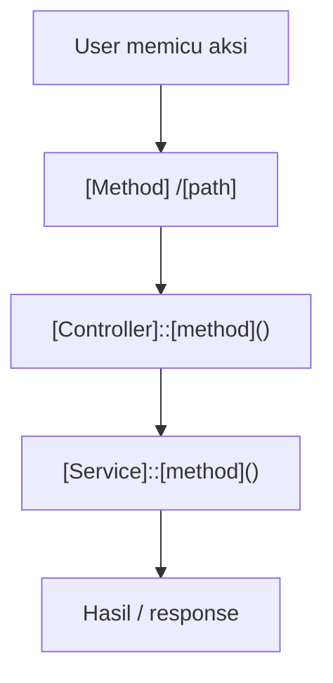

# Dokumentasi Modul [NAMA MODUL]

> Template standar dokumentasi modul Siakurat. Salin file ini, ganti bagian di dalam `[...]`,
> lalu hapus baris kutipan pengantar ini. Ikuti gaya `bridging-pendapatan.md` sebagai acuan emas.

## Ringkasan Modul

Modul **[Nama Modul]** digunakan untuk:

1. [tujuan utama 1],
2. [tujuan utama 2],
3. [tujuan utama 3].

Implementasi utama modul ini berada di:

- `routes/web.php`
- `app/Http/Controllers/[Path]/[Nama]Controller.php`
- `app/Http/Requests/[Path]/[Nama]Request.php`
- `app/Services/[Path]/[Nama]Service.php`
- `app/Models/[Model].php`

## Entry Point / API

| Method | Path | Route Name | Controller Method |
| --- | --- | --- | --- |
| `GET` | `/[path]` | `[route.name]` | `index()` |

## Alur [N]: [Nama Alur]

### Validasi Request (jika ada)

`[NamaRequest]` memvalidasi:

- `[field]` [aturan].

### Flowchart

### Algoritma

1. [langkah 1].
2. [langkah 2].
3. [langkah 3].

### Fungsi yang Dipanggil

- `[Controller]::[method]()`
- `[Service]::[method]()`
- `[Model]::[method]()`

## Catatan Penting Bisnis

- [aturan bisnis / batasan / asumsi penting].
- [efek samping penting, mis. sinkronisasi buku besar, log aktivitas].

---

**Panduan pengisian:**

- Satu file per submodul/fitur.
- Sertakan flowchart mermaid untuk setiap alur (baca/tulis/hapus/proses khusus).
- Daftar fungsi harus mencerminkan nama method nyata di kode, bukan asumsi.
- Sebutkan efek samping lintas modul (mis. `BukuBesarService`, `LogAktifitasService`).
- Perbarui dokumen ini setiap ada perubahan kode pada modul terkait (lihat `AGENTS.md` — Documentation Policy).
