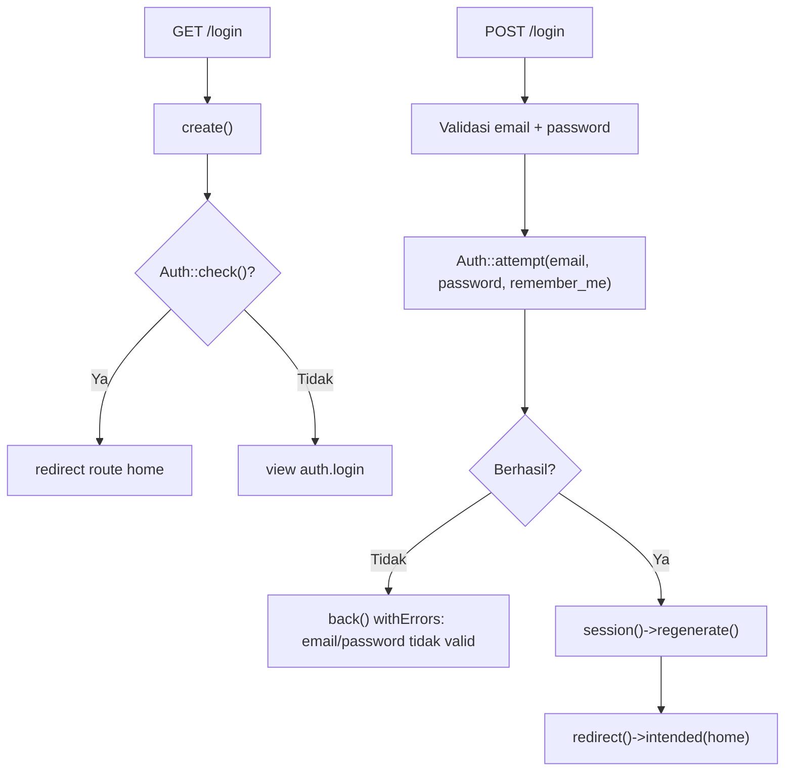
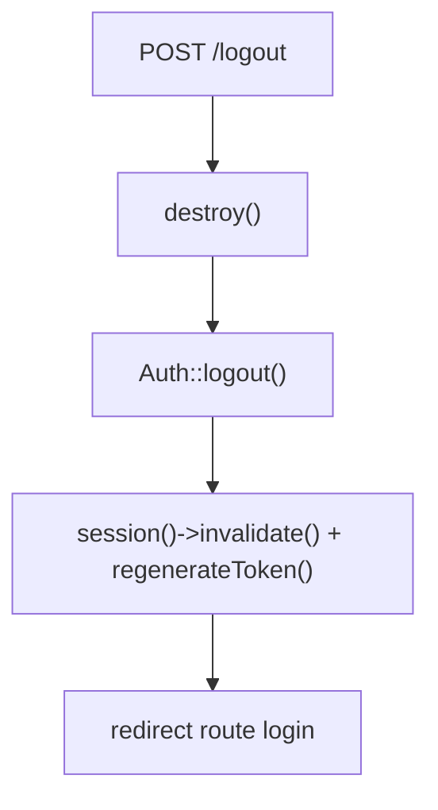

# Dokumentasi Modul Autentikasi

## Ringkasan Modul

Modul **Autentikasi** menangani login dan logout pengguna menggunakan session guard bawaan Laravel.

Implementasi utama:

- `routes/web.php`
- `app/Http/Controllers/Auth/AuthController.php`
- `app/Models/User.php`

## Entry Point / API

| Method | Path | Route Name | Controller Method | Middleware |
| --- | --- | --- | --- | --- |
| `GET` | `/login` | `login` | `create()` | guest |
| `POST` | `/login` | `login.store` | `store()` | guest |
| `POST` | `/logout` | `logout` | `destroy()` | auth |

> Halaman root `/` mengarahkan ke `home` bila sudah login, atau ke `login` bila belum.

## Alur Login

### Algoritma

1. `create()` menampilkan form login; bila sudah login, langsung diarahkan ke `home`.
2. `store()` memvalidasi `email` dan `password`, lalu memanggil `Auth::attempt()` dengan opsi
   `remember_me`.
3. Bila gagal, kembali ke form dengan pesan error dan mempertahankan input `email`/`remember_me`.
4. Bila berhasil, session di-regenerate lalu diarahkan ke halaman tujuan (`intended`) atau `home`.

## Alur Logout

## Fungsi yang Dipanggil

- `AuthController::create()/store()/destroy()`
- `Auth::check()/attempt()/logout()`

## Catatan Penting Bisnis

- Login memakai kredensial `email` + `password`; password diverifikasi terhadap hash pada model `User`.
- Opsi `remember_me` mengaktifkan "remember token" Laravel.
- Session di-regenerate saat login dan di-invalidate saat logout untuk mencegah session fixation.
- Hak akses per modul ditentukan setelah login melalui middleware `module.access`
  (lihat [Sistem Otorisasi](fondasi/sistem-otorisasi.md)).
