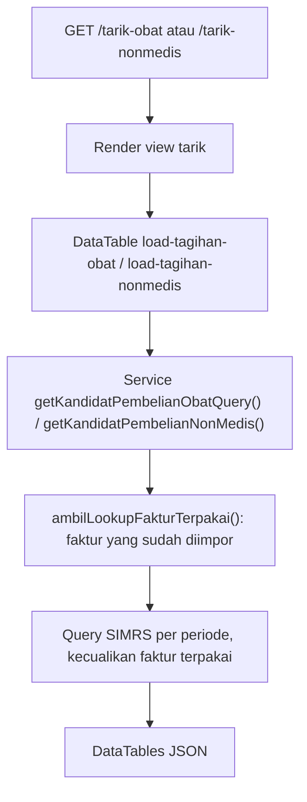
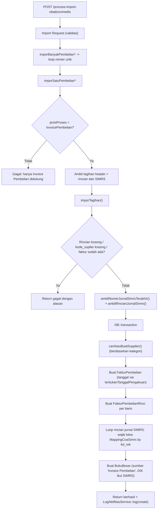
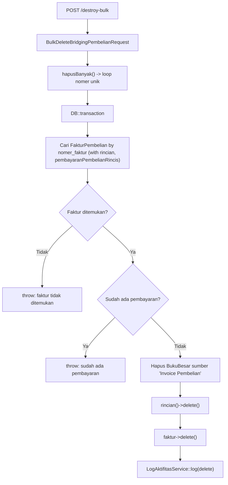

# Dokumentasi Modul Bridging — Pembelian

## Ringkasan Modul

Modul **Bridging Pembelian** digunakan untuk:

1. menarik kandidat tagihan pembelian **Obat & BHP** dan **Barang Non Medis** dari SIMRS,
2. mengimpor tagihan terpilih menjadi **Invoice Pembelian** (`FakturPembelian`),
3. menghapus data hasil import secara massal (dengan proteksi bila sudah ada pembayaran).

Implementasi utama:

- `routes/web.php`
- `app/Http/Controllers/Bridging/BridgingPembelianController.php`
- `app/Http/Requests/Bridging/ImportPembelianObatRequest.php`
- `app/Http/Requests/Bridging/ImportPembelianNonMedisRequest.php`
- `app/Http/Requests/Bridging/BulkDeleteBridgingPembelianRequest.php`
- `app/Services/Bridging/BridgingPembelianService.php`
- `app/Models/FakturPembelian.php`, `app/Models/FakturPembelianRinci.php`, `app/Models/Supplier.php`,
  `app/Models/MappingCoaSimrs.php`, `app/Models/BukuBesar.php`

## Entry Point / API

| Method | Path | Route Name | Controller Method | Izin |
| --- | --- | --- | --- | --- |
| `GET` | `/bridging/pembelian` | `bridging.pembelian.index` | `index()` | view |
| `GET` | `/bridging/pembelian/load-imported-data` | `bridging.pembelian.load-imported-data` | `loadImportedData()` | view |
| `GET` | `/bridging/pembelian/tarik-obat` | `bridging.pembelian.tarik-obat` | `tarikPembelianObat()` | view |
| `GET` | `/bridging/pembelian/load-tagihan-obat` | `bridging.pembelian.load-tagihan-obat` | `loadTagihanObat()` | view |
| `GET` | `/bridging/pembelian/tarik-nonmedis` | `bridging.pembelian.tarik-nonmedis` | `tarikPembelianNonMedis()` | view |
| `GET` | `/bridging/pembelian/load-tagihan-nonmedis` | `bridging.pembelian.load-tagihan-nonmedis` | `loadTagihanNonMedis()` | view |
| `POST` | `/bridging/pembelian/process-import-obat` | `bridging.pembelian.process-import-obat` | `processImportObat()` | update |
| `POST` | `/bridging/pembelian/process-import-nonmedis` | `bridging.pembelian.process-import-nonmedis` | `processImportNonMedis()` | update |
| `POST` | `/bridging/pembelian/destroy-bulk` | `bridging.pembelian.destroy-bulk` | `destroyBulk()` | delete |

## Validasi Request

`ImportPembelianObatRequest` / `ImportPembelianNonMedisRequest`:

- `selectedNoTransaksi` wajib array minimal 1 (item string maks 100),
- `jenisProses` hanya boleh `InvoicePembelian`,
- `metodeTanggalPengakuan` hanya boleh `TanggalInvoice` atau `TanggalBarangDatang`.

`BulkDeleteBridgingPembelianRequest`: `selectedNoTransaksi` wajib array minimal 1 (item string).

## Alur 1: Tarik Kandidat Tagihan dari SIMRS

Dua sumber kandidat dengan pola sama:

- **Obat & BHP**: tabel SIMRS `pemesanan` + `datasuplier` (`loadTagihanObat()`, query builder,
  mendukung pencarian per kolom).
- **Barang Non Medis**: tabel SIMRS `ipsrspemesanan` + `ipsrssuplier` (`loadTagihanNonMedis()`, collection).

## Alur 2: Import ke Invoice Pembelian

Kedua jenis (obat / non medis) berujung pada method bersama `imporTagihan()`.

### Algoritma

1. `imporBanyakPembelianObat()`/`imporBanyakPembelianNonMedis()` loop tiap nomor unik, menangkap error per item.
2. `imporSatuPembelian*()` menolak jenis proses selain `InvoicePembelian`, mengambil header tagihan,
   lalu memanggil `imporTagihan()` dengan kategori supplier/faktur yang sesuai.
3. `imporTagihan()` menolak bila rincian kosong, `kode_suplier` kosong, atau `nomer_faktur` sudah ada.
4. Mengambil nomor jurnal SIMRS terakhir (dari `jurnal` by `no_bukti`) dan rincian jurnal (`detailjurnal`).
5. Dalam transaksi: cari/buat supplier via `cariAtauBuatSupplier()` (mengisi `kategori_supplier`
   bila belum ada), buat `FakturPembelian`, tentukan `tanggal_faktur` via `tentukanTanggalPengakuan()`.
6. Buat `FakturPembelianRinci` per baris rincian tagihan.
7. Untuk tiap baris jurnal SIMRS, `kd_rek` **wajib** punya `MappingCoaSimrs`; jika tidak, `RuntimeException`.
8. Buat mutasi `BukuBesar` (`sumber_transaksi = 'Invoice Pembelian'`) mengikuti debet/kredit SIMRS.
9. Aktivitas dicatat via `LogAktifitasService::log('Bridging Pembelian', 'create')`.

### Tanggal Pengakuan

- `TanggalBarangDatang`: pakai `tgl_pesan` bila tersedia,
- selain itu (atau `tgl_pesan` kosong): pakai `tgl_faktur`.

## Alur 3: Hapus Massal

### Algoritma

1. Untuk tiap nomor, cari faktur beserta rincian dan rincian pembayaran.
2. Bila faktur tidak ada, gagal. Bila **sudah ada pembayaran**, hapus ditolak.
3. Hapus mutasi buku besar sumber `Invoice Pembelian`, hapus rincian faktur, lalu faktur.

## Fungsi yang Dipanggil

- `BridgingPembelianController::index()/loadImportedData()/tarikPembelianObat()/loadTagihanObat()`
- `BridgingPembelianController::tarikPembelianNonMedis()/loadTagihanNonMedis()/processImportObat()/processImportNonMedis()/destroyBulk()`
- `BridgingPembelianController::resolveDateRange()` + helper pencarian DataTable (private)
- `BridgingPembelianService::getQueryHasilImport()/getKandidatPembelianObat()/getKandidatPembelianObatQuery()/getKandidatPembelianNonMedis()`
- `BridgingPembelianService::imporBanyakPembelianObat()/imporBanyakPembelianNonMedis()/hapusBanyak()`
- `BridgingPembelianService::imporSatuPembelianObat()/imporSatuPembelianNonMedis()/imporTagihan()` (private)
- `BridgingPembelianService::cariAtauBuatSupplier()/tentukanTanggalPengakuan()/buatKeteranganFaktur()` (private)
- `BridgingPembelianService::ambilTagihan*()/ambilRincianTagihan*()/ambilNomerJurnalSimrsTerakhir()/ambilRincianJurnalSimrs()` (private)
- `BukuBesarService::resolvePeriode()` (static), `LogAktifitasService::log()`
- `FakturPembelian::scopeBetweenDates()`, `MappingCoaSimrs::query()`

## Catatan Penting Bisnis

- Saat ini hanya import ke **Invoice Pembelian** yang didukung.
- Faktur dengan `nomer_faktur` yang sudah ada tidak diimpor ulang; kandidat yang sudah dipakai
  dikecualikan dari daftar tarik.
- Mutasi buku besar **mengikuti jurnal SIMRS** apa adanya; setiap `kd_rek` wajib punya `MappingCoaSimrs`.
- Supplier dibuat otomatis bila belum ada (berdasarkan `kode_supplier` + `nama_supplier`), dengan
  kategori `Obat & BHP` atau `Barang Non Medis`.
- Hapus massal **ditolak** bila faktur sudah memiliki pembayaran (`pembayaranPembelianRincis`).
- Lihat [Integrasi SIMRS](fondasi/integrasi-simrs.md), [Pembelian — Invoice](pembelian-invoice.md),
  dan [Pembelian — Pembayaran](pembelian-pembayaran.md).
