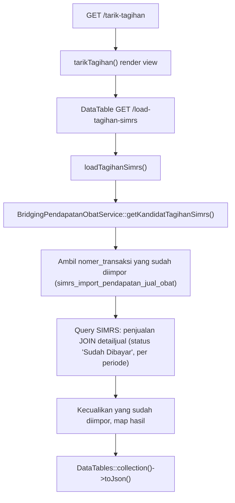
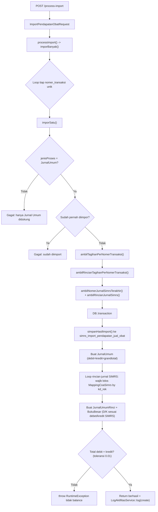
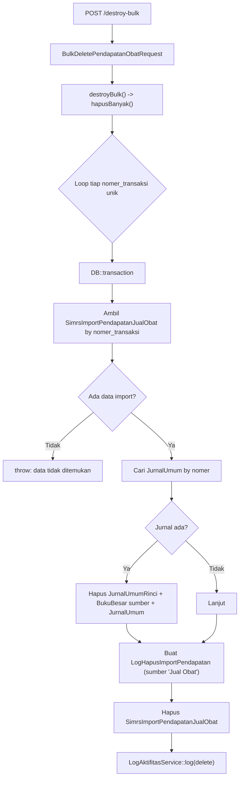

# Dokumentasi Modul Bridging — Pendapatan Obat

## Ringkasan Modul

Modul **Bridging Pendapatan Obat** digunakan untuk:

1. menarik kandidat tagihan penjualan obat & BHP dari SIMRS,
2. mengimpor transaksi terpilih menjadi **Jurnal Umum**,
3. menghapus data hasil import secara massal.

Implementasi utama:

- `routes/web.php`
- `app/Http/Controllers/Bridging/BridgingPendapatanObatController.php`
- `app/Http/Requests/Bridging/ImportPendapatanObatRequest.php`
- `app/Http/Requests/Bridging/BulkDeletePendapatanObatRequest.php`
- `app/Services/Bridging/BridgingPendapatanObatService.php`
- `app/Models/SimrsImportPendapatanJualObat.php`, `app/Models/MappingCoaSimrs.php`,
  `app/Models/JurnalUmum.php`, `app/Models/JurnalUmumRinci.php`, `app/Models/BukuBesar.php`,
  `app/Models/LogHapusImportPendapatan.php`

## Entry Point / API

| Method | Path | Route Name | Controller Method | Izin |
| --- | --- | --- | --- | --- |
| `GET` | `/bridging/pendapatan-obat` | `bridging.pendapatan-obat.index` | `index()` | view |
| `GET` | `/bridging/pendapatan-obat/load-imported-data` | `bridging.pendapatan-obat.load-imported-data` | `loadImportedData()` | view |
| `GET` | `/bridging/pendapatan-obat/tarik-tagihan` | `bridging.pendapatan-obat.tarik-tagihan` | `tarikTagihan()` | view |
| `GET` | `/bridging/pendapatan-obat/load-tagihan-simrs` | `bridging.pendapatan-obat.load-tagihan-simrs` | `loadTagihanSimrs()` | view |
| `POST` | `/bridging/pendapatan-obat/process-import` | `bridging.pendapatan-obat.process-import` | `processImport()` | update |
| `POST` | `/bridging/pendapatan-obat/destroy-bulk` | `bridging.pendapatan-obat.destroy-bulk` | `destroyBulk()` | delete |

## Validasi Request

`ImportPendapatanObatRequest`:

- `selectedNoTransaksi` wajib array minimal 1,
- `selectedNoTransaksi.*` wajib string maks 100,
- `jenisProses` hanya boleh `JurnalUmum`.

`BulkDeletePendapatanObatRequest`: `selectedNoTransaksi` wajib array minimal 1 (item string).

## Alur 1: Tarik Kandidat Tagihan dari SIMRS

### Flowchart

### Algoritma

1. `getKandidatTagihanSimrs()` mengambil daftar `nomer_transaksi` yang sudah diimpor pada periode itu.
2. Query ke koneksi `simrs` mengambil header penjualan (`penjualan`) + agregasi subtotal dari
   `detailjual`, hanya status `Sudah Dibayar`, `grandtotal = SUM(subtotal) + ongkir + ppn`.
3. Baris yang sudah pernah diimpor dikecualikan (`reject`), sisanya dipetakan ke array kandidat.

## Alur 2: Import ke Jurnal Umum

### Flowchart

### Algoritma

1. `imporBanyak()` melakukan loop tiap `nomer_transaksi` unik, memanggil `imporSatu()`, menangkap
   error per transaksi ke dalam hasil.
2. `imporSatu()` menolak jenis proses selain `JurnalUmum` dan menolak transaksi yang sudah diimpor.
3. Service mengambil header tagihan, rincian tagihan, nomor jurnal SIMRS terakhir (dari `jurnal` by
   `no_bukti`), dan rincian jurnal SIMRS (dari `detailjurnal`).
4. Dalam transaksi: simpan log import, buat `JurnalUmum` dengan `debit = kredit = grandtotal`.
5. Untuk tiap baris jurnal SIMRS, kode rekening (`kd_rek`) **wajib** punya `MappingCoaSimrs`; bila
   tidak ada, `RuntimeException` dilempar.
6. Buat `JurnalUmumRinci` dan mutasi `BukuBesar` (`sumber_transaksi = 'Jurnal Umum'`) dengan arah
   `D`/`K` mengikuti nilai debet/kredit SIMRS.
7. Bila total debit ≠ kredit (toleransi `0.01`), transaksi digagalkan.
8. Aktivitas dicatat via `LogAktifitasService::log('Bridging Pendapatan Obat', 'create')`.

## Alur 3: Hapus Massal

### Flowchart

## Fungsi yang Dipanggil

- `BridgingPendapatanObatController::index()/loadImportedData()/tarikTagihan()/loadTagihanSimrs()/processImport()/destroyBulk()`
- `BridgingPendapatanObatController::resolveDateRange()/applyDataTableSearch()` (private)
- `BridgingPendapatanObatService::getQueryDataImport()/getKandidatTagihanSimrs()/imporBanyak()/hapusBanyak()`
- `BridgingPendapatanObatService::imporSatu()/simpanHasilImport()/buatKeteranganJurnal()` (private)
- `BridgingPendapatanObatService::ambilTagihanPerNomerTransaksi()/ambilRincianTagihanPerNomerTransaksi()` (private)
- `BridgingPendapatanObatService::ambilNomerJurnalSimrsTerakhir()/ambilRincianJurnalSimrs()/formatNominal()` (private)
- `BukuBesarService::resolvePeriode()` (static)
- `LogAktifitasService::log()`
- `MappingCoaSimrs::query()`, `SimrsImportPendapatanJualObat::scopeBetweenDates()`

## Catatan Penting Bisnis

- Saat ini hanya import ke **Jurnal Umum** yang didukung (`jenisProses = JurnalUmum`).
- Transaksi yang sudah diimpor tidak dapat diimpor ulang (dicek pada `simrs_import_pendapatan_jual_obat`).
- Jurnal lokal **mengikuti jurnal SIMRS** apa adanya, tetapi setiap `kd_rek` wajib punya
  `MappingCoaSimrs` agar COA konsisten; jika belum dipetakan, import gagal.
- Import digagalkan bila total debit ≠ kredit (toleransi `0.01`).
- Hapus massal menghapus jurnal + rincian + mutasi buku besar terkait, mencatat
  `LogHapusImportPendapatan` (sumber `Jual Obat`), lalu menghapus data import.
- Lihat [Integrasi SIMRS](fondasi/integrasi-simrs.md) dan [Konvensi Buku Besar & COA](fondasi/konvensi-bukubesar-coa.md).
