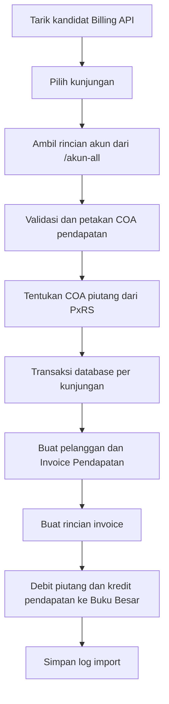

# Dokumentasi Modul Bridging Pendapatan

## Ringkasan

Modul Bridging Pendapatan menarik kunjungan pasien dari Billing API dan membuat:

1. Invoice Pendapatan;
2. rincian invoice berdasarkan akun pendapatan dari endpoint `/akun-all`;
3. mutasi debit dan kredit pada Buku Besar; dan
4. log import pada `simrs_import_pendapatan`.

Bridging Pendapatan tidak membuat Jurnal Umum. Tanggal invoice dan Buku Besar selalu menggunakan tanggal registrasi dari Billing API.

## Endpoint Aplikasi

| Method | Path | Kegunaan |
| --- | --- | --- |
| `GET` | `/bridging/pendapatan` | Daftar hasil import |
| `GET` | `/bridging/pendapatan/load-imported-data` | DataTable hasil import |
| `GET` | `/bridging/pendapatan/export-csv` | Export hasil import |
| `GET` | `/bridging/pendapatan/tarik-simrs` | Halaman kandidat Billing API |
| `GET` | `/bridging/pendapatan/load-billing-simrs` | Memuat kandidat Billing API |
| `POST` | `/bridging/pendapatan/process-import` | Membuat Invoice Pendapatan |
| `POST` | `/bridging/pendapatan/destroy-bulk` | Menghapus hasil import invoice |

## Alur Tarik dan Import

Request import berisi `selectedExternalIds`, rentang tanggal, jenis layanan, serta filter dokter/spesialis. Tujuan import dan basis tanggal tidak dikirim dari form karena keduanya tetap: Invoice Pendapatan dan tanggal registrasi.

Setiap kunjungan diproses dalam transaksi tersendiri. Kegagalan satu kunjungan tidak membatalkan kunjungan lain, tetapi tidak boleh meninggalkan pelanggan, invoice, rincian, Buku Besar, atau log import parsial.

## Pemetaan Penjamin dan COA

Field `PxRS` dari Billing API ditampilkan dan disimpan sebagai Penjamin. Nilainya dinormalisasi dengan trim dan perbandingan tanpa membedakan kapital:

| Nilai `PxRS` | Nama COA piutang |
| --- | --- |
| Kosong atau `U/Px` | `Piutang Pasien Umum` |
| `BPJS` | `Piutang Pasien BPJS Kesehatan` |
| Nilai lainnya | `Piutang Asuransi (Non BPJS Kesehatan)` |

COA piutang dicari berdasarkan nama persis dan harus unik, aktif, postable, leaf, serta memiliki tipe COA yang mengandung kata `piutang`.

Setiap kode `akun` dari `/akun-all` dicocokkan ke `coa.kode` setelah trim. COA tersebut harus unik, aktif, postable, leaf, dan bertipe pendapatan. Baris positif dikreditkan dan baris negatif dibalik ke debit.

Pelanggan dibentuk dengan nomor rawat sebagai `kode_pelanggan` dan nama pasien sebagai `nama_pelanggan`. NIK tidak digunakan.

## Penyimpanan Invoice dan Buku Besar

- `nomor_faktur` dan `nomer_rawat` menggunakan nomor rawat.
- `tanggal_faktur` dan `tanggal_registrasi` menggunakan tanggal registrasi.
- `grandtotal` merupakan total bersih seluruh `biaya × jml`.
- `sudah_terbayar` dan `status_proses` dimulai dari `0`.
- `akun_piutang_id` menunjuk COA hasil pemetaan `PxRS`.
- `simrs_import_pendapatan.import_ke` selalu berisi `Invoice Pendapatan`.
- Buku Besar memakai sumber transaksi `Invoice Pendapatan` dan harus balance sebelum disimpan.

## Penghapusan

Penghapusan hasil bridging menghapus Buku Besar bersumber `Invoice Pendapatan`, rincian invoice, header invoice, dan log import terkait. Jurnal Umum dengan nomor yang sama tidak boleh diubah atau dihapus.
