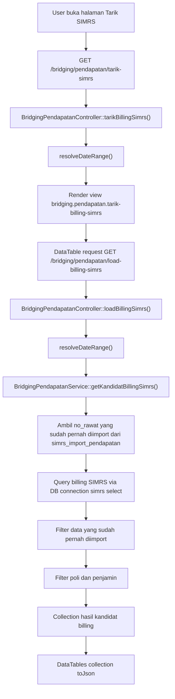
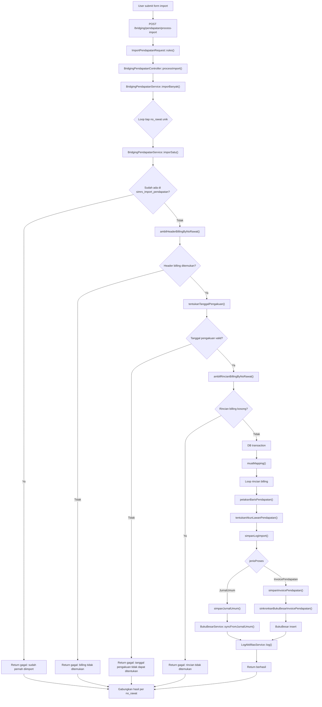
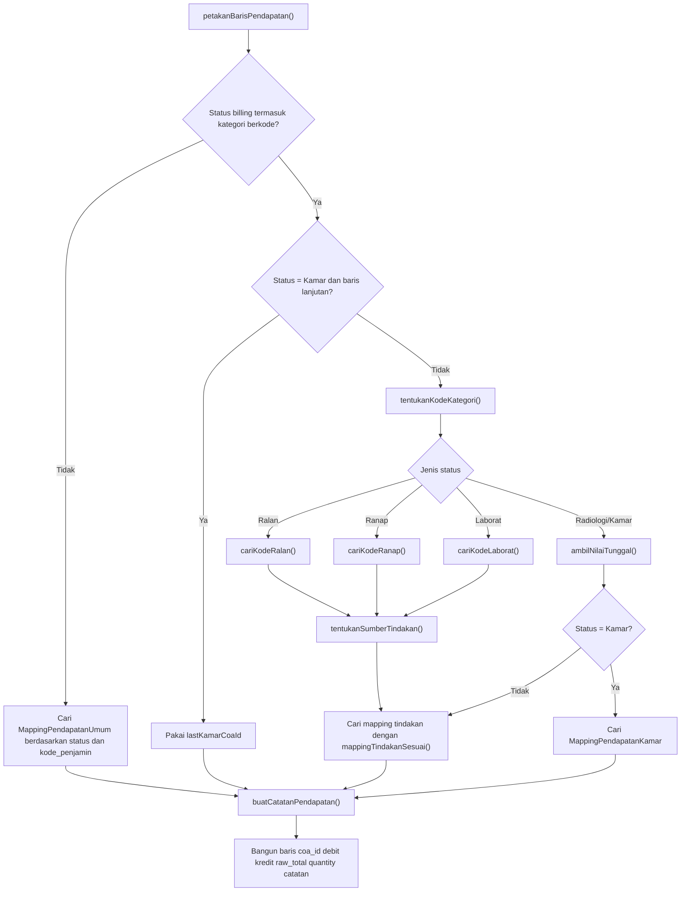
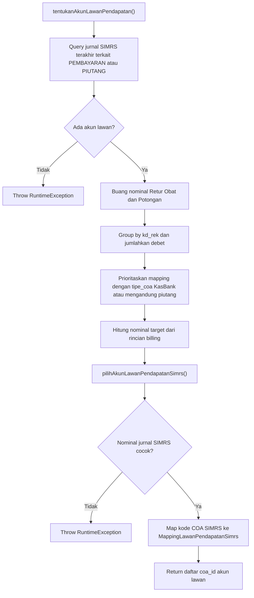
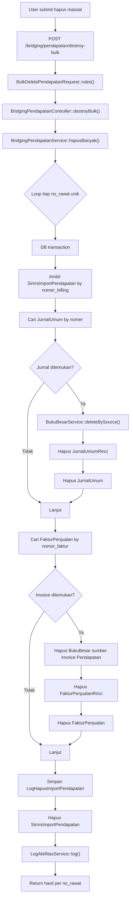
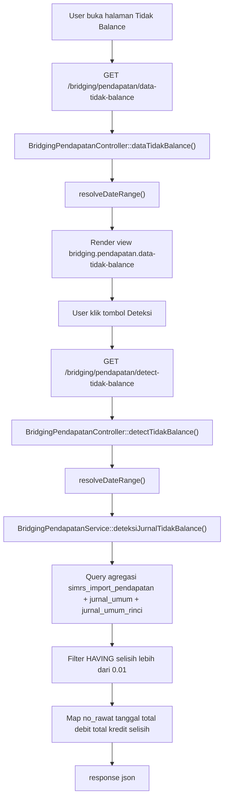

# Dokumentasi Flowchart Modul Bridging Pendapatan

## Ringkasan Modul

Modul **Bridging Pendapatan** digunakan untuk:

1. menarik kandidat billing pasien dari database SIMRS,
2. mengimpor billing terpilih menjadi **Jurnal Umum** atau **Invoice Pendapatan**,
3. menghapus data hasil import secara massal,
4. mendeteksi jurnal hasil bridging yang tidak balance.

Implementasi utama modul ini berada di:

- `routes/web.php`
- `app/Http/Controllers/Bridging/BridgingPendapatanController.php`
- `app/Http/Requests/Bridging/ImportPendapatanRequest.php`
- `app/Http/Requests/Bridging/BulkDeletePendapatanRequest.php`
- `app/Services/Bridging/BridgingPendapatanService.php`

## Entry Point / API

| Method | Path | Route Name | Controller Method |
| --- | --- | --- | --- |
| `GET` | `/bridging/pendapatan` | `bridging.pendapatan.index` | `index()` |
| `GET` | `/bridging/pendapatan/load-imported-data` | `bridging.pendapatan.load-imported-data` | `loadImportedData()` |
| `GET` | `/bridging/pendapatan/tarik-simrs` | `bridging.pendapatan.tarik-billing-simrs` | `tarikBillingSimrs()` |
| `GET` | `/bridging/pendapatan/load-billing-simrs` | `bridging.pendapatan.load-billing-simrs` | `loadBillingSimrs()` |
| `POST` | `/bridging/pendapatan/process-import` | `bridging.pendapatan.process-import` | `processImport()` |
| `POST` | `/bridging/pendapatan/destroy-bulk` | `bridging.pendapatan.destroy-bulk` | `destroyBulk()` |
| `GET` | `/bridging/pendapatan/data-tidak-balance` | `bridging.pendapatan.data-tidak-balance` | `dataTidakBalance()` |
| `GET` | `/bridging/pendapatan/detect-tidak-balance` | `bridging.pendapatan.detect-tidak-balance` | `detectTidakBalance()` |

## Alur 1: Tarik Kandidat Billing dari SIMRS

### Flowchart

### Algoritma

1. User membuka halaman tarik billing melalui `tarikBillingSimrs()`.
2. Controller memanggil `resolveDateRange()` untuk menentukan `startDate` dan `endDate`.
3. View `bridging.pendapatan.tarik-billing-simrs` ditampilkan.
4. DataTable pada halaman memanggil endpoint `loadBillingSimrs()`.
5. Controller kembali memanggil `resolveDateRange()`.
6. Controller memanggil `BridgingPendapatanService::getKandidatBillingSimrs($startDate, $endDate, $poli, $penjamin)`.
7. Service membaca daftar `nomer_billing` yang sudah ada pada tabel `simrs_import_pendapatan`.
8. Service menjalankan query ke koneksi `simrs` untuk mengambil header billing pasien yang sudah bayar.
9. Hasil query difilter agar:
   - data yang sudah pernah diimport tidak ikut muncul,
   - filter `poli` dan `penjamin` ikut diterapkan.
10. Hasil dikirim kembali ke DataTable dalam format JSON.

### Fungsi yang Dipanggil

- `BridgingPendapatanController::tarikBillingSimrs()`
- `BridgingPendapatanController::loadBillingSimrs()`
- `BridgingPendapatanController::resolveDateRange()`
- `BridgingPendapatanService::getKandidatBillingSimrs()`
- `SimrsImportPendapatan::query()->pluck()`
- `DB::connection('simrs')->select()`
- `DataTables::collection()->toJson()`

## Alur 2: Import Billing ke Jurnal Umum / Invoice Pendapatan

### Validasi Request

Sebelum import dijalankan, `ImportPendapatanRequest` memvalidasi:

- `selectedNoRawat` wajib berupa array dan minimal 1 data,
- `selectedNoRawat.*` wajib string,
- `jenisProses` hanya boleh `JurnalUmum` atau `InvoicePendapatan`,
- `basisTanggalPengakuan` hanya boleh `TanggalRegistrasi` atau `TanggalKeluarRanap`.

### Flowchart Utama

### Flowchart Subproses Mapping Pendapatan

### Flowchart Subproses Akun Lawan Pendapatan

### Algoritma Langkah demi Langkah

1. User memilih satu atau lebih `no_rawat`, tujuan import, dan basis tanggal pengakuan.
2. Request masuk ke `processImport()`.
3. `ImportPendapatanRequest` melakukan validasi input.
4. Controller memanggil `BridgingPendapatanService::imporBanyak()`.
5. `imporBanyak()` melakukan loop terhadap setiap `no_rawat` unik, lalu memanggil `imporSatu()`.
6. `imporSatu()` memeriksa apakah `nomer_billing` sudah ada di tabel `simrs_import_pendapatan`.
7. Jika sudah ada, proses untuk `no_rawat` tersebut langsung gagal tanpa melanjutkan import.
8. Jika belum ada, service mengambil header billing melalui `ambilHeaderBillingByNoRawat()`.
9. Service menentukan tanggal pengakuan dengan `tentukanTanggalPengakuan()`.
10. Jika basis yang dipilih `TanggalKeluarRanap` dan pasien `Ranap`, service mencari tanggal keluar menggunakan `ambilNilaiTunggal()`. Jika tidak ada, fallback ke tanggal registrasi.
11. Service mengambil rincian billing dengan `ambilRincianBillingByNoRawat()`.
12. Jika rincian kosong, proses dihentikan untuk `no_rawat` tersebut.
13. Service membuka `DB::transaction(...)`.
14. Service memuat seluruh mapping yang dibutuhkan melalui `muatMapping()`, yaitu:
    - `MappingPendapatan`,
    - `MappingPendapatanUmum`,
    - `MappingPendapatanKamar`,
    - `MappingLawanPendapatanSimrs`,
    - `Coa`.
15. Service melakukan loop semua rincian billing dan memanggil `petakanBarisPendapatan()` pada tiap baris.
16. Di dalam `petakanBarisPendapatan()`, sistem menentukan apakah status billing termasuk kategori yang butuh kode tindakan/kode kamar atau cukup memakai mapping umum.
17. Jika butuh kode kategori, service memanggil `tentukanKodeKategori()`.
18. `tentukanKodeKategori()` akan memanggil salah satu fungsi berikut sesuai status:
    - `cariKodeRalan()`,
    - `cariKodeRanap()`,
    - `cariKodeLaborat()`,
    - `ambilNilaiTunggal()`.
19. Untuk tindakan rawat inap, `cariKodeRanap()` mencari kode pada `no_rawat` utama terlebih dahulu. Jika tidak ditemukan, pencarian dilanjutkan ke episode anak melalui relasi `ranap_gabung.no_rawat2`.
20. Untuk laboratorium, `cariKodeLaborat()` juga mencari pada `no_rawat` utama terlebih dahulu, kemudian memakai fallback `ranap_gabung.no_rawat2` jika kode belum ditemukan.
21. Jika status bukan `Kamar`, service menentukan sumber tindakan melalui `tentukanSumberTindakan()`, lalu mencari mapping yang cocok dengan `mappingTindakanSesuai()`.
22. Jika status `Kamar`, service bisa memakai `lastKamarCoaId` untuk baris lanjutan, atau mencari `MappingPendapatanKamar` untuk baris utama.
23. Setelah COA ditemukan, service membentuk baris pendapatan berisi `coa_id`, `debit`, `kredit`, `raw_total`, `quantity`, dan `catatan` dengan bantuan `buatCatatanPendapatan()`.
24. Setelah seluruh rincian terpetakan, service menentukan akun lawan dengan `tentukanAkunLawanPendapatan()`.
25. Fungsi ini mengambil detail jurnal SIMRS terakhir yang berkaitan dengan `PEMBAYARAN` atau `PIUTANG`, membuang nominal `Retur Obat` dan `Potongan`, lalu mengelompokkan akun berdasarkan `kd_rek`.
26. `prioritaskanAkunLawanKasAtauPiutang()` memetakan `kd_rek` SIMRS ke COA lokal dan, bila tersedia, hanya mempertahankan akun dengan `tipe_coa = KasBank` atau `tipe_coa` yang mengandung teks `piutang` (pencocokan tanpa membedakan huruf besar/kecil). Prefix kode COA tidak digunakan untuk klasifikasi ini. Jika tidak ada akun dengan tipe tersebut, seluruh kandidat akun tetap dipakai.
27. Kombinasi akun final dipilih melalui `pilihAkunLawanPendapatanSimrs()`.
28. Jika mapping akun lawan SIMRS ke COA lokal belum ada, service melempar `RuntimeException`.
29. Setelah semua validasi lolos, service menyimpan log import ke `simrs_import_pendapatan` melalui `simpanLogImport()`.
30. Jika `jenisProses = InvoicePendapatan`, service memanggil `simpanInvoicePendapatan()`.
31. Di dalam `simpanInvoicePendapatan()`, service:
    - memastikan pelanggan tersedia lewat `cariAtauBuatPelanggan()`,
    - menghitung `sudah_terbayar`,
    - menentukan `akun_piutang_id` bila lawan murni piutang,
    - membuat `FakturPenjualan`,
    - membuat `FakturPenjualanRinci`,
    - memanggil `sinkronkanBukuBesarInvoicePendapatan()`.
32. `sinkronkanBukuBesarInvoicePendapatan()` menghapus buku besar lama untuk sumber yang sama, lalu mengisi ulang mutasi melalui `BukuBesar::insert(...)`.
33. Jika `jenisProses = JurnalUmum`, service memanggil `simpanJurnalUmum()`.
34. `simpanJurnalUmum()` membuat `JurnalUmum`, membuat `JurnalUmumRinci` untuk baris pendapatan dan akun lawan, mengecek keseimbangan debit-kredit, lalu memanggil `BukuBesarService::syncFromJurnalUmum(...)`.
35. Setelah proses utama selesai, service mencatat aktivitas dengan `LogAktifitasService::log(...)`.
36. `imporSatu()` mengembalikan hasil sukses atau gagal per `no_rawat`.
37. `imporBanyak()` menggabungkan semua hasil dan controller menyimpannya ke session flash.

### Fungsi yang Dipanggil

#### Controller dan Request

- `ImportPendapatanRequest::rules()`
- `ImportPendapatanRequest::messages()`
- `BridgingPendapatanController::processImport()`
- `BridgingPendapatanService::imporBanyak()`

#### Service Import Utama

- `BridgingPendapatanService::imporBanyak()`
- `BridgingPendapatanService::imporSatu()`
- `BridgingPendapatanService::ambilHeaderBillingByNoRawat()`
- `BridgingPendapatanService::tentukanTanggalPengakuan()`
- `BridgingPendapatanService::ambilRincianBillingByNoRawat()`
- `BridgingPendapatanService::muatMapping()`
- `BridgingPendapatanService::petakanBarisPendapatan()`
- `BridgingPendapatanService::tentukanAkunLawanPendapatan()`
- `BridgingPendapatanService::simpanLogImport()`
- `BridgingPendapatanService::simpanJurnalUmum()`
- `BridgingPendapatanService::simpanInvoicePendapatan()`
- `BridgingPendapatanService::sinkronkanBukuBesarInvoicePendapatan()`
- `LogAktifitasService::log()`

#### Subfungsi Mapping Pendapatan

- `BridgingPendapatanService::tentukanKodeKategori()`
- `BridgingPendapatanService::cariKodeRalan()`
- `BridgingPendapatanService::cariKodeRanap()`
- `BridgingPendapatanService::cariKodeLaborat()`
- `BridgingPendapatanService::ambilNilaiTunggal()`
- `BridgingPendapatanService::tentukanSumberTindakan()`
- `BridgingPendapatanService::mappingTindakanSesuai()`
- `BridgingPendapatanService::buatCatatanPendapatan()`
- `BridgingPendapatanService::normalisasiNamaPerawatan()`
- `BridgingPendapatanService::formatTeksTebal()`

#### Subfungsi Akun Lawan dan Buku Besar

- `BridgingPendapatanService::prioritaskanAkunLawanKasAtauPiutang()`
- `BridgingPendapatanService::pilihAkunLawanPendapatanSimrs()`
- `BridgingPendapatanService::normalisasiBarisNominal()`
- `BridgingPendapatanService::cariAtauBuatPelanggan()`
- `BridgingPendapatanService::buatNarasi()`
- `BukuBesarService::syncFromJurnalUmum()`
- `BukuBesarService::resolvePeriode()`

## Alur 3: Hapus Massal Hasil Import

### Validasi Request

`BulkDeletePendapatanRequest` memvalidasi:

- `selectedNoRawat` wajib berupa array dan minimal 1 data,
- `selectedNoRawat.*` wajib string.

### Flowchart

### Algoritma

1. User memilih satu atau lebih data import pada halaman Bridging Pendapatan atau halaman Tidak Balance.
2. Request masuk ke `destroyBulk()`.
3. `BulkDeletePendapatanRequest` memvalidasi input.
4. Controller memanggil `BridgingPendapatanService::hapusBanyak()`.
5. Service melakukan loop pada setiap `no_rawat` unik.
6. Untuk setiap data, service membuka `DB::transaction(...)`.
7. Service mengambil seluruh baris `SimrsImportPendapatan` berdasarkan `nomer_billing`.
8. Service mencari `JurnalUmum` berdasarkan `nomer = no_rawat`.
9. Jika jurnal ditemukan:
   - hapus buku besar melalui `BukuBesarService::deleteBySource('Jurnal Umum', $jurnal->id)`,
   - hapus `rincian()` jurnal,
   - hapus jurnal utama.
10. Service mencari `FakturPenjualan` berdasarkan `nomor_faktur = no_rawat`.
11. Jika invoice ditemukan:
   - hapus data `BukuBesar` dengan `sumber_transaksi = 'Invoice Pendapatan'`,
   - hapus `rincian()` invoice,
   - hapus invoice utama.
12. Untuk setiap baris import yang ditemukan, service membuat `LogHapusImportPendapatan`.
13. Service menghapus semua data `SimrsImportPendapatan` untuk `no_rawat` tersebut.
14. Setelah transaksi sukses, service memanggil `LogAktifitasService::log(...)`.
15. Hasil sukses atau gagal dikembalikan per `no_rawat`.

### Fungsi yang Dipanggil

- `BulkDeletePendapatanRequest::rules()`
- `BulkDeletePendapatanRequest::messages()`
- `BridgingPendapatanController::destroyBulk()`
- `BridgingPendapatanService::hapusBanyak()`
- `SimrsImportPendapatan::query()->where(...)->get()`
- `JurnalUmum::query()->where(...)->first()`
- `BukuBesarService::deleteBySource()`
- `JurnalUmum::rincian()->delete()`
- `FakturPenjualan::query()->where(...)->first()`
- `BukuBesar::query()->where(...)->delete()`
- `FakturPenjualan::rincian()->delete()`
- `LogHapusImportPendapatan::query()->create()`
- `SimrsImportPendapatan::query()->where(...)->delete()`
- `LogAktifitasService::log()`

## Alur 4: Deteksi Jurnal Tidak Balance

### Flowchart

### Algoritma

1. User membuka halaman `dataTidakBalance()`.
2. Controller menentukan periode dengan `resolveDateRange()`.
3. View `bridging.pendapatan.data-tidak-balance` ditampilkan.
4. Saat tombol **Deteksi** diklik, browser memanggil endpoint `detectTidakBalance()`.
5. Controller kembali memanggil `resolveDateRange()`.
6. Controller memanggil `BridgingPendapatanService::deteksiJurnalTidakBalance($startDate, $endDate)`.
7. Service menjalankan query agregasi yang menggabungkan:
   - `simrs_import_pendapatan`,
   - `jurnal_umum`,
   - `jurnal_umum_rinci`.
8. Query hanya mengambil data dengan `import_ke = 'Jurnal Umum'`.
9. Query menghitung total debit dan total kredit per `nomer_billing`.
10. Klausa `HAVING` memfilter hanya jurnal dengan selisih absolut lebih dari `0.01`.
11. Hasil query dipetakan ke format:
    - `no_rawat`,
    - `tanggal_registrasi`,
    - `total_debit`,
    - `total_kredit`,
    - `selisih`.
12. Controller mengirimkan JSON `success = true` beserta data hasil deteksi.

### Fungsi yang Dipanggil

- `BridgingPendapatanController::dataTidakBalance()`
- `BridgingPendapatanController::detectTidakBalance()`
- `BridgingPendapatanController::resolveDateRange()`
- `BridgingPendapatanService::deteksiJurnalTidakBalance()`
- `DB::select()`
- `response()->json()`

## Alur Tambahan: Load Data Import yang Sudah Masuk

Walaupun bukan proses inti import, halaman utama Bridging Pendapatan juga memiliki alur pembacaan data import yang sudah pernah masuk.

### Ringkas Alur

1. User membuka `index()`.
2. Controller memanggil `resolveDateRange()`.
3. Halaman `bridging.pendapatan.index` dirender.
4. DataTable memanggil `loadImportedData()`.
5. Controller memanggil `BridgingPendapatanService::getQueryDataImport(...)`.
6. Query difilter lagi oleh `applyDataTableSearch(...)`.
7. DataTables menambahkan kolom turunan seperti checkbox, tanggal display, total display, dan `grandTotal`.

### Fungsi yang Dipanggil

- `BridgingPendapatanController::index()`
- `BridgingPendapatanController::loadImportedData()`
- `BridgingPendapatanController::resolveDateRange()`
- `BridgingPendapatanController::applyDataTableSearch()`
- `BridgingPendapatanService::getQueryDataImport()`
- `SimrsImportPendapatan::scopeBetweenDates()`
- `DataTables::eloquent()->toJson()`

## Catatan Penting Bisnis

- Import tidak boleh berjalan dua kali untuk `no_rawat` yang sama karena dicek terlebih dahulu di `simrs_import_pendapatan`.
- Mapping pendapatan harus lengkap sebelum jurnal atau invoice dibuat, karena validasi mapping dijalankan lebih dulu untuk seluruh rincian billing.
- Status `Kamar` memiliki perlakuan khusus karena dapat menggunakan `lastKamarCoaId` untuk baris lanjutan.
- Nominal `Retur Obat` dan `Potongan` dikeluarkan dari pencarian akun lawan agar tidak menyebabkan mismatch dengan jurnal SIMRS.
- Tindakan rawat inap dan laboratorium yang berasal dari episode gabungan tetap dapat dipetakan melalui fallback relasi `ranap_gabung`.
- Prioritas akun lawan kas/piutang mengikuti `tipe_coa` lokal (`KasBank` atau mengandung `piutang`); kode/prefix COA tidak menjadi dasar klasifikasi.
- Pada cabang `Jurnal Umum`, service akan menghentikan proses bila total debit dan kredit tidak balance.
- Pada cabang `Invoice Pendapatan`, sinkronisasi buku besar dilakukan manual melalui `sinkronkanBukuBesarInvoicePendapatan()`, bukan melalui `syncFromJurnalUmum()`.
