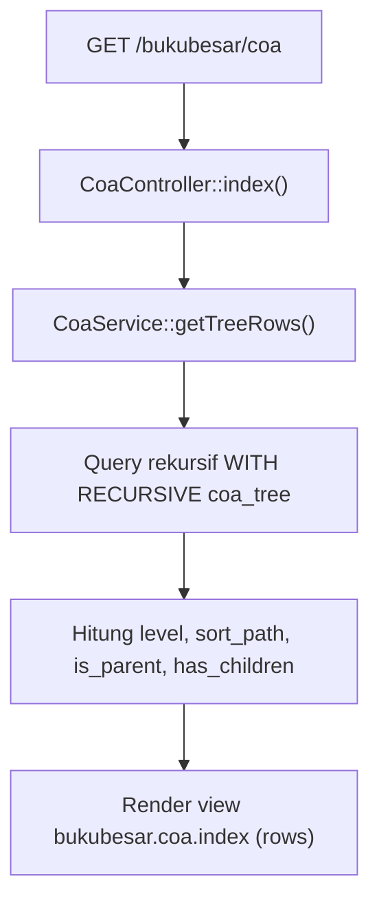
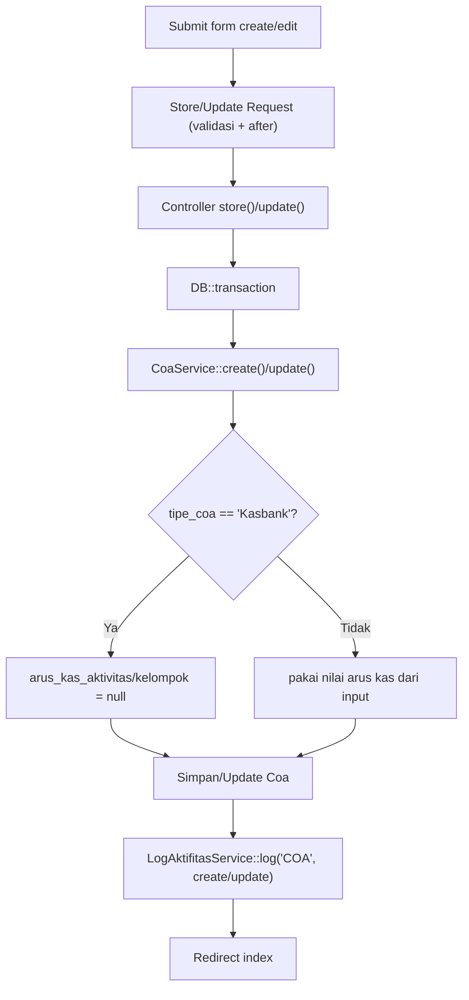
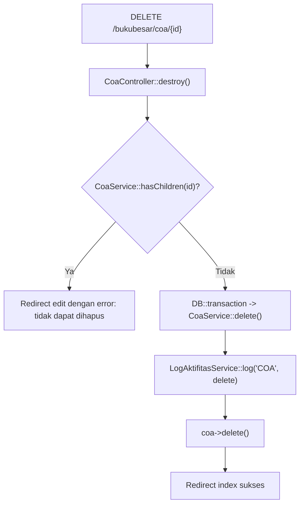

# Dokumentasi Modul Bukubesar — COA

## Ringkasan Modul

Modul **COA (Chart of Accounts)** digunakan untuk:

1. menampilkan daftar akun dalam struktur pohon (hirarki parent-child),
2. membuat, mengubah, dan menghapus akun,
3. menjaga integritas hirarki (mencegah siklus dan parent tidak valid).

Implementasi utama:

- `routes/web.php`
- `app/Http/Controllers/Bukubesar/CoaController.php`
- `app/Http/Requests/Bukubesar/StoreCoaRequest.php`
- `app/Http/Requests/Bukubesar/UpdateCoaRequest.php`
- `app/Services/Bukubesar/CoaService.php`
- `app/Models/Coa.php`, `app/Models/TipeCoa.php`, `app/Models/BukuBesar.php`

## Entry Point / API

| Method | Path | Route Name | Controller Method | Izin |
| --- | --- | --- | --- | --- |
| `GET` | `/bukubesar/coa` | `bukubesar.coa.index` | `index()` | view |
| `GET` | `/bukubesar/coa/create` | `bukubesar.coa.create` | `create()` | create |
| `POST` | `/bukubesar/coa` | `bukubesar.coa.store` | `store()` | create |
| `GET` | `/bukubesar/coa/{coa}/edit` | `bukubesar.coa.edit` | `edit()` | update |
| `PUT` | `/bukubesar/coa/{coa}` | `bukubesar.coa.update` | `update()` | update |
| `DELETE` | `/bukubesar/coa/{coa}` | `bukubesar.coa.destroy` | `destroy()` | delete |

## Validasi Request

`StoreCoaRequest` / `UpdateCoaRequest` memvalidasi:

- `status_aktif` wajib integer `0` atau `1`,
- `parent_id` opsional, harus ada di `coa`; pada update tidak boleh sama dengan id akun itu sendiri,
- `tipe_coa` wajib string,
- `arus_kas_aktivitas` opsional, salah satu dari `operasi`/`investasi`/`pendanaan`,
- `arus_kas_kelompok` wajib bila `arus_kas_aktivitas` diisi,
- `kode` wajib, maks 20, unik (ignore diri sendiri saat update),
- `nama` wajib, maks 100, unik (ignore diri sendiri saat update),
- `deskripsi` opsional.

Validasi tambahan (`after`):

- **Store & Update**: `parent_id` tidak boleh berupa akun daun yang sudah punya transaksi buku besar
  (`cannotBeSelectedAsParent`).
- **Update**: `parent_id` tidak boleh membentuk siklus hirarki (`wouldCreateHierarchyCycle`).

## Alur 1: Daftar COA (Pohon)

### Flowchart

### Algoritma

1. `index()` memanggil `getTreeRows()`.
2. Service menjalankan query MySQL rekursif (`WITH RECURSIVE`) untuk membangun pohon COA,
   menghitung `level`, `sort_path`, serta flag `is_parent`/`has_children`.
3. Baris hasil dikirim ke view untuk ditampilkan sebagai struktur hirarki.

## Alur 2: Buat / Ubah COA

### Flowchart

### Algoritma

1. Halaman create/edit menyediakan opsi parent (`getParentOptions()`) dan tipe (`getTipeOptions()`).
2. `getParentOptions($excludeId)` mengecualikan akun itu sendiri beserta seluruh turunannya
   (`getDescendantIds()`), dan hanya menampilkan akun yang punya anak atau belum punya mutasi buku besar.
3. Pada create, `is_postable` diset `false`.
4. Bila `tipe_coa = 'Kasbank'`, kolom arus kas dipaksa `null`.
5. Pada update, hanya field yang berubah (`getDirty()`) yang dicatat pada log.

## Alur 3: Hapus COA

### Flowchart

### Algoritma

1. Controller mengecek `hasChildren()`; jika punya anak, hapus ditolak dengan pesan error.
2. Jika tidak, service mencatat log delete lalu menghapus akun.

## Fungsi yang Dipanggil

- `CoaController::index()/create()/store()/edit()/update()/destroy()`
- `CoaService::getTreeRows()/getParentOptions()/getSelectableTransactionOptions()/getTipeOptions()`
- `CoaService::hasChildren()/cannotBeSelectedAsParent()/getDescendantIds()/wouldCreateHierarchyCycle()`
- `CoaService::create()/update()/delete()`
- `LogAktifitasService::log()`
- `Coa` scope: `active()/leaf()/activeLeaf()/selectableTransaction()`
- `TipeCoa::scopeActive()`

## Catatan Penting Bisnis

- Struktur COA bersifat **hirarkis**; akun induk tidak bisa dihapus selama punya turunan.
- Akun daun yang **sudah punya transaksi buku besar** tidak boleh dijadikan parent.
- Perubahan parent tidak boleh membentuk **siklus** hirarki.
- Akun bertipe `Kasbank` tidak menyimpan klasifikasi arus kas (dikosongkan otomatis).
- Hanya akun **daun aktif** yang dapat dipilih pada input transaksi (lihat modul lain yang memakai
  `selectableTransaction()`).
- Lihat [Konvensi Buku Besar & COA](fondasi/konvensi-bukubesar-coa.md).
