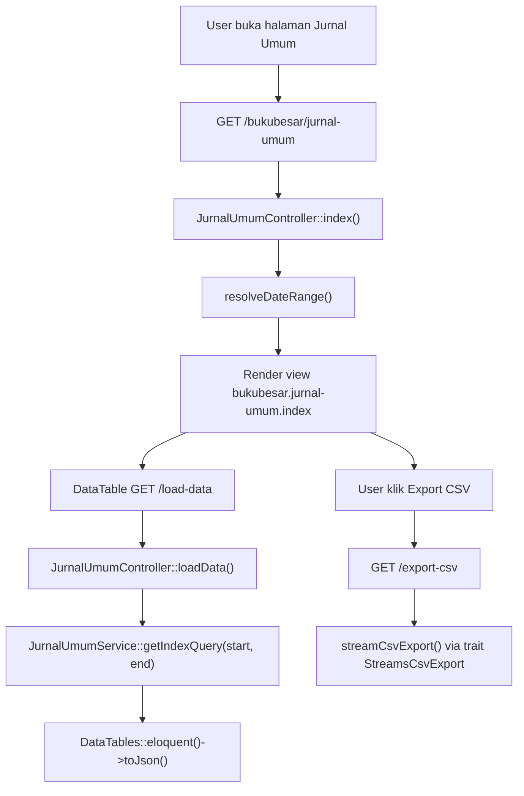
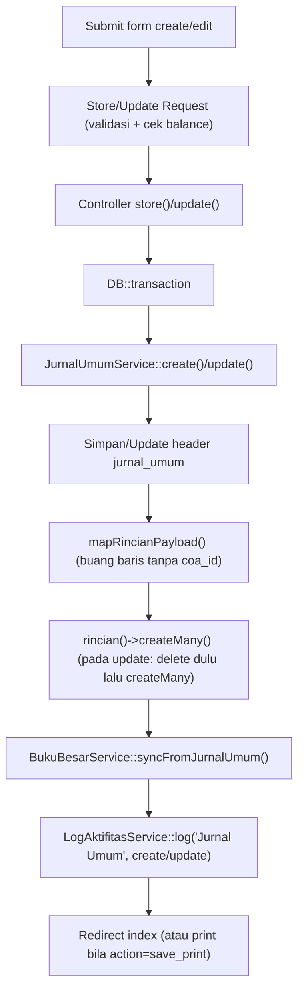
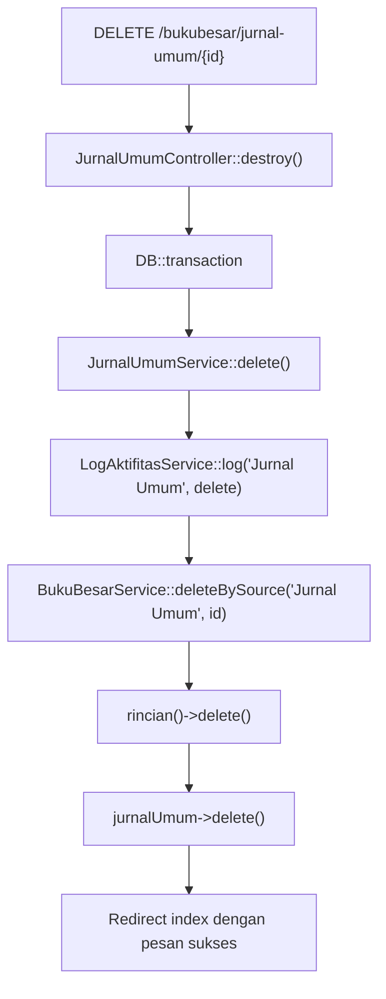

# Dokumentasi Modul Bukubesar — Jurnal Umum

## Ringkasan Modul

Modul **Jurnal Umum** digunakan untuk:

1. mencatat jurnal umum manual (header + rincian debit/kredit),
2. menampilkan daftar jurnal per periode (DataTables) dan mengekspornya ke CSV,
3. mengubah dan menghapus jurnal,
4. mencetak jurnal,
5. menyinkronkan setiap perubahan jurnal ke **Buku Besar**.

Implementasi utama:

- `routes/web.php`
- `app/Http/Controllers/Bukubesar/JurnalUmumController.php`
- `app/Http/Requests/Bukubesar/StoreJurnalUmumRequest.php`
- `app/Http/Requests/Bukubesar/UpdateJurnalUmumRequest.php`
- `app/Services/Bukubesar/JurnalUmumService.php`
- `app/Services/Bukubesar/BukuBesarService.php`
- `app/Models/JurnalUmum.php`, `app/Models/JurnalUmumRinci.php`, `app/Models/Coa.php`

## Entry Point / API

| Method | Path | Route Name | Controller Method | Izin |
| --- | --- | --- | --- | --- |
| `GET` | `/bukubesar/jurnal-umum` | `bukubesar.jurnal-umum.index` | `index()` | view |
| `GET` | `/bukubesar/jurnal-umum/load-data` | `bukubesar.jurnal-umum.load-data` | `loadData()` | view |
| `GET` | `/bukubesar/jurnal-umum/export-csv` | `bukubesar.jurnal-umum.export-csv` | `exportCsv()` | view |
| `GET` | `/bukubesar/jurnal-umum/{jurnalUmum}/print` | `bukubesar.jurnal-umum.print` | `print()` | view |
| `GET` | `/bukubesar/jurnal-umum/create` | `bukubesar.jurnal-umum.create` | `create()` | create |
| `POST` | `/bukubesar/jurnal-umum` | `bukubesar.jurnal-umum.store` | `store()` | create |
| `GET` | `/bukubesar/jurnal-umum/{jurnalUmum}/edit` | `bukubesar.jurnal-umum.edit` | `edit()` | update |
| `PUT` | `/bukubesar/jurnal-umum/{jurnalUmum}` | `bukubesar.jurnal-umum.update` | `update()` | update |
| `DELETE` | `/bukubesar/jurnal-umum/{jurnalUmum}` | `bukubesar.jurnal-umum.destroy` | `destroy()` | delete |

## Validasi Request

`StoreJurnalUmumRequest` / `UpdateJurnalUmumRequest` memvalidasi:

- `nomer` wajib, unik pada tabel `jurnal_umum` (pada update, mengabaikan record saat ini),
- `tanggal` wajib berupa tanggal,
- `keterangan` opsional,
- `debit`, `kredit` wajib numerik `>= 0`,
- `rincian` wajib array minimal 1 baris,
- `rincian.*.coa_id` wajib integer yang ada di tabel `coa`,
- `rincian.*.debit`, `rincian.*.kredit` wajib numerik `>= 0`,
- `rincian.*.catatan` opsional,
- Validasi tambahan (`after`): total `debit` harus sama dengan total `kredit`, jika tidak akan
  menambahkan error pada field `debit`.

## Alur 1: Daftar & Ekspor Jurnal

### Flowchart

### Algoritma

1. `index()` menentukan rentang tanggal via `resolveDateRange()` (default: awal bulan s.d. hari ini).
2. View daftar dirender dengan `startDate`/`endDate`.
3. DataTable memanggil `loadData()` yang mengambil query dari `getIndexQuery()` (urut `tanggal` & `id` desc).
4. Kolom `tanggal` dan `debit` diformat; `nomer_link` menuju halaman edit.
5. Ekspor CSV memvalidasi rentang tanggal lalu men-stream kolom Nomor, Tanggal, Nominal, Keterangan.

## Alur 2: Buat / Ubah Jurnal + Sinkronisasi Buku Besar

### Flowchart

### Algoritma

1. Request tervalidasi, termasuk cek total debit = kredit.
2. Controller membungkus operasi dalam `DB::transaction`.
3. Service menyimpan/memperbarui header `jurnal_umum`.
4. `mapRincianPayload()` menyaring baris tanpa `coa_id`, menormalkan `debit`/`kredit`/`catatan`.
5. Pada create: `rincian()->createMany()`. Pada update: hapus rincian lama lalu `createMany()`.
6. `BukuBesarService::syncFromJurnalUmum()` mengisi ulang mutasi buku besar untuk jurnal ini.
7. Aktivitas dicatat via `LogAktifitasService::log()` (create menyertakan data baru; update menyertakan data lama & baru).
8. Pada `store`, bila `action = save_print`, redirect ke halaman print; selain itu ke index.

## Alur 3: Hapus Jurnal

### Flowchart

### Algoritma

1. Controller memanggil `delete()` dalam transaksi.
2. Service mencatat log delete, menghapus mutasi buku besar sumber `Jurnal Umum`, menghapus rincian, lalu header.

## Alur 4: Cetak Jurnal

1. `print()` mengambil identitas cetak via `PreferensiPerusahaanService::getPrintIdentity()`.
2. View `bukubesar.jurnal-umum.print` dirender dengan data jurnal (beserta `rincian.coa`), nama RS,
   nama petugas (user login), dan tanda tangan direktur/kabag.

## Fungsi yang Dipanggil

- `JurnalUmumController::index()/loadData()/exportCsv()/create()/store()/edit()/update()/destroy()/print()`
- `JurnalUmumController::resolveDateRange()` (private), `sanitizeDateInput()` (private)
- `JurnalUmumService::getIndexQuery()/getCoaOptions()/create()/update()/delete()/mapRincianPayload()`
- `BukuBesarService::syncFromJurnalUmum()/deleteBySource()`
- `LogAktifitasService::log()`
- `PreferensiPerusahaanService::getPrintIdentity()`
- `Coa::scopeSelectableTransaction()`
- `JurnalUmum::scopeBetweenDates()`, `JurnalUmum::rincian()`
- Trait `StreamsCsvExport::streamCsvExport()/csvNumber()`

## Catatan Penting Bisnis

- Jurnal wajib **balance** (total debit = total kredit); validasi dilakukan di Form Request.
- Setiap create/update **menyinkronkan ulang** buku besar secara idempoten (hapus lalu isi ulang).
- Hapus jurnal juga menghapus mutasi buku besar sumber `Jurnal Umum` agar konsisten.
- Baris rincian tanpa `coa_id` diabaikan saat penyimpanan.
- Opsi COA hanya akun **daun aktif** (`selectableTransaction()`).
- Lihat [Konvensi Buku Besar & COA](fondasi/konvensi-bukubesar-coa.md) untuk detail sinkronisasi.
