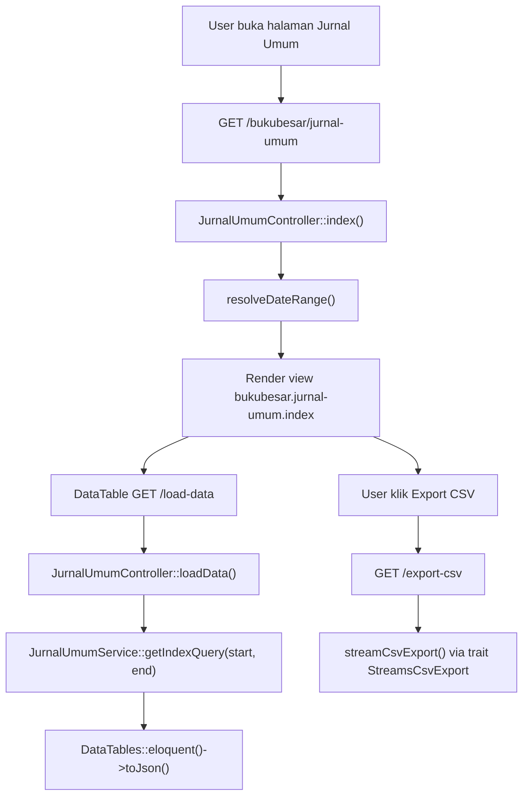
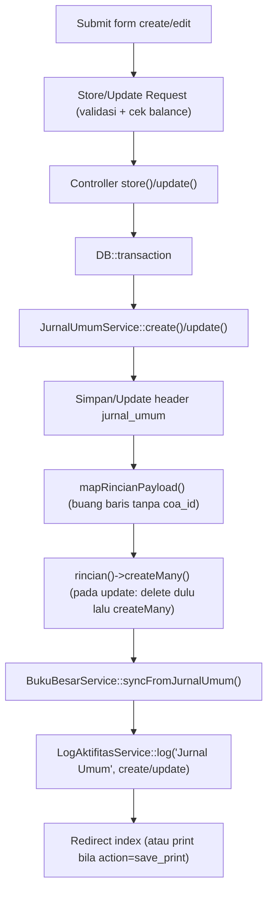
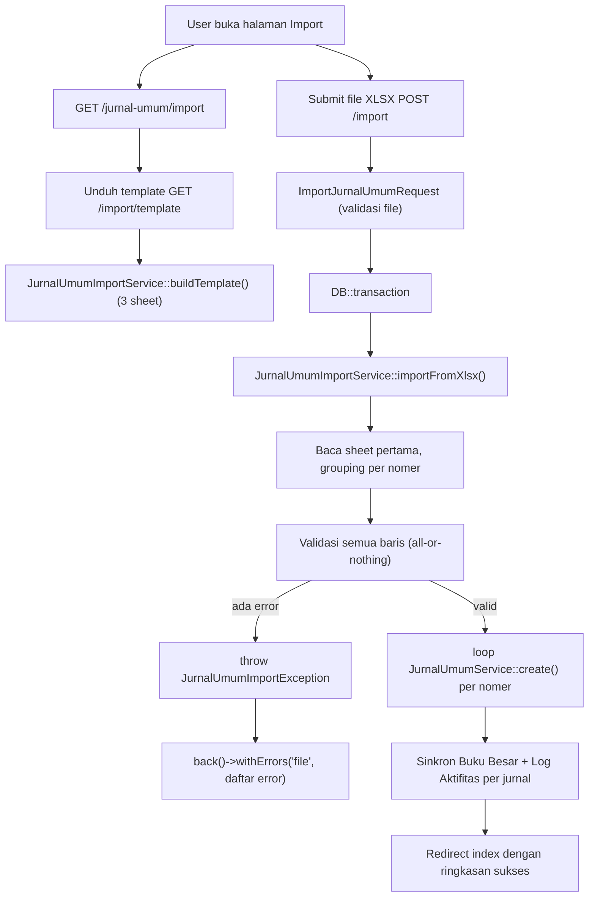
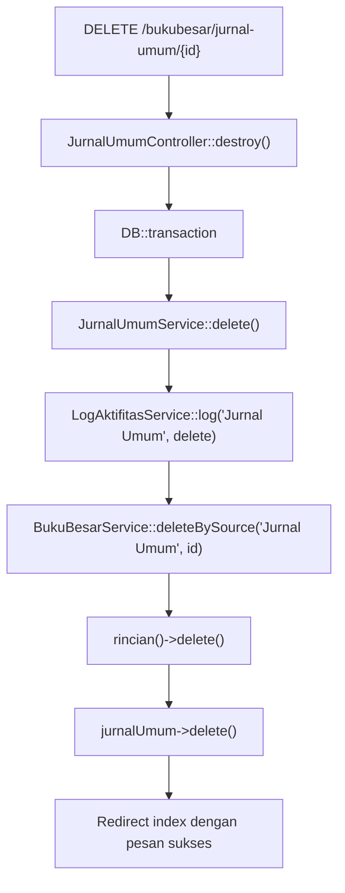

# Dokumentasi Modul Bukubesar — Jurnal Umum

## Ringkasan Modul

Modul **Jurnal Umum** digunakan untuk:

1. mencatat jurnal umum manual (header + rincian debit/kredit),
2. menampilkan daftar jurnal per periode (DataTables) dan mengekspornya ke CSV,
3. mengubah dan menghapus jurnal,
4. mencetak jurnal,
5. mengimpor banyak jurnal sekaligus dari file XLSX (beserta unduhan template),
6. menyinkronkan setiap perubahan jurnal ke **Buku Besar**.

Implementasi utama:

- `routes/web.php`
- `app/Http/Controllers/Bukubesar/JurnalUmumController.php`
- `app/Http/Requests/Bukubesar/StoreJurnalUmumRequest.php`
- `app/Http/Requests/Bukubesar/UpdateJurnalUmumRequest.php`
- `app/Http/Requests/Bukubesar/ImportJurnalUmumRequest.php`
- `app/Services/Bukubesar/JurnalUmumService.php`
- `app/Services/Bukubesar/JurnalUmumImportService.php`
- `app/Services/Bukubesar/JurnalUmumImportException.php`
- `app/Services/Bukubesar/BukuBesarService.php`
- `app/Models/JurnalUmum.php`, `app/Models/JurnalUmumRinci.php`, `app/Models/Coa.php`

## Entry Point / API

| Method | Path | Route Name | Controller Method | Izin |
| --- | --- | --- | --- | --- |
| `GET` | `/bukubesar/jurnal-umum` | `bukubesar.jurnal-umum.index` | `index()` | view |
| `GET` | `/bukubesar/jurnal-umum/load-data` | `bukubesar.jurnal-umum.load-data` | `loadData()` | view |
| `GET` | `/bukubesar/jurnal-umum/export-csv` | `bukubesar.jurnal-umum.export-csv` | `exportCsv()` | view |
| `GET` | `/bukubesar/jurnal-umum/{jurnalUmum}/print` | `bukubesar.jurnal-umum.print` | `print()` | view |
| `GET` | `/bukubesar/jurnal-umum/create` | `bukubesar.jurnal-umum.create` | `create()` | create |
| `POST` | `/bukubesar/jurnal-umum` | `bukubesar.jurnal-umum.store` | `store()` | create |
| `GET` | `/bukubesar/jurnal-umum/import` | `bukubesar.jurnal-umum.import.form` | `importForm()` | create |
| `GET` | `/bukubesar/jurnal-umum/import/template` | `bukubesar.jurnal-umum.import.template` | `importTemplate()` | create |
| `POST` | `/bukubesar/jurnal-umum/import` | `bukubesar.jurnal-umum.import.store` | `import()` | create |
| `GET` | `/bukubesar/jurnal-umum/{jurnalUmum}/edit` | `bukubesar.jurnal-umum.edit` | `edit()` | update |
| `PUT` | `/bukubesar/jurnal-umum/{jurnalUmum}` | `bukubesar.jurnal-umum.update` | `update()` | update |
| `DELETE` | `/bukubesar/jurnal-umum/{jurnalUmum}` | `bukubesar.jurnal-umum.destroy` | `destroy()` | delete |

## Validasi Request

`StoreJurnalUmumRequest` / `UpdateJurnalUmumRequest` memvalidasi:

- `nomer` wajib, unik pada tabel `jurnal_umum` (pada update, mengabaikan record saat ini),
- `tanggal` wajib berupa tanggal,
- `keterangan` opsional,
- `debit`, `kredit` wajib numerik `>= 0`,
- `rincian` wajib array minimal 1 baris,
- `rincian.*.coa_id` wajib integer yang ada di tabel `coa`,
- `rincian.*.debit`, `rincian.*.kredit` wajib numerik `>= 0`,
- `rincian.*.catatan` opsional,
- Validasi tambahan (`after`): total `debit` harus sama dengan total `kredit`, jika tidak akan
  menambahkan error pada field `debit`.

`ImportJurnalUmumRequest` memvalidasi berkas unggahan:

- `file` wajib, bertipe `file`, berformat `xlsx`/`xls`, maksimal 10 MB.

Validasi isi file (dilakukan di `JurnalUmumImportService`, bukan Form Request):

- Setiap baris mewakili satu rincian; baris dengan `nomer` sama digabung menjadi satu jurnal.
- `nomer` wajib, belum ada di tabel `jurnal_umum`, dan tidak boleh duplikat lintas file.
- `kode_coa` wajib dan harus merupakan akun transaksi (`selectableTransaction()` = leaf aktif);
  di-resolve menjadi `coa_id`.
- `tanggal` wajib valid dengan format `YYYY-MM-DD` (diambil dari baris pertama tiap `nomer`).
- `debit`/`kredit` wajib numerik `>= 0`.
- Total `debit` harus sama dengan total `kredit` untuk setiap `nomer`.
- Bersifat **all-or-nothing**: bila ada satu error pun, seluruh import dibatalkan dan tidak ada
  data tersimpan (`JurnalUmumImportException` membawa daftar seluruh pesan error).

### Format File XLSX

Sheet pertama (`Transaksi`) memakai header kolom berurutan:
`nomer`, `tanggal`, `keterangan`, `kode_coa`, `debit`, `kredit`, `catatan`.

Template unduhan (`importTemplate()`) berisi tiga sheet:

1. `Transaksi` — header + baris contoh (JU-001, JU-002) yang harus dihapus sebelum unggah.
2. `Petunjuk` — ringkasan aturan pengisian.
3. `Master COA` — daftar akun transaksi (leaf aktif) berisi kolom `kode` dan `nama`.

## Alur 1: Daftar & Ekspor Jurnal

### Flowchart

```mermaid
flowchart TD
    A["User buka halaman Jurnal Umum"] --> B["GET /bukubesar/jurnal-umum"]
    B --> C["JurnalUmumController::index()"]
    C --> D["resolveDateRange()"]
    D --> E["Render view bukubesar.jurnal-umum.index"]
    E --> F["DataTable GET /load-data"]
    F --> G["JurnalUmumController::loadData()"]
    G --> H["JurnalUmumService::getIndexQuery(start, end)"]
    H --> I["DataTables::eloquent()->toJson()"]
    E --> J["User klik Export CSV"]
    J --> K["GET /export-csv"]
    K --> L["streamCsvExport() via trait StreamsCsvExport"]
```

### Algoritma

1. `index()` menentukan rentang tanggal via `resolveDateRange()` (default: awal bulan s.d. hari ini).
2. View daftar dirender dengan `startDate`/`endDate`.
3. DataTable memanggil `loadData()` yang mengambil query dari `getIndexQuery()` (urut `tanggal` & `id` desc).
4. Kolom `tanggal` dan `debit` diformat; `nomer_link` menuju halaman edit.
5. Ekspor CSV memvalidasi rentang tanggal lalu men-stream kolom Nomor, Tanggal, Nominal, Keterangan.

## Alur 2: Buat / Ubah Jurnal + Sinkronisasi Buku Besar

### Flowchart

```mermaid
flowchart TD
    A["Submit form create/edit"] --> B["Store/Update Request (validasi + cek balance)"]
    B --> C["Controller store()/update()"]
    C --> D["DB::transaction"]
    D --> E["JurnalUmumService::create()/update()"]
    E --> F["Simpan/Update header jurnal_umum"]
    F --> G["mapRincianPayload() (buang baris tanpa coa_id)"]
    G --> H["rincian()->createMany() (pada update: delete dulu lalu createMany)"]
    H --> I["BukuBesarService::syncFromJurnalUmum()"]
    I --> J["LogAktifitasService::log('Jurnal Umum', create/update)"]
    J --> K["Redirect index (atau print bila action=save_print)"]
```

### Algoritma

1. Request tervalidasi, termasuk cek total debit = kredit.
2. Controller membungkus operasi dalam `DB::transaction`.
3. Service menyimpan/memperbarui header `jurnal_umum`.
4. `mapRincianPayload()` menyaring baris tanpa `coa_id`, menormalkan `debit`/`kredit`/`catatan`.
5. Pada create: `rincian()->createMany()`. Pada update: hapus rincian lama lalu `createMany()`.
6. `BukuBesarService::syncFromJurnalUmum()` mengisi ulang mutasi buku besar untuk jurnal ini.
7. Aktivitas dicatat via `LogAktifitasService::log()` (create menyertakan data baru; update menyertakan data lama & baru).
8. Pada `store`, bila `action = save_print`, redirect ke halaman print; selain itu ke index.

## Alur 2b: Import Jurnal dari XLSX

### Flowchart

```mermaid
flowchart TD
    A["User buka halaman Import"] --> B["GET /jurnal-umum/import"]
    B --> C["Unduh template GET /import/template"]
    C --> D["JurnalUmumImportService::buildTemplate() (3 sheet)"]
    A --> E["Submit file XLSX POST /import"]
    E --> F["ImportJurnalUmumRequest (validasi file)"]
    F --> G["DB::transaction"]
    G --> H["JurnalUmumImportService::importFromXlsx()"]
    H --> I["Baca sheet pertama, grouping per nomer"]
    I --> J["Validasi semua baris (all-or-nothing)"]
    J -->|ada error| K["throw JurnalUmumImportException"]
    K --> L["back()->withErrors('file', daftar error)"]
    J -->|valid| M["loop JurnalUmumService::create() per nomer"]
    M --> N["Sinkron Buku Besar + Log Aktifitas per jurnal"]
    N --> O["Redirect index dengan ringkasan sukses"]
```

### Algoritma

1. `importForm()` menampilkan form unggah + tautan unduh template.
2. `importTemplate()` memanggil `buildTemplate()` untuk menghasilkan XLSX (sheet `Transaksi`,
   `Petunjuk`, `Master COA`) lalu mengirimnya sebagai unduhan (`deleteFileAfterSend`).
3. `import()` memvalidasi berkas via `ImportJurnalUmumRequest`, lalu memanggil
   `importFromXlsx()` di dalam `DB::transaction`.
4. Service membaca sheet pertama (lewat baris header), menyaring baris kosong, dan
   mengelompokkan baris per `nomer`.
5. Seluruh baris divalidasi; bila ada error, `JurnalUmumImportException` dilempar dan transaksi
   di-rollback (tidak ada data tersimpan). Controller mengembalikan error ke form.
6. Bila semua valid, tiap grup `nomer` dibuat melalui `JurnalUmumService::create()` sehingga
   rincian, Buku Besar, dan Log Aktifitas tersinkron seperti pembuatan manual.
7. Controller redirect ke index dengan ringkasan jumlah jurnal yang dibuat.

## Alur 3: Hapus Jurnal

### Flowchart

```mermaid
flowchart TD
    A["DELETE /bukubesar/jurnal-umum/{id}"] --> B["JurnalUmumController::destroy()"]
    B --> C["DB::transaction"]
    C --> D["JurnalUmumService::delete()"]
    D --> E["LogAktifitasService::log('Jurnal Umum', delete)"]
    E --> F["BukuBesarService::deleteBySource('Jurnal Umum', id)"]
    F --> G["rincian()->delete()"]
    G --> H["jurnalUmum->delete()"]
    H --> I["Redirect index dengan pesan sukses"]
```

### Algoritma

1. Controller memanggil `delete()` dalam transaksi.
2. Service mencatat log delete, menghapus mutasi buku besar sumber `Jurnal Umum`, menghapus rincian, lalu header.

## Alur 4: Cetak Jurnal

1. `print()` mengambil identitas cetak via `PreferensiPerusahaanService::getPrintIdentity()`.
2. View `bukubesar.jurnal-umum.print` dirender dengan data jurnal (beserta `rincian.coa`), nama RS,
   nama petugas (user login), dan tanda tangan direktur/kabag.

## Fungsi yang Dipanggil

- `JurnalUmumController::index()/loadData()/exportCsv()/create()/store()/edit()/update()/destroy()/print()`
- `JurnalUmumController::importForm()/importTemplate()/import()`
- `JurnalUmumController::resolveDateRange()` (private), `sanitizeDateInput()` (private)
- `JurnalUmumService::getIndexQuery()/getCoaOptions()/create()/update()/delete()/mapRincianPayload()`
- `JurnalUmumImportService::buildTemplate()/importFromXlsx()`
- `BukuBesarService::syncFromJurnalUmum()/deleteBySource()`
- `LogAktifitasService::log()`
- `PreferensiPerusahaanService::getPrintIdentity()`
- `Coa::scopeSelectableTransaction()`
- `JurnalUmum::scopeBetweenDates()`, `JurnalUmum::rincian()`
- Trait `StreamsCsvExport::streamCsvExport()/csvNumber()`

## Catatan Penting Bisnis

- Jurnal wajib **balance** (total debit = total kredit); validasi dilakukan di Form Request.
- Setiap create/update **menyinkronkan ulang** buku besar secara idempoten (hapus lalu isi ulang).
- Hapus jurnal juga menghapus mutasi buku besar sumber `Jurnal Umum` agar konsisten.
- Baris rincian tanpa `coa_id` diabaikan saat penyimpanan.
- Opsi COA hanya akun **daun aktif** (`selectableTransaction()`).
- Import XLSX bersifat **all-or-nothing** dan menggunakan `kode_coa` (bukan `coa_id`); setiap jurnal
  hasil import tetap menyinkronkan Buku Besar & Log Aktifitas melalui `JurnalUmumService::create()`.
- Lihat [Konvensi Buku Besar & COA](fondasi/konvensi-bukubesar-coa.md) untuk detail sinkronisasi.
