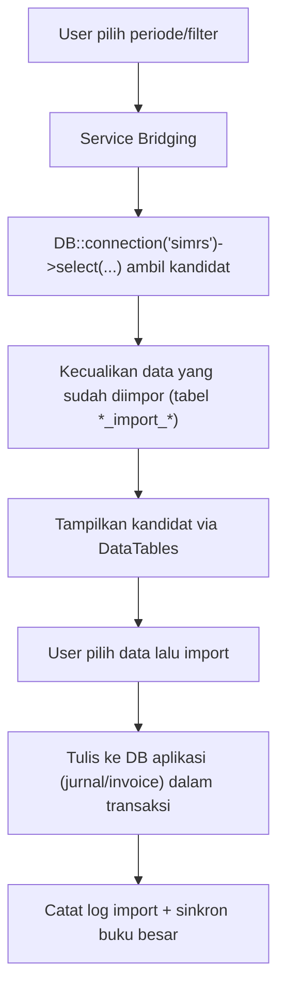

# Integrasi SIMRS

## Ringkasan

Siakurat membaca data operasional rumah sakit (billing pasien, tagihan obat, jurnal SIMRS)
dari database **SIMRS** melalui **koneksi database terpisah** bernama `simrs`. Koneksi ini
dipakai **baca-saja** oleh modul Bridging untuk menarik kandidat data sebelum diimpor menjadi
jurnal/invoice di database aplikasi.

Implementasi utama:

- `config/database.php` — definisi koneksi `simrs`.
- `.env` / `.env.example` — kredensial koneksi SIMRS (`SIMRS_DB_*`).
- Service Bridging (`app/Services/Bridging/*`) — konsumen utama koneksi `simrs`.

## Koneksi Database

Aplikasi punya dua koneksi MySQL:

| Koneksi | Peran | ENV kunci |
| --- | --- | --- |
| `mysql` (default) | Database aplikasi Siakurat (jurnal, invoice, mapping, dll) | `DB_*` |
| `simrs` | Database SIMRS (sumber data operasional), baca-saja | `SIMRS_DB_*` |

Variabel lingkungan untuk koneksi `simrs` (default di `config/database.php`):

| ENV | Default | Keterangan |
| --- | --- | --- |
| `SIMRS_DB_HOST` | `127.0.0.1` | Host database SIMRS |
| `SIMRS_DB_PORT` | `3306` | Port |
| `SIMRS_DB_DATABASE` | `sik` | Nama database SIMRS |
| `SIMRS_DB_USERNAME` | `root` | User |
| `SIMRS_DB_PASSWORD` | *(kosong)* | Password |
| `SIMRS_DB_URL` | — | Alternatif URL koneksi penuh |
| `SIMRS_DB_CHARSET` | `utf8mb4` | Charset |
| `SIMRS_DB_COLLATION` | `utf8mb4_unicode_ci` | Collation |

## Pola Query Lintas-Koneksi

Query ke SIMRS memakai koneksi `simrs` secara eksplisit:

```php
DB::connection('simrs')->select($sql, $bindings);
// atau
DB::connection('simrs')->table('billing')->...;
```

### Prinsip Penggunaan

- **Baca-saja**: aplikasi tidak menulis ke database SIMRS. Semua operasi tulis dilakukan pada
  database aplikasi (`mysql`).
- **Filter idempoten**: sebelum menarik kandidat, service mengecualikan data yang sudah pernah
  diimpor (mis. cek `simrs_import_pendapatan`) agar import tidak dobel.
- **Bindings**: gunakan parameter binding untuk nilai dinamis, hindari interpolasi string mentah.
- **Isolasi di service**: query SIMRS dijaga tetap berada di lapisan service Bridging, bukan di
  controller.

## Alur Umum Bridging (Ringkas)



Detail per submodul Bridging:

- [Bridging Pendapatan](../bridging-pendapatan.md)
- [Bridging Pendapatan Obat](../bridging-pendapatan-obat.md)
- [Bridging Pembelian](../bridging-pembelian.md)

## Catatan Operasional

- Bila koneksi `simrs` tidak dikonfigurasi/tersedia, seluruh alur tarik data Bridging akan gagal;
  modul non-Bridging tetap berjalan karena hanya memakai koneksi `mysql`.
- Skema tabel SIMRS berada di luar kendali migrasi Siakurat. Perubahan struktur SIMRS dapat
  memengaruhi query Bridging dan harus diuji ulang.
