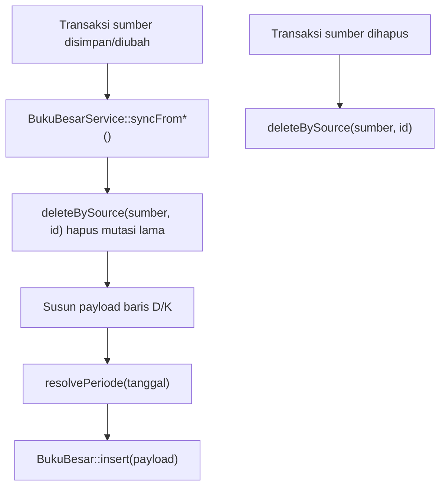

# Konvensi Buku Besar & COA

## Ringkasan

Inti akuntansi Siakurat terdiri dari **COA** (Chart of Accounts), **Jurnal Umum**, dan
**Buku Besar**. Setiap transaksi keuangan (jurnal umum, kasbank, penerimaan pendapatan,
pembayaran pembelian, hasil bridging) menghasilkan mutasi pada tabel `bukubesar` melalui
`BukuBesarService`.

Implementasi utama:

- `app/Models/Coa.php`, `app/Models/TipeCoa.php`
- `app/Models/JurnalUmum.php`, `app/Models/JurnalUmumRinci.php`
- `app/Models/BukuBesar.php`
- `app/Services/Bukubesar/BukuBesarService.php`

## COA (Chart of Accounts)

Tabel `coa`. Kolom penting:

| Kolom | Keterangan |
| --- | --- |
| `kode`, `nama` | Kode dan nama akun |
| `parent_coa` | Referensi ke COA induk (self relation) → struktur hirarki |
| `tipe_coa` | Klasifikasi tipe akun (lihat `TipeCoa`) |
| `status_aktif` | `1` aktif |
| `is_postable` | Boleh menerima posting transaksi |
| `arus_kas_aktivitas`, `arus_kas_kelompok` | Klasifikasi untuk laporan arus kas |

Relasi & scope (`app/Models/Coa.php`):

- `parent()` / `children()` — hirarki akun.
- `bukuBesar()` — mutasi buku besar milik akun.
- `scopeActive()` — `status_aktif = 1`.
- `scopeLeaf()` — akun tanpa anak (daun).
- `scopeActiveLeaf()` — aktif dan daun.
- `scopeSelectableTransaction()` — akun yang boleh dipilih pada transaksi (`activeLeaf()` urut `kode`).

> Konvensi: hanya **akun daun aktif** yang dipakai untuk input transaksi. Akun induk berfungsi
> sebagai pengelompokan/agregasi laporan.

### TipeCoa

Tabel `tipe_coa` (`nama`, `status_aktif`). Nilai `tipe_coa` dipakai untuk klasifikasi bisnis,
mis. akun bertipe `Kasbank` atau tipe yang mengandung teks `piutang` dipakai untuk menentukan
akun kas/piutang pada beberapa alur (lihat modul Bridging Pendapatan dan Penerimaan Pendapatan).

## Jurnal Umum

- `jurnal_umum` (header): `nomer`, `tanggal`, `keterangan`, `debit`, `kredit`.
- `jurnal_umum_rinci` (baris): `coa_id`, `debit`, `kredit`, `catatan`.
- Relasi: `JurnalUmum::rincian()` → `JurnalUmumRinci`.
- Scope: `JurnalUmum::scopeBetweenDates($start, $end)`.
- Nominal disimpan `decimal:2`.

Konvensi keseimbangan: total `debit` harus sama dengan total `kredit`. Alur pembuat jurnal
(mis. bridging cabang Jurnal Umum) menghentikan proses jika tidak balance.

## Buku Besar

Tabel `bukubesar` adalah **mutasi akun** yang diturunkan dari transaksi sumber.

| Kolom | Keterangan |
| --- | --- |
| `coa_id` | Akun terdampak |
| `sumber_transaksi` | Jenis transaksi sumber (mis. `Jurnal Umum`, `Kasbank Penerimaan`) |
| `sumber_id` | ID record sumber |
| `nomer` | Nomor dokumen sumber |
| `tanggal` | Tanggal mutasi |
| `periode_tahun`, `periode_bulan` | Periode diturunkan dari `tanggal` |
| `nominal` | Nilai mutasi (`decimal:2`) |
| `tipe_mutasi` | `D` (debit) atau `K` (kredit) |
| `keterangan` | Catatan |

Scope: `BukuBesar::scopeForSource($sumberTransaksi, $sumberId)`.

### Pembacaan Buku Bank

`Kasbank\BukuBankService` membaca tabel `bukubesar` tanpa mengubah data. Akun yang dapat
dipilih dibatasi pada akun daun dengan `tipe_coa = Kasbank` secara case-insensitive. Akun
nonaktif tetap tersedia untuk penelusuran histori. Saldo awal dihitung dari debit dikurangi
kredit sebelum tanggal mulai, kemudian setiap mutasi periode memperbarui saldo berjalan.
Lihat [Kasbank — Buku Bank](../kasbank-buku-bank.md) untuk endpoint dan alur lengkap.

## Sinkronisasi via BukuBesarService

`BukuBesarService` bertanggung jawab mengisi ulang mutasi buku besar dari transaksi sumber.
Pola umum tiap method `syncFrom*`:

1. Hapus mutasi lama untuk sumber yang sama (`deleteBySource($sumberTransaksi, $sumberId)`).
2. Susun payload baris debit/kredit dari data transaksi.
3. Turunkan periode dari tanggal via `resolvePeriode($tanggal)`.
4. Insert massal ke tabel `bukubesar`.

Method yang tersedia dan nilai `sumber_transaksi` yang dihasilkan:

| Method | `sumber_transaksi` | Ringkas mutasi |
| --- | --- | --- |
| `syncFromJurnalUmum()` | `Jurnal Umum` | Per baris rincian: `D` bila debit>0, selain itu `K` |
| `syncFromKasbankPenerimaan()` | `Kasbank Penerimaan` | Akun kas `D` (total); tiap rincian `K` |
| `syncFromKasbankPembayaran()` | `Kasbank Pembayaran` | Akun kas `K` (total); tiap rincian `D` |
| `syncFromPenerimaanPendapatan()` | `Penerimaan Pendapatan` | Bank `D`; Piutang `K`; Selisih tarif `K/D` bila ada |
| `syncFromPembayaranPembelian()` | `Pembayaran Pembelian` | Hutang `D`; Bank `K` (total−potongan); Potongan admin `K` bila ada |
| `deleteBySource()` | — | Hapus semua mutasi untuk sumber tertentu |
| `resolvePeriode()` (static) | — | Turunkan `periode_tahun`/`periode_bulan` dari tanggal |

### Aturan Debit/Kredit per Sumber (detail)

- **Jurnal Umum**: baris dengan `debit > 0` → `tipe_mutasi = D` dengan `nominal = debit`;
  selain itu `tipe_mutasi = K` dengan `nominal = kredit`. Baris tanpa `coa_id` diabaikan.
- **Kasbank Penerimaan**: satu baris akun kas `D` sebesar total; tiap rincian akun lawan `K`.
- **Kasbank Pembayaran**: satu baris akun kas `K` sebesar total; tiap rincian akun lawan `D`.
- **Penerimaan Pendapatan**: Bank `D = jumlah_pembayaran`; Piutang `K = jumlah_pembayaran − selisih_tarif`;
  bila ada selisih tarif, akun selisih tarif `K` (selisih>0) atau `D` (selisih<0) sebesar `abs(selisih)`.
- **Pembayaran Pembelian**: Hutang `D = total_bayar`; Bank `K = total_bayar − potongan_admin`;
  bila ada potongan admin, akun potongan `K` sebesar `potongan_admin`.

### Diagram Sinkronisasi

## Catatan Penting

- Sinkronisasi bersifat **idempoten** karena selalu menghapus mutasi lama untuk sumber yang sama
  sebelum menyisipkan yang baru. Aman dipanggil ulang saat update.
- Saat menghapus transaksi sumber, panggil `deleteBySource(...)` agar buku besar tetap konsisten.
- `resolvePeriode()` mengembalikan `null` untuk tanggal kosong/tak valid, sehingga periode bisa
  kosong bila tanggal tidak tersedia.
- Untuk deteksi jurnal tidak balance, lihat modul [Laporan Keuangan](../laporan-keuangan.md) dan
  [Bridging Pendapatan](../bridging-pendapatan.md).
