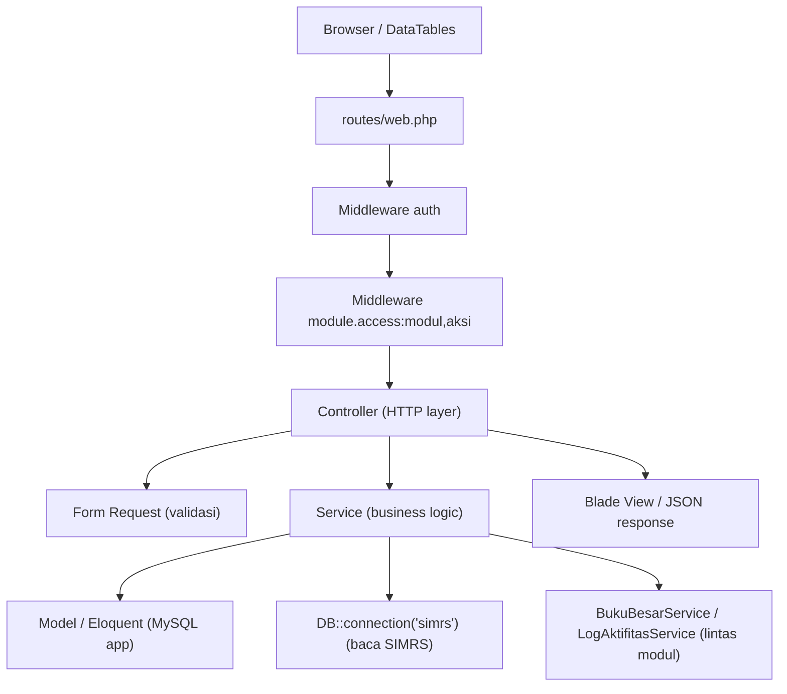

# Overview Arsitektur Siakurat

## Ringkasan

Siakurat adalah aplikasi akuntansi/keuangan rumah sakit berbasis **Laravel 12** (PHP 8.2+)
dengan database **MySQL**. Aplikasi menarik data operasional dari **SIMRS** (koneksi database
terpisah, lihat [Integrasi SIMRS](integrasi-simrs.md)) lalu mengubahnya menjadi jurnal,
invoice, dan laporan keuangan.

Dependensi utama (dari `composer.json`):

- `laravel/framework` `^12.0`
- `yajra/laravel-datatables-oracle` `12.0` — server-side DataTables untuk daftar data.
- `phpoffice/phpspreadsheet` `^5.8` — konversi/ekspor spreadsheet.
- `laravel/tinker`, dan tooling dev seperti `laravel/pint` (PSR-12), `phpunit`.

## Arsitektur Berlapis

Aplikasi mengikuti konvensi di `AGENTS.md`: **thin controller**, **business logic di service**,
**model fokus pada representasi data**.



### Tanggung Jawab Tiap Lapisan

| Lapisan | Lokasi | Tanggung jawab |
| --- | --- | --- |
| Routing | `routes/web.php` | Definisi endpoint, pengelompokan prefix, penerapan middleware otorisasi |
| Middleware | `app/Http/Middleware` | `EnsureModuleAccess` (alias `module.access`) menegakkan hak akses per modul+aksi |
| Controller | `app/Http/Controllers` | Menerima request, koordinasi validasi, memanggil service, mengembalikan response |
| Form Request | `app/Http/Requests` | Aturan validasi input dan pesan kesalahan |
| Service | `app/Services` | Alur bisnis, orkestrasi, transaksi database |
| Model | `app/Models` | Representasi data, relasi, cast, scope |
| Support | `app/Support` | Utilitas lintas modul, mis. `AccessModuleRegistry` |
| Provider | `app/Providers` | `AppServiceProvider` — view composer global untuk nama perusahaan |

## Struktur Folder `app/`

```
app/
  Http/
    Controllers/        HTTP layer per grup modul (Auth, Bridging, Bukubesar, Kasbank,
                        Laporan, Pembelian, Pendapatan, Pengaturan) + Concerns/
    Middleware/         EnsureModuleAccess
    Requests/           Form Request per grup modul
  Models/               Eloquent model (Coa, BukuBesar, JurnalUmum, Faktur*, dst)
  Services/             Business logic per grup modul + service lintas modul
  Support/              AccessModuleRegistry
  Providers/            AppServiceProvider
```

Pengelompokan folder di `Controllers`, `Requests`, dan `Services` konsisten mengikuti grup modul
yang sama (mis. `Bridging/`, `Bukubesar/`, `Kasbank/`, `Pendapatan/`, `Pembelian/`, `Laporan/`,
`Pengaturan/`, `Auth/`).

## Alur Request Umum

1. Request masuk ke `routes/web.php`.
2. Middleware `auth` memastikan user login; grup `guest` untuk halaman login.
3. Middleware `module.access:<modul>,<aksi>` memeriksa hak akses (lihat [Sistem Otorisasi](sistem-otorisasi.md)).
4. Controller memvalidasi input via Form Request bila diperlukan.
5. Controller memanggil Service untuk menjalankan alur bisnis.
6. Service mengakses data melalui Eloquent (MySQL aplikasi) dan/atau koneksi `simrs` (baca-saja).
7. Untuk operasi tulis multi-tabel, Service membungkusnya dalam `DB::transaction(...)`.
8. Efek samping lintas modul umum: sinkronisasi buku besar (`BukuBesarService`) dan pencatatan
   audit (`LogAktifitasService`).
9. Controller mengembalikan Blade view, JSON (DataTables/API), atau file (print/ekspor CSV/XLSX).

## Layanan Lintas Modul

| Service | Peran |
| --- | --- |
| `BukuBesarService` | Sinkronisasi mutasi buku besar dari jurnal/transaksi, hapus berdasarkan sumber |
| `LogAktifitasService` | Mencatat aktivitas (audit trail) untuk operasi penting |
| `ModuleAccessService` | Mengecek dan menegakkan hak akses modul |
| `PreferensiPerusahaanService` | Preferensi perusahaan (mis. nama perusahaan untuk branding view) |
| `HomeDashboardService` | Agregasi data dashboard |

## Konvensi Pendukung

- Daftar data besar memakai **server-side DataTables** (endpoint `load-data` / `load-*`).
- Ekspor CSV memakai trait `app/Http/Controllers/Concerns/StreamsCsvExport.php`.
- Cetak dokumen memakai endpoint `.../{model}/print`.
- Branding nama perusahaan disuntikkan ke semua view lewat `AppServiceProvider::boot()`.

## Referensi

- [Sistem Otorisasi](sistem-otorisasi.md)
- [Integrasi SIMRS](integrasi-simrs.md)
- [Konvensi Buku Besar & COA](konvensi-bukubesar-coa.md)
- [Glosarium](glosarium.md)
