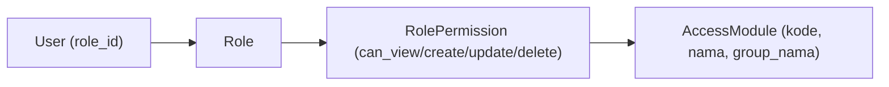
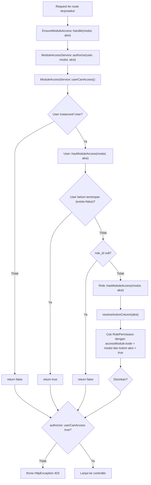

# Sistem Otorisasi

## Ringkasan

Otorisasi Siakurat berbasis **modul + aksi**. Setiap route yang butuh proteksi memakai middleware
`module.access:<kode_modul>,<aksi>`. Hak akses disimpan per **Role**, dan setiap user terikat pada
satu role.

Implementasi utama:

- `bootstrap/app.php` — registrasi alias middleware `module.access`.
- `app/Http/Middleware/EnsureModuleAccess.php`
- `app/Services/Auth/ModuleAccessService.php`
- `app/Models/User.php`, `app/Models/Role.php`, `app/Models/RolePermission.php`, `app/Models/AccessModule.php`
- `app/Support/AccessModuleRegistry.php` — daftar kanonik modul.
- `routes/web.php` — penerapan middleware per grup route.

## Model Data Otorisasi

| Model | Tabel | Peran |
| --- | --- | --- |
| `User` | `users` | Punya `role_id`; `hasModuleAccess()` mendelegasikan cek ke role |
| `Role` | `roles` | Kumpulan izin; `hasModuleAccess($modul, $aksi)` |
| `RolePermission` | `role_permissions` | Flag `can_view`, `can_create`, `can_update`, `can_delete` per modul |
| `AccessModule` | `access_modules` | Master modul yang dapat diberi izin (`kode`, `nama`, `group_nama`, `urutan`) |

## Aksi dan Pemetaan Kolom

`RolePermission::resolveActionColumn()` memetakan nama aksi ke kolom boolean:

| Aksi | Kolom |
| --- | --- |
| `view` | `can_view` |
| `create` | `can_create` |
| `update` | `can_update` |
| `delete` | `can_delete` |

Aksi selain keempat di atas melempar `InvalidArgumentException`.

## Alur Pengecekan Akses

### Catatan Perilaku

- Bila user **belum tersimpan** (`$this->exists === false`), `hasModuleAccess()` mengembalikan `true`.
  Ini relevan untuk konteks non-persisted (mis. pengujian/seed), bukan user login normal.
- Bila `role_id` `null`, akses ditolak.
- `Role::hasModuleAccess()` memakai relasi `permissions` yang sudah dimuat bila tersedia
  (`relationLoaded`), jika tidak, melakukan query `whereHas('accessModule', ...)`.
- Penolakan menghasilkan **HTTP 403** dengan pesan "Anda tidak memiliki akses ke modul ini."

## Daftar Modul (AccessModuleRegistry)

Sumber kanonik daftar modul adalah `App\Support\AccessModuleRegistry::all()`. Kode di sini harus
sama dengan `kode` yang dipakai pada middleware `module.access` di `routes/web.php`.

| Kode Modul | Nama | Group |
| --- | --- | --- |
| `home` | Home | Dashboard |
| `bukubesar.jurnal-umum` | Jurnal Umum | Bukubesar |
| `bukubesar.coa` | COA | Bukubesar |
| `kasbank.penerimaan` | Kasbank Penerimaan | Kasbank |
| `kasbank.pembayaran` | Kasbank Pembayaran | Kasbank |
| `bridging.pendapatan` | Bridging Pendapatan | Bridging |
| `bridging.pendapatan-obat` | Bridging Pendapatan Obat | Bridging |
| `bridging.pembelian` | Bridging Pembelian | Bridging |
| `pendapatan.invoice` | Invoice Pendapatan | Pendapatan |
| `pendapatan.penerimaan` | Penerimaan Pendapatan | Pendapatan |
| `pembelian.invoice` | Invoice Pembelian | Pembelian |
| `pembelian.pembayaran` | Pembayaran Pembelian | Pembelian |
| `laporan.keuangan` | Laporan Keuangan | Laporan |
| `laporan.pendapatan` | Laporan Pendapatan | Laporan |
| `pengaturan.mapping-pendapatan` | Mapping Pendapatan | Pengaturan |
| `pengaturan.mapping-general` | Mapping General | Pengaturan |
| `pengaturan.setting-rba` | Setting RBA | Pengaturan |
| `pengaturan.preferensi` | Preferensi | Pengaturan |
| `pengaturan.pengguna` | Pengguna | Pengaturan |
| `pengaturan.role-akses` | Role Akses | Pengaturan |
| `pengaturan.konversi-file` | Konversi File | Pengaturan |

## Aksi yang Dipakai per Modul (dari routes/web.php)

| Modul | view | create | update | delete |
| --- | :---: | :---: | :---: | :---: |
| `home` | ✔ | | | |
| `bukubesar.jurnal-umum` | ✔ | ✔ | ✔ | ✔ |
| `bukubesar.coa` | ✔ | ✔ | ✔ | ✔ |
| `kasbank.penerimaan` | ✔ | ✔ | ✔ | ✔ |
| `kasbank.pembayaran` | ✔ | ✔ | ✔ | ✔ |
| `bridging.pendapatan` | ✔ | | ✔ | ✔ |
| `bridging.pendapatan-obat` | ✔ | | ✔ | ✔ |
| `bridging.pembelian` | ✔ | | ✔ | ✔ |
| `pendapatan.invoice` | ✔ | | | |
| `pendapatan.penerimaan` | ✔ | ✔ | ✔ | ✔ |
| `pembelian.invoice` | ✔ | | | |
| `pembelian.pembayaran` | ✔ | ✔ | ✔ | ✔ |
| `laporan.keuangan` | ✔ | | | |
| `laporan.pendapatan` | ✔ | | | |
| `pengaturan.mapping-pendapatan` | ✔ | ✔ | | ✔ |
| `pengaturan.mapping-general` | ✔ | ✔ | | ✔ |
| `pengaturan.setting-rba` | ✔ | ✔ | | ✔ |
| `pengaturan.preferensi` | ✔ | | ✔ | |
| `pengaturan.pengguna` | ✔ | ✔ | ✔ | ✔ |
| `pengaturan.role-akses` | ✔ | ✔ | ✔ | |
| `pengaturan.konversi-file` | ✔ | ✔ | | |

> Catatan: pada Bridging, aksi `import` dan `hapus massal` masing-masing dipetakan ke izin
> `update` dan `delete`.

## Menambah Modul Baru

1. Tambahkan entri di `AccessModuleRegistry::all()` (`kode`, `nama`, `group_nama`, `urutan`).
2. Terapkan `module.access:<kode>,<aksi>` pada route modul di `routes/web.php`.
3. Pastikan seed/isian `access_modules` dan `role_permissions` mencakup modul baru.
4. Perbarui dokumen ini (tabel modul + tabel aksi) sesuai perubahan.
