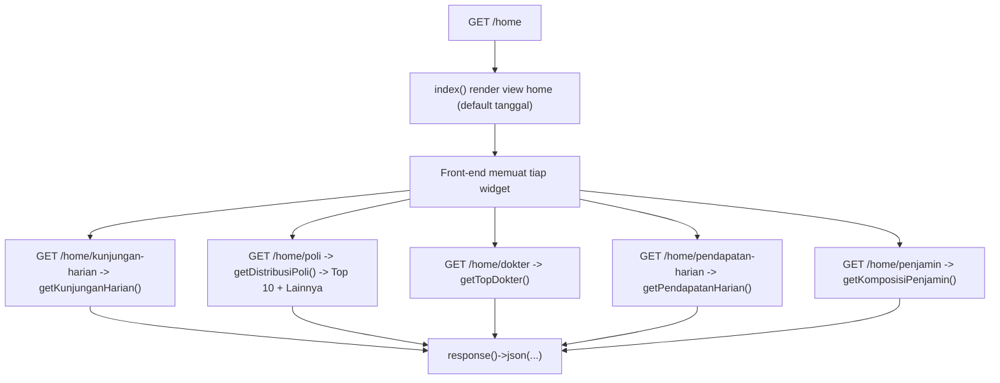

# Dokumentasi Modul Home / Dashboard

## Ringkasan Modul

Modul **Home / Dashboard** menampilkan ringkasan operasional rumah sakit dalam bentuk widget/grafik:
kunjungan harian, distribusi poli, top dokter, pendapatan harian, dan komposisi penjamin. Widget
memuat datanya melalui endpoint JSON terpisah (dipanggil dari front-end dashboard).

Distribusi Poli dan Top Dokter ditampilkan sebagai diagram ranking horizontal. Distribusi Poli
memuat 10 poli dengan kunjungan terbanyak dan, jika ada kategori tambahan, satu baris `Lainnya`
yang menjumlahkan seluruh kategori tersisa. Top Dokter memuat maksimal 10 dokter.

Implementasi utama:

- `routes/web.php`
- `app/Http/Controllers/HomeController.php`
- `app/Services/HomeDashboardService.php`

## Entry Point / API

Semua endpoint memakai izin `home,view`.

| Method | Path | Route Name | Controller Method |
| --- | --- | --- | --- |
| `GET` | `/home` | `home` | `index()` |
| `GET` | `/home/kunjungan-harian` | `home.kunjungan-harian` | `kunjunganHarian()` |
| `GET` | `/home/poli` | `home.poli` | `distribusiPoli()` |
| `GET` | `/home/dokter` | `home.dokter` | `topDokter()` |
| `GET` | `/home/pendapatan-harian` | `home.pendapatan-harian` | `pendapatanHarian()` |
| `GET` | `/home/penjamin` | `home.penjamin` | `komposisiPenjamin()` |

## Parameter

- Endpoint data menerima `dariTanggal` dan `sampaiTanggal`; `resolveDateRange()` memberi default
  awal bulan s.d. hari ini bila kosong.
- `index()` mengirim `defaultStartDate`/`defaultEndDate` ke view untuk inisialisasi filter.
- Respons `/home/poli` tetap berbentuk `{ poli, total }` dan berisi maksimal 11 baris: 10 poli
  terbesar ditambah `Lainnya` bila jumlah kategori lebih dari 10.

## Alur

### Algoritma

1. `index()` merender halaman dashboard dengan rentang tanggal default.
2. Tiap endpoint widget menentukan rentang tanggal via `resolveDateRange()` lalu memanggil method
   `HomeDashboardService` yang sesuai dan mengembalikan JSON.
3. `getDistribusiPoli()` mengurutkan hasil dari total terbesar, mengambil 10 poli pertama, lalu
   menjumlahkan kategori sisanya sebagai `Lainnya`.
4. Front-end merender Distribusi Poli dan Top Dokter sebagai diagram batang horizontal dengan
   tinggi adaptif berdasarkan jumlah baris.

## Fungsi yang Dipanggil

- `HomeController::index()/kunjunganHarian()/distribusiPoli()/topDokter()/pendapatanHarian()/komposisiPenjamin()`
- `HomeController::resolveDateRange()` (private)
- `HomeDashboardService::getKunjunganHarian()/getDistribusiPoli()/getTopDokter()/getPendapatanHarian()/getKomposisiPenjamin()`

## Catatan Penting Bisnis

- Dashboard bersifat **read-only**; hanya menampilkan agregasi data.
- Setiap widget memuat datanya secara asinkron melalui endpoint JSON masing-masing.
- Rentang tanggal default adalah awal bulan berjalan s.d. hari ini.
- Diagram ranking memakai satu warna aksen hijau; label panjang dibungkus ke beberapa baris dan
  nilai lengkap tetap tersedia melalui tooltip.
