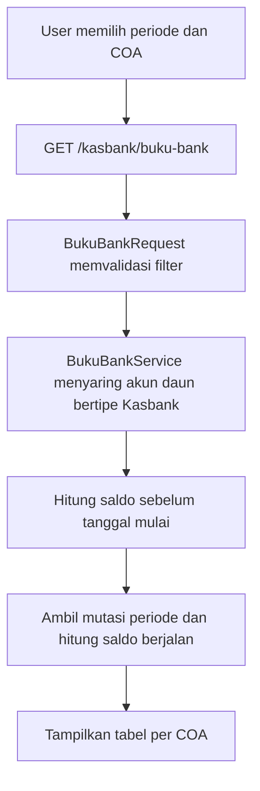
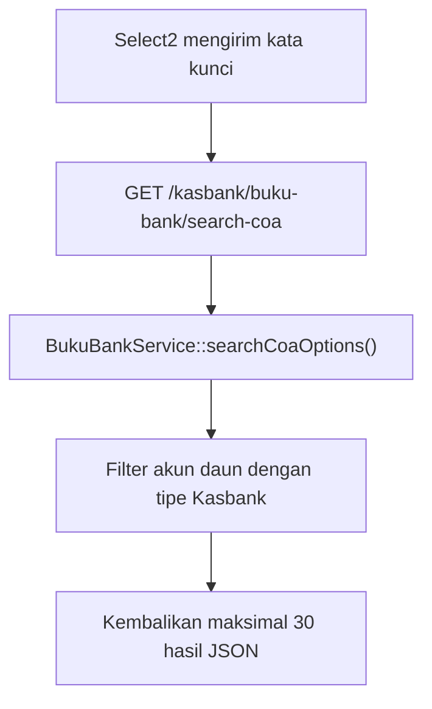

# Dokumentasi Modul Kasbank — Buku Bank

## Ringkasan Modul

Modul **Buku Bank** digunakan untuk:

1. melihat mutasi buku besar untuk akun daun bertipe `Kasbank`,
2. menghitung saldo awal dan saldo berjalan per akun,
3. mencetak atau mengekspor hasil terfilter ke Excel.

Implementasi utama modul ini berada di:

- `routes/web.php`
- `app/Http/Controllers/Kasbank/BukuBankController.php`
- `app/Http/Requests/Kasbank/BukuBankRequest.php`
- `app/Services/Kasbank/BukuBankService.php`
- `app/Models/BukuBesar.php` dan `app/Models/Coa.php`

## Entry Point / API

| Method | Path | Route Name | Controller Method | Permission |
| --- | --- | --- | --- | --- |
| `GET` | `/kasbank/buku-bank` | `kasbank.buku-bank.index` | `index()` | `kasbank.buku-bank:view` |
| `GET` | `/kasbank/buku-bank/search-coa` | `kasbank.buku-bank.search-coa` | `searchCoa()` | `kasbank.buku-bank:view` |

## Alur 1: Menampilkan Buku Bank

### Validasi Request

`BukuBankRequest` memvalidasi:

- `startDate` dan `endDate` opsional dengan format `Y-m-d`;
- `endDate` tidak boleh lebih awal dari `startDate`;
- `coaIds` berupa array dan setiap nilai merupakan ID COA yang ada serta tidak duplikat.

### Flowchart

### Algoritma

1. Periode default adalah awal bulan berjalan sampai hari ini dan seluruh pilihan COA Kasbank
   yang valid dimuat bersama halaman agar daftar tetap tersedia tanpa bergantung pada AJAX.
2. ID COA disaring kembali pada service; akun parent dan akun selain tipe `Kasbank` diabaikan.
3. Akun nonaktif tetap dapat digunakan agar histori lama tetap tersedia.
4. Saldo awal adalah debit dikurangi kredit sebelum tanggal mulai.
5. Mutasi periode diurutkan berdasarkan COA, tanggal, lalu ID dan membentuk saldo berjalan.
6. Pencarian di halaman memfilter nomor, sumber transaksi, dan keterangan yang sedang tampil.

### Fungsi yang Dipanggil

- `BukuBankController::index()`
- `BukuBankService::getBukuBank()`
- `BukuBankService::getCoaOptions()`
- `Coa::scopeLeaf()`

## Alur 2: Mencari COA Kasbank

### Flowchart

### Fungsi yang Dipanggil

- `BukuBankController::searchCoa()`
- `BukuBankService::searchCoaOptions()`

## Catatan Penting Bisnis

- Modul bersifat baca-saja dan tidak mengubah transaksi maupun buku besar.
- Data selalu berasal dari tabel `bukubesar`; tidak dibatasi pada sumber transaksi tertentu.
- Print dan export Excel menggunakan data yang sudah difilter pada halaman.
