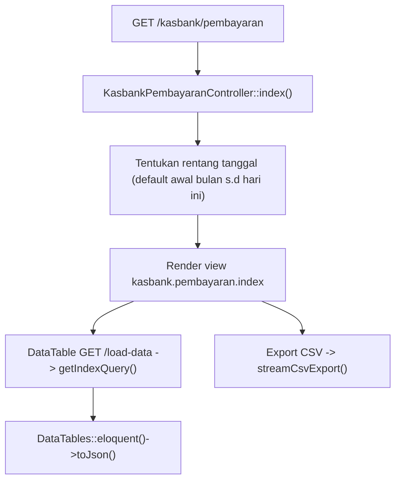
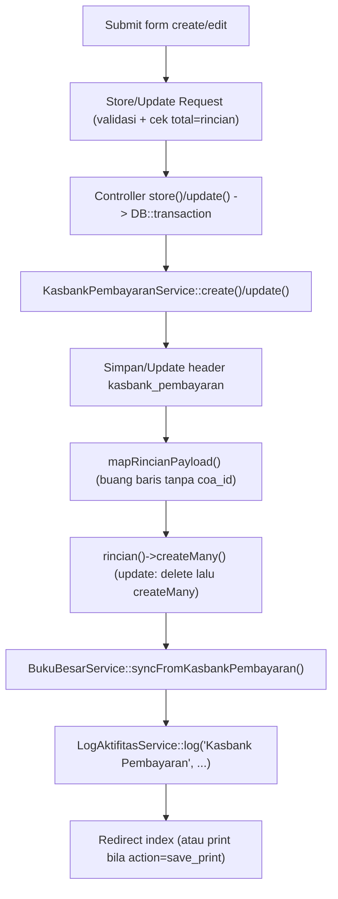
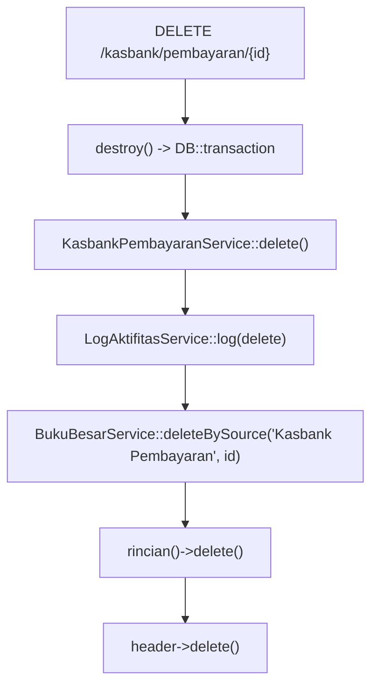

# Dokumentasi Modul Kasbank — Pembayaran

## Ringkasan Modul

Modul **Kasbank Pembayaran** digunakan untuk:

1. mencatat pengeluaran kas/bank (satu akun kas + rincian akun lawan),
2. menampilkan daftar pembayaran per periode (DataTables) dan mengekspornya ke CSV,
3. mengubah dan menghapus pembayaran,
4. mencetak bukti pembayaran,
5. menyinkronkan setiap perubahan ke **Buku Besar**.

Implementasi utama:

- `routes/web.php`
- `app/Http/Controllers/Kasbank/KasbankPembayaranController.php`
- `app/Http/Requests/Kasbank/StoreKasbankPembayaranRequest.php`
- `app/Http/Requests/Kasbank/UpdateKasbankPembayaranRequest.php`
- `app/Services/Kasbank/KasbankPembayaranService.php`
- `app/Services/Bukubesar/BukuBesarService.php`
- `app/Models/KasbankPembayaran.php`, `app/Models/KasbankPembayaranRinci.php`, `app/Models/Coa.php`

## Entry Point / API

| Method | Path | Route Name | Controller Method | Izin |
| --- | --- | --- | --- | --- |
| `GET` | `/kasbank/pembayaran` | `kasbank.pembayaran.index` | `index()` | view |
| `GET` | `/kasbank/pembayaran/load-data` | `kasbank.pembayaran.load-data` | `loadData()` | view |
| `GET` | `/kasbank/pembayaran/export-csv` | `kasbank.pembayaran.export-csv` | `exportCsv()` | view |
| `GET` | `/kasbank/pembayaran/{kasbankPembayaran}/print` | `kasbank.pembayaran.print` | `print()` | view |
| `GET` | `/kasbank/pembayaran/create` | `kasbank.pembayaran.create` | `create()` | create |
| `POST` | `/kasbank/pembayaran` | `kasbank.pembayaran.store` | `store()` | create |
| `GET` | `/kasbank/pembayaran/{kasbankPembayaran}/edit` | `kasbank.pembayaran.edit` | `edit()` | update |
| `PUT` | `/kasbank/pembayaran/{kasbankPembayaran}` | `kasbank.pembayaran.update` | `update()` | update |
| `DELETE` | `/kasbank/pembayaran/{kasbankPembayaran}` | `kasbank.pembayaran.destroy` | `destroy()` | delete |

## Validasi Request

`StoreKasbankPembayaranRequest` / `UpdateKasbankPembayaranRequest` memvalidasi field yang sama
dengan modul Penerimaan (`coa_id`, `nomer` unik pada `kasbank_pembayaran`, `tanggal`, `keterangan`,
`total`, `rincian[]` dengan `coa_id`/`nominal`/`catatan`), termasuk validasi tambahan `after`:
`total` harus > 0 dan sama dengan jumlah nominal rincian (toleransi `0.00001`).

## Alur 1: Daftar & Ekspor

Kolom yang diformat: `tanggal`, `total`; kolom tambahan `coa_display` (nama akun bank) dan
`nomer_link` (menuju edit). Ekspor CSV: Nomor, Tanggal, Bank, Nominal, Keterangan.

## Alur 2: Buat / Ubah + Sinkronisasi Buku Besar

### Algoritma

1. Request tervalidasi (termasuk kecocokan total = jumlah rincian).
2. Controller membungkus dalam `DB::transaction`.
3. Service menyimpan/memperbarui header lalu menulis ulang rincian.
4. `syncFromKasbankPembayaran()` mengisi buku besar: **akun kas Kredit** sebesar total, tiap
   **rincian Debit** sebesar nominalnya (idempoten: hapus dulu lalu isi ulang).
5. Aktivitas dicatat via `LogAktifitasService::log()`.
6. Pada `store`, `action = save_print` mengarah ke halaman cetak.

## Alur 3: Hapus

## Alur 4: Cetak

- `print()` mengambil identitas cetak (`PreferensiPerusahaanService::getPrintIdentity()`) dan merender
  view `kasbank.pembayaran.print` dengan data (beserta `coa`, `rincian.coa`), nama RS, petugas, TTD.

## Fungsi yang Dipanggil

- `KasbankPembayaranController::index()/loadData()/exportCsv()/create()/store()/edit()/update()/destroy()/print()`
- `KasbankPembayaranService::getCoaOptions()/getIndexQuery()/create()/update()/delete()/mapRincianPayload()`
- `BukuBesarService::syncFromKasbankPembayaran()/deleteBySource()`
- `LogAktifitasService::log()`
- `PreferensiPerusahaanService::getPrintIdentity()`
- `Coa::scopeSelectableTransaction()`, `KasbankPembayaran::scopeBetweenDates()`, `KasbankPembayaran::rincian()`
- Trait `StreamsCsvExport::streamCsvExport()/csvNumber()`

## Catatan Penting Bisnis

- `total` harus sama dengan jumlah nominal rincian dan lebih besar dari nol.
- Arah buku besar: **akun kas Kredit**, **rincian akun lawan Debit** (kebalikan dari Penerimaan).
- Sinkronisasi buku besar idempoten (hapus lalu isi ulang) pada setiap create/update.
- Hapus juga menghapus mutasi buku besar sumber `Kasbank Pembayaran`.
- Opsi COA memakai akun **daun aktif** (`selectableTransaction()`).
- Lihat [Konvensi Buku Besar & COA](fondasi/konvensi-bukubesar-coa.md).
