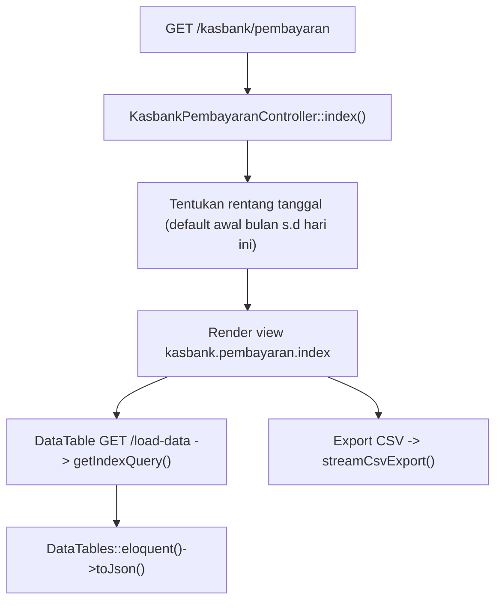
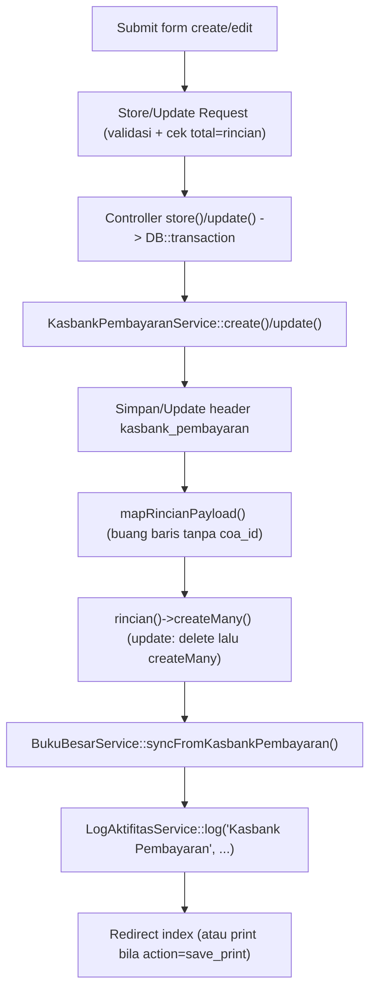
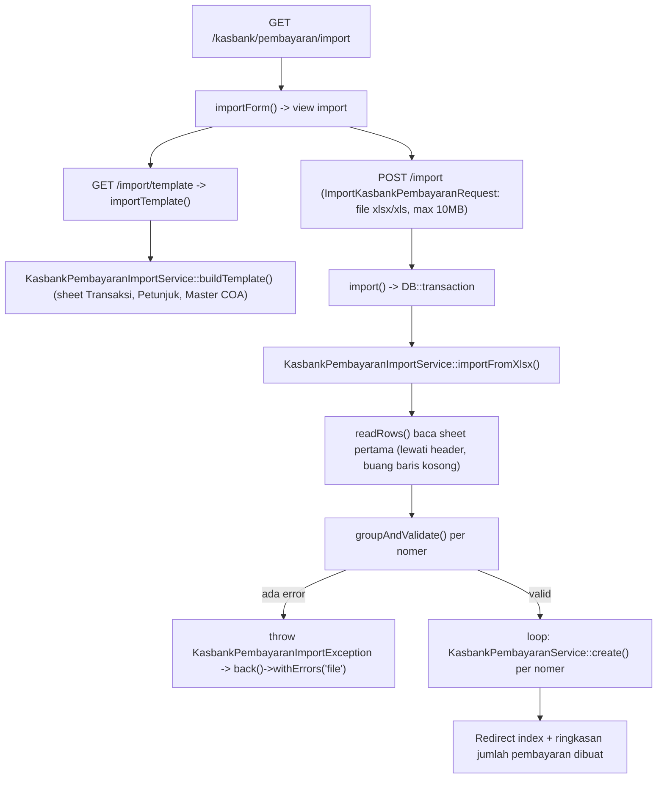
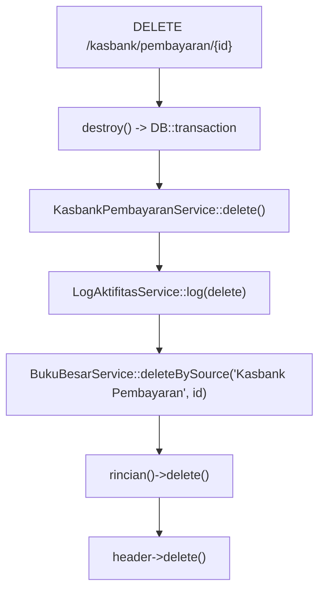

# Dokumentasi Modul Kasbank — Pembayaran

## Ringkasan Modul

Modul **Kasbank Pembayaran** digunakan untuk:

1. mencatat pengeluaran kas/bank (satu akun kas + rincian akun lawan),
2. menampilkan daftar pembayaran per periode (DataTables) dan mengekspornya ke CSV,
3. mengubah dan menghapus pembayaran,
4. mencetak bukti pembayaran,
5. mengimpor banyak pembayaran sekaligus dari file XLSX (template + validasi all-or-nothing),
6. menyinkronkan setiap perubahan ke **Buku Besar**.

Implementasi utama:

- `routes/web.php`
- `app/Http/Controllers/Kasbank/KasbankPembayaranController.php`
- `app/Http/Requests/Kasbank/StoreKasbankPembayaranRequest.php`
- `app/Http/Requests/Kasbank/UpdateKasbankPembayaranRequest.php`
- `app/Http/Requests/Kasbank/ImportKasbankPembayaranRequest.php`
- `app/Services/Kasbank/KasbankPembayaranService.php`
- `app/Services/Kasbank/KasbankPembayaranImportService.php`
- `app/Services/Kasbank/KasbankPembayaranImportException.php`
- `app/Services/Bukubesar/BukuBesarService.php`
- `app/Models/KasbankPembayaran.php`, `app/Models/KasbankPembayaranRinci.php`, `app/Models/Coa.php`

## Entry Point / API

| Method | Path | Route Name | Controller Method | Izin |
| --- | --- | --- | --- | --- |
| `GET` | `/kasbank/pembayaran` | `kasbank.pembayaran.index` | `index()` | view |
| `GET` | `/kasbank/pembayaran/load-data` | `kasbank.pembayaran.load-data` | `loadData()` | view |
| `GET` | `/kasbank/pembayaran/export-csv` | `kasbank.pembayaran.export-csv` | `exportCsv()` | view |
| `GET` | `/kasbank/pembayaran/{kasbankPembayaran}/print` | `kasbank.pembayaran.print` | `print()` | view |
| `GET` | `/kasbank/pembayaran/import` | `kasbank.pembayaran.import.form` | `importForm()` | create |
| `GET` | `/kasbank/pembayaran/import/template` | `kasbank.pembayaran.import.template` | `importTemplate()` | create |
| `POST` | `/kasbank/pembayaran/import` | `kasbank.pembayaran.import.store` | `import()` | create |
| `GET` | `/kasbank/pembayaran/create` | `kasbank.pembayaran.create` | `create()` | create |
| `POST` | `/kasbank/pembayaran` | `kasbank.pembayaran.store` | `store()` | create |
| `GET` | `/kasbank/pembayaran/{kasbankPembayaran}/edit` | `kasbank.pembayaran.edit` | `edit()` | update |
| `PUT` | `/kasbank/pembayaran/{kasbankPembayaran}` | `kasbank.pembayaran.update` | `update()` | update |
| `DELETE` | `/kasbank/pembayaran/{kasbankPembayaran}` | `kasbank.pembayaran.destroy` | `destroy()` | delete |

## Validasi Request

`StoreKasbankPembayaranRequest` / `UpdateKasbankPembayaranRequest` memvalidasi field yang sama
dengan modul Penerimaan (`coa_id`, `nomer` unik pada `kasbank_pembayaran`, `tanggal`, `keterangan`,
`total`, `rincian[]` dengan `coa_id`/`nominal`/`catatan`), termasuk validasi tambahan `after`:
`total` harus > 0 dan sama dengan jumlah nominal rincian (toleransi `0.00001`).

`ImportKasbankPembayaranRequest` memvalidasi file unggahan: `file` wajib, bertipe `file`,
berekstensi `xlsx`/`xls` (`mimes:xlsx,xls`), dan maksimal 10 MB (`max:10240`). Validasi isi baris
(nomer, tanggal, kode COA, nominal, konsistensi, total, duplikasi) dilakukan di
`KasbankPembayaranImportService`.

## Alur 1: Daftar & Ekspor

```mermaid
flowchart TD
    A["GET /kasbank/pembayaran"] --> B["KasbankPembayaranController::index()"]
    B --> C["Tentukan rentang tanggal (default awal bulan s.d hari ini)"]
    C --> D["Render view kasbank.pembayaran.index"]
    D --> E["DataTable GET /load-data -> getIndexQuery()"]
    E --> F["DataTables::eloquent()->toJson()"]
    D --> G["Export CSV -> streamCsvExport()"]
```

Kolom yang diformat: `tanggal`, `total`; kolom tambahan `coa_display` (nama akun bank) dan
`nomer_link` (menuju edit). Ekspor CSV: Nomor, Tanggal, Bank, Nominal, Keterangan.

## Alur 2: Buat / Ubah + Sinkronisasi Buku Besar

```mermaid
flowchart TD
    A["Submit form create/edit"] --> B["Store/Update Request (validasi + cek total=rincian)"]
    B --> C["Controller store()/update() -> DB::transaction"]
    C --> D["KasbankPembayaranService::create()/update()"]
    D --> E["Simpan/Update header kasbank_pembayaran"]
    E --> F["mapRincianPayload() (buang baris tanpa coa_id)"]
    F --> G["rincian()->createMany() (update: delete lalu createMany)"]
    G --> H["BukuBesarService::syncFromKasbankPembayaran()"]
    H --> I["LogAktifitasService::log('Kasbank Pembayaran', ...)"]
    I --> J["Redirect index (atau print bila action=save_print)"]
```

### Algoritma

1. Request tervalidasi (termasuk kecocokan total = jumlah rincian).
2. Controller membungkus dalam `DB::transaction`.
3. Service menyimpan/memperbarui header lalu menulis ulang rincian.
4. `syncFromKasbankPembayaran()` mengisi buku besar: **akun kas Kredit** sebesar total, tiap
   **rincian Debit** sebesar nominalnya (idempoten: hapus dulu lalu isi ulang).
5. Aktivitas dicatat via `LogAktifitasService::log()`.
6. Pada `store`, `action = save_print` mengarah ke halaman cetak.

## Alur 3: Import XLSX

```mermaid
flowchart TD
    A["GET /kasbank/pembayaran/import"] --> B["importForm() -> view import"]
    B --> C["GET /import/template -> importTemplate()"]
    C --> D["KasbankPembayaranImportService::buildTemplate() (sheet Transaksi, Petunjuk, Master COA)"]
    B --> E["POST /import (ImportKasbankPembayaranRequest: file xlsx/xls, max 10MB)"]
    E --> F["import() -> DB::transaction"]
    F --> G["KasbankPembayaranImportService::importFromXlsx()"]
    G --> H["readRows() baca sheet pertama (lewati header, buang baris kosong)"]
    H --> I["groupAndValidate() per nomer"]
    I -->|ada error| J["throw KasbankPembayaranImportException -> back()->withErrors('file')"]
    I -->|valid| K["loop: KasbankPembayaranService::create() per nomer"]
    K --> L["Redirect index + ringkasan jumlah pembayaran dibuat"]
```

### Algoritma

1. Pengguna mengunduh template XLSX (`buildTemplate()`): sheet **Transaksi** dengan kolom
   `nomer, tanggal, keterangan, kode_coa_kas, kode_coa_rincian, nominal, catatan` + baris contoh,
   sheet **Petunjuk**, dan sheet **Master COA** (seluruh akun leaf aktif via `selectableTransaction()`).
2. File diunggah, `ImportKasbankPembayaranRequest` memvalidasi tipe & ukuran file.
3. `importFromXlsx()` membaca baris, lalu `groupAndValidate()` mengelompokkan per `nomer`:
   - `nomer`, `kode_coa_kas`, `kode_coa_rincian` wajib; kode COA harus akun transaksi (leaf aktif).
   - `tanggal` format `YYYY-MM-DD`; `nominal` numerik ≥ 0.
   - `tanggal`, `keterangan`, dan `kode_coa_kas` diambil dari baris pertama tiap `nomer` dan
     **harus konsisten** untuk seluruh baris dengan `nomer` sama (bila beda → error).
   - setiap baris menjadi satu rincian (akun lawan + nominal); `total` = jumlah nominal grup, harus > 0.
   - `nomer` harus unik dan belum ada di database.
4. Bila ada **satu** error, seluruh import dibatalkan (dibungkus `DB::transaction`, exception memicu rollback).
5. Bila valid, tiap grup dibuat lewat `KasbankPembayaranService::create()` sehingga rincian, buku besar,
   dan log aktivitas tersinkron sama seperti pembuatan manual.

## Alur 4: Hapus

```mermaid
flowchart TD
    A["DELETE /kasbank/pembayaran/{id}"] --> B["destroy() -> DB::transaction"]
    B --> C["KasbankPembayaranService::delete()"]
    C --> D["LogAktifitasService::log(delete)"]
    D --> E["BukuBesarService::deleteBySource('Kasbank Pembayaran', id)"]
    E --> F["rincian()->delete()"]
    F --> G["header->delete()"]
```

## Alur 5: Cetak

- `print()` mengambil identitas cetak (`PreferensiPerusahaanService::getPrintIdentity()`) dan merender
  view `kasbank.pembayaran.print` dengan data (beserta `coa`, `rincian.coa`), nama RS, petugas, TTD.

## Fungsi yang Dipanggil

- `KasbankPembayaranController::index()/loadData()/exportCsv()/create()/store()/edit()/update()/destroy()/print()`
- `KasbankPembayaranController::importForm()/importTemplate()/import()`
- `KasbankPembayaranService::getCoaOptions()/getIndexQuery()/create()/update()/delete()/mapRincianPayload()`
- `KasbankPembayaranImportService::buildTemplate()/importFromXlsx()`
- `KasbankPembayaranImportException::errors()`
- `BukuBesarService::syncFromKasbankPembayaran()/deleteBySource()`
- `LogAktifitasService::log()`
- `PreferensiPerusahaanService::getPrintIdentity()`
- `Coa::scopeSelectableTransaction()`, `KasbankPembayaran::scopeBetweenDates()`, `KasbankPembayaran::rincian()`
- Trait `StreamsCsvExport::streamCsvExport()/csvNumber()`

## Catatan Penting Bisnis

- `total` harus sama dengan jumlah nominal rincian dan lebih besar dari nol.
- Arah buku besar: **akun kas Kredit**, **rincian akun lawan Debit** (kebalikan dari Penerimaan).
- Sinkronisasi buku besar idempoten (hapus lalu isi ulang) pada setiap create/update.
- Hapus juga menghapus mutasi buku besar sumber `Kasbank Pembayaran`.
- Opsi COA memakai akun **daun aktif** (`selectableTransaction()`).
- Import XLSX bersifat **all-or-nothing**: satu baris tidak valid membatalkan seluruh import.
- Pada import, `tanggal`, `keterangan`, dan `kode_coa_kas` diambil dari baris pertama tiap `nomer`
  dan harus konsisten di seluruh baris dengan `nomer` yang sama; `total` = jumlah nominal rincian
  dan harus > 0; `nomer` harus unik (belum ada di database).
- Import memanggil `KasbankPembayaranService::create()` sehingga efek buku besar & log identik dengan input manual.
- Rute import berada di grup izin **create** (`module.access:kasbank.pembayaran,create`).
- Lihat [Konvensi Buku Besar & COA](fondasi/konvensi-bukubesar-coa.md).
