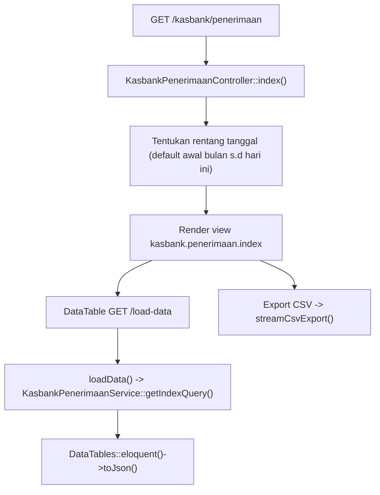
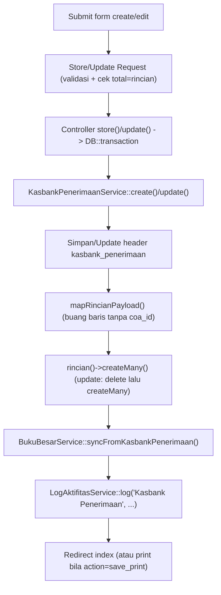
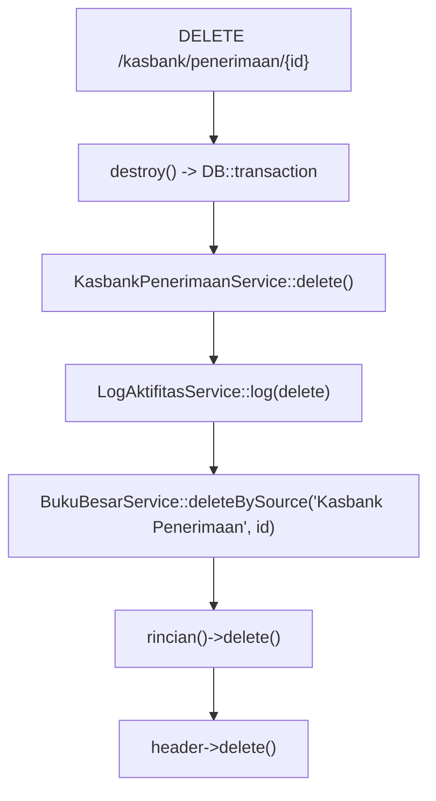

# Dokumentasi Modul Kasbank — Penerimaan

## Ringkasan Modul

Modul **Kasbank Penerimaan** digunakan untuk:

1. mencatat penerimaan kas/bank (satu akun kas + rincian akun lawan),
2. menampilkan daftar penerimaan per periode (DataTables) dan mengekspornya ke CSV,
3. mengubah dan menghapus penerimaan,
4. mencetak bukti penerimaan,
5. menyinkronkan setiap perubahan ke **Buku Besar**.

Implementasi utama:

- `routes/web.php`
- `app/Http/Controllers/Kasbank/KasbankPenerimaanController.php`
- `app/Http/Requests/Kasbank/StoreKasbankPenerimaanRequest.php`
- `app/Http/Requests/Kasbank/UpdateKasbankPenerimaanRequest.php`
- `app/Services/Kasbank/KasbankPenerimaanService.php`
- `app/Services/Bukubesar/BukuBesarService.php`
- `app/Models/KasbankPenerimaan.php`, `app/Models/KasbankPenerimaanRinci.php`, `app/Models/Coa.php`

## Entry Point / API

| Method | Path | Route Name | Controller Method | Izin |
| --- | --- | --- | --- | --- |
| `GET` | `/kasbank/penerimaan` | `kasbank.penerimaan.index` | `index()` | view |
| `GET` | `/kasbank/penerimaan/load-data` | `kasbank.penerimaan.load-data` | `loadData()` | view |
| `GET` | `/kasbank/penerimaan/export-csv` | `kasbank.penerimaan.export-csv` | `exportCsv()` | view |
| `GET` | `/kasbank/penerimaan/{kasbankPenerimaan}/print` | `kasbank.penerimaan.print` | `print()` | view |
| `GET` | `/kasbank/penerimaan/create` | `kasbank.penerimaan.create` | `create()` | create |
| `POST` | `/kasbank/penerimaan` | `kasbank.penerimaan.store` | `store()` | create |
| `GET` | `/kasbank/penerimaan/{kasbankPenerimaan}/edit` | `kasbank.penerimaan.edit` | `edit()` | update |
| `PUT` | `/kasbank/penerimaan/{kasbankPenerimaan}` | `kasbank.penerimaan.update` | `update()` | update |
| `DELETE` | `/kasbank/penerimaan/{kasbankPenerimaan}` | `kasbank.penerimaan.destroy` | `destroy()` | delete |

## Validasi Request

`StoreKasbankPenerimaanRequest` / `UpdateKasbankPenerimaanRequest` memvalidasi:

- `coa_id` wajib integer yang ada di `coa` (akun kas/bank),
- `nomer` wajib, unik pada `kasbank_penerimaan` (ignore diri sendiri saat update),
- `tanggal` wajib berupa tanggal,
- `keterangan` opsional,
- `total` wajib numerik `>= 0`,
- `rincian` wajib array minimal 1 baris,
- `rincian.*.coa_id` wajib integer yang ada di `coa`,
- `rincian.*.nominal` wajib numerik `>= 0`,
- `rincian.*.catatan` opsional.

Validasi tambahan (`after`):

- `total` harus lebih besar dari nol,
- `total` harus sama dengan jumlah `nominal` seluruh rincian (toleransi `0.00001`).

## Alur 1: Daftar & Ekspor

### Flowchart

### Algoritma

1. `index()` menentukan `startDate`/`endDate` (default awal bulan s.d. hari ini).
2. `loadData()` mengambil query dari `getIndexQuery()` (eager load `coa`, urut `tanggal`/`id` desc).
3. Kolom `tanggal`, `total` diformat; `coa_display` menampilkan nama akun; `nomer_link` menuju edit.
4. Ekspor CSV memvalidasi rentang tanggal lalu men-stream kolom Nomor, Tanggal, Bank, Nominal, Keterangan.

## Alur 2: Buat / Ubah + Sinkronisasi Buku Besar

### Flowchart

### Algoritma

1. Request tervalidasi (termasuk kecocokan total = jumlah rincian).
2. Controller membungkus dalam `DB::transaction`.
3. Service menyimpan/memperbarui header lalu menulis ulang rincian.
4. `syncFromKasbankPenerimaan()` mengisi buku besar: **akun kas Debit** sebesar total, tiap
   **rincian Kredit** sebesar nominalnya (idempoten: hapus dulu lalu isi ulang).
5. Aktivitas dicatat via `LogAktifitasService::log()`.
6. Pada `store`, `action = save_print` mengarah ke halaman cetak.

## Alur 3: Hapus

## Alur 4: Cetak

- `print()` mengambil identitas cetak (`PreferensiPerusahaanService::getPrintIdentity()`) dan merender
  view `kasbank.penerimaan.print` dengan data (beserta `coa`, `rincian.coa`), nama RS, petugas, TTD.

## Fungsi yang Dipanggil

- `KasbankPenerimaanController::index()/loadData()/exportCsv()/create()/store()/edit()/update()/destroy()/print()`
- `KasbankPenerimaanService::getCoaOptions()/getIndexQuery()/create()/update()/delete()/mapRincianPayload()`
- `BukuBesarService::syncFromKasbankPenerimaan()/deleteBySource()`
- `LogAktifitasService::log()`
- `PreferensiPerusahaanService::getPrintIdentity()`
- `Coa::scopeSelectableTransaction()`, `KasbankPenerimaan::scopeBetweenDates()`, `KasbankPenerimaan::rincian()`
- Trait `StreamsCsvExport::streamCsvExport()/csvNumber()`

## Catatan Penting Bisnis

- `total` harus sama dengan jumlah nominal rincian dan lebih besar dari nol.
- Arah buku besar: **akun kas Debit**, **rincian akun lawan Kredit**.
- Sinkronisasi buku besar idempoten (hapus lalu isi ulang) pada setiap create/update.
- Hapus juga menghapus mutasi buku besar sumber `Kasbank Penerimaan`.
- Opsi COA memakai akun **daun aktif** (`selectableTransaction()`).
- Lihat [Konvensi Buku Besar & COA](fondasi/konvensi-bukubesar-coa.md).
