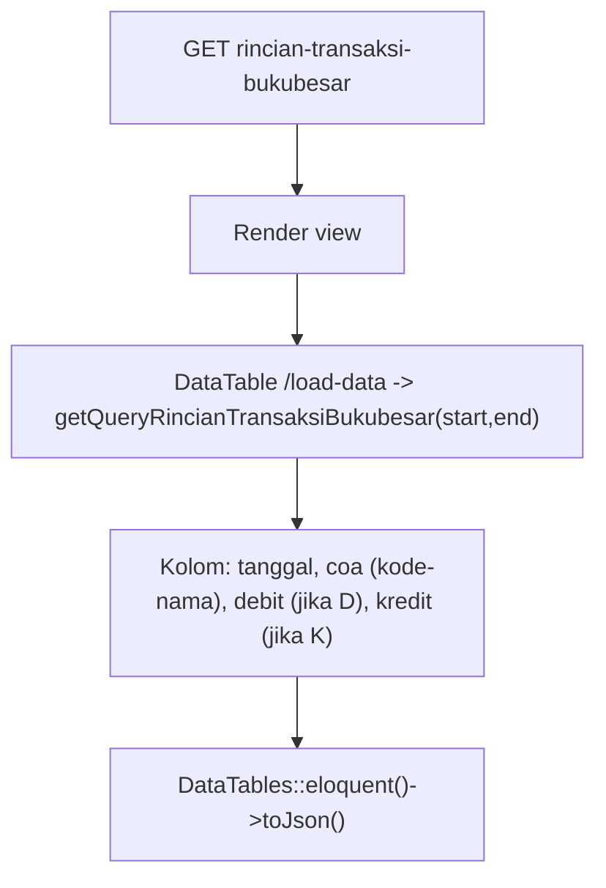
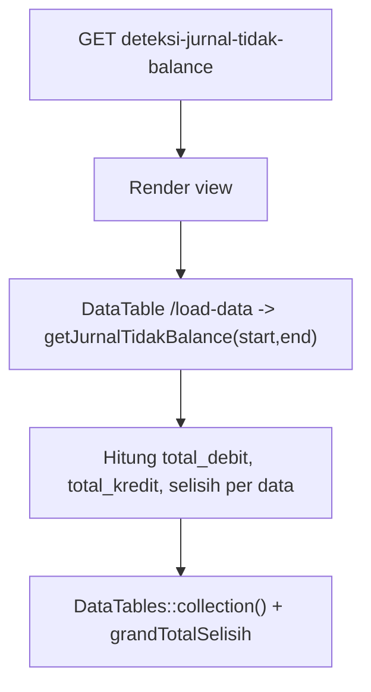
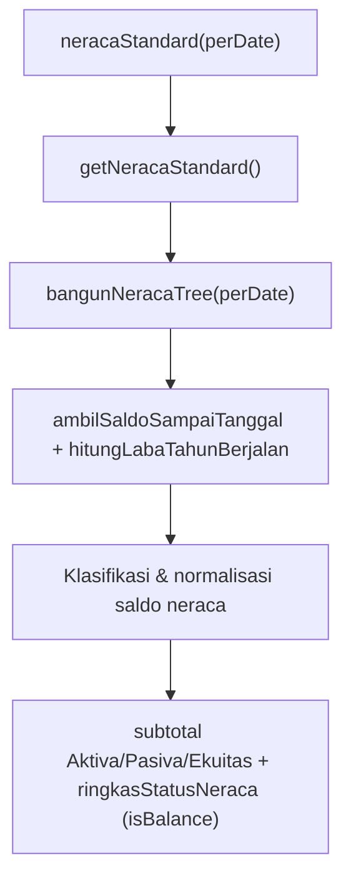
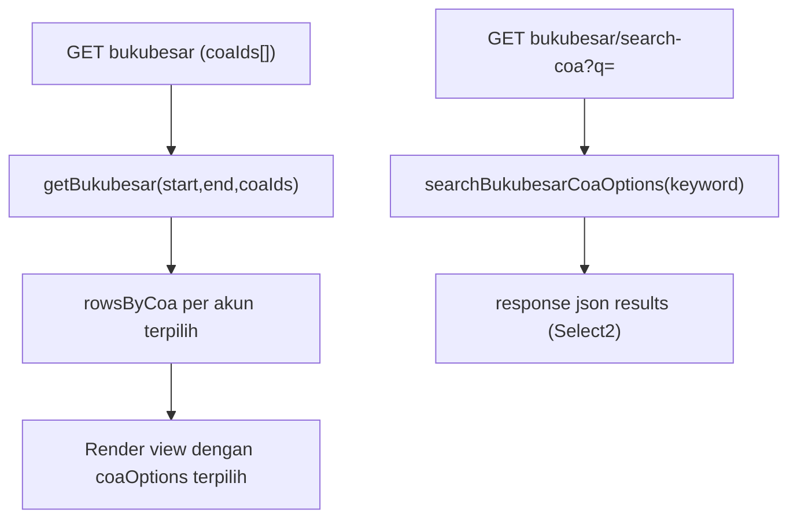
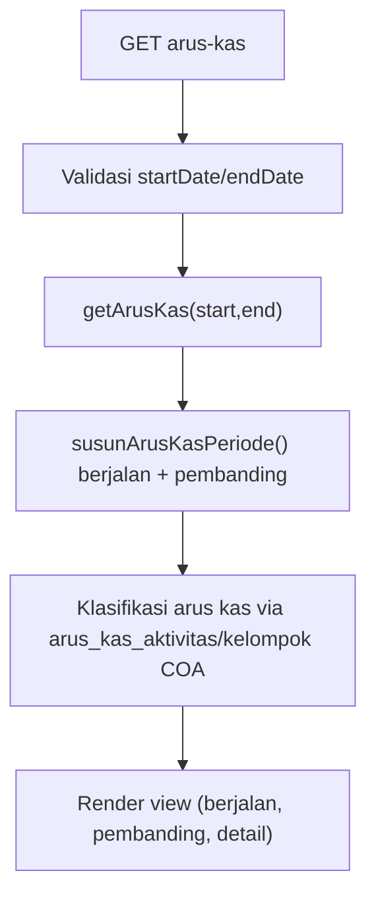

# Dokumentasi Modul Laporan — Keuangan

## Ringkasan Modul

Modul **Laporan Keuangan** menyajikan berbagai laporan akuntansi berbasis data Buku Besar dan COA
(read-only, hanya `view`):

1. Rincian transaksi buku besar,
2. Deteksi jurnal tidak balance,
3. Laba rugi (detil, standard, per parent COA),
4. Neraca (standard, per parent COA, saldo, detil, rinci),
5. Buku besar per COA,
6. Arus kas.

Implementasi utama:

- `routes/web.php`
- `app/Http/Controllers/Laporan/LaporanKeuanganController.php`
- `app/Services/Laporan/LaporanKeuanganService.php`
- `app/Models/BukuBesar.php`, `app/Models/Coa.php`, `app/Models/TipeCoa.php`,
  `app/Models/JurnalUmum.php`, `app/Models/SettingRba.php`

## Entry Point / API

Semua endpoint memakai izin `laporan.keuangan,view`.

| Method | Path | Route Name | Controller Method |
| --- | --- | --- | --- |
| `GET` | `/laporan/keuangan` | `laporan.keuangan.index` | `index()` |
| `GET` | `/laporan/keuangan/rincian-transaksi-bukubesar` | `laporan.keuangan.rincian-transaksi-bukubesar` | `rincianTransaksiBukubesar()` |
| `GET` | `/laporan/keuangan/rincian-transaksi-bukubesar/load-data` | `laporan.keuangan.rincian-transaksi-bukubesar.load-data` | `loadRincianTransaksiBukubesar()` |
| `GET` | `/laporan/keuangan/deteksi-jurnal-tidak-balance` | `laporan.keuangan.deteksi-jurnal-tidak-balance` | `deteksiJurnalTidakBalance()` |
| `GET` | `/laporan/keuangan/deteksi-jurnal-tidak-balance/load-data` | `laporan.keuangan.deteksi-jurnal-tidak-balance.load-data` | `loadDeteksiJurnalTidakBalance()` |
| `GET` | `/laporan/keuangan/laba-rugi-detil` | `laporan.keuangan.laba-rugi-detil` | `labaRugiDetil()` |
| `GET` | `/laporan/keuangan/laba-rugi-standard` | `laporan.keuangan.laba-rugi-standard` | `labaRugiStandard()` |
| `GET` | `/laporan/keuangan/laba-rugi-per-parent-coa` | `laporan.keuangan.laba-rugi-per-parent-coa` | `labaRugiPerParentCoa()` |
| `GET` | `/laporan/keuangan/neraca-standard` | `laporan.keuangan.neraca-standard` | `neracaStandard()` |
| `GET` | `/laporan/keuangan/neraca-per-parent-coa` | `laporan.keuangan.neraca-per-parent-coa` | `neracaPerParentCoa()` |
| `GET` | `/laporan/keuangan/bukubesar` | `laporan.keuangan.bukubesar` | `bukubesar()` |
| `GET` | `/laporan/keuangan/bukubesar/search-coa` | `laporan.keuangan.bukubesar.search-coa` | `searchBukubesarCoa()` |
| `GET` | `/laporan/keuangan/neraca-saldo` | `laporan.keuangan.neraca-saldo` | `neracaSaldo()` |
| `GET` | `/laporan/keuangan/neraca-detil` | `laporan.keuangan.neraca-detil` | `neracaDetil()` |
| `GET` | `/laporan/keuangan/neraca-rinci` | `laporan.keuangan.neraca-rinci` | `neracaRinci()` |
| `GET` | `/laporan/keuangan/arus-kas` | `laporan.keuangan.arus-kas` | `arusKas()` |

## Parameter Umum

- `resolveDateRange()` menentukan `startDate`/`endDate` (default awal bulan s.d. hari ini).
- Laporan berbasis titik waktu memakai `perDate` (default hari ini): neraca standard, per parent COA,
  saldo, detil.
- `getIdentitasLaporan()` menyediakan identitas laporan (nama RS, dll) untuk header laporan.

## Alur Sub-Laporan

### Rincian Transaksi Buku Besar

### Deteksi Jurnal Tidak Balance

### Laba Rugi (Detil / Standard / Per Parent COA)

- `labaRugiDetil()` → `getLabaRugiDetil()`: baris laba rugi rinci per akun.
- `labaRugiStandard()` → `getLabaRugiStandard()`: bentuk agregat standar (parent-child).
- `labaRugiPerParentCoa()` (param `coaId`) → `getLabaRugiPerParentCoa()`: drill-down per parent COA.

Service melibatkan klasifikasi tipe (pendapatan vs biaya), agregasi subtree per akun daun, dan
integrasi anggaran **RBA** (`ambilRbaPerCoa`, `hitungAlokasiBulanPerTahun`) untuk pembanding.

### Neraca (Standard / Per Parent COA / Saldo / Detil / Rinci)

- `neracaStandard()` (param `perDate`) → `getNeracaStandard()`: aktiva/pasiva/ekuitas + status balance.
- `neracaPerParentCoa()` (param `perDate`, `coaId`) → `getNeracaPerParentCoa()`: drill-down.
- `neracaSaldo()` (param `perDate`) → `getNeracaSaldo()`.
- `neracaDetil()` (param `perDate`) → `getNeracaDetil()`.
- `neracaRinci()` (param `startDate`, `endDate`, `tipeCoa[]`) → `getNeracaRinci()`, dengan opsi tipe
  COA dari `getDaftarTipeCoaAktif()`.

### Buku Besar per COA

### Arus Kas

## Fungsi yang Dipanggil

- Controller: `index()`, `rincianTransaksiBukubesar()/loadRincianTransaksiBukubesar()`,
  `deteksiJurnalTidakBalance()/loadDeteksiJurnalTidakBalance()`, `labaRugiDetil()/labaRugiStandard()/labaRugiPerParentCoa()`,
  `neracaStandard()/neracaPerParentCoa()/neracaSaldo()/neracaDetil()/neracaRinci()`,
  `bukubesar()/searchBukubesarCoa()`, `arusKas()`, `resolveDateRange()` (private).
- Service: `getIdentitasLaporan()`, `getQueryRincianTransaksiBukubesar()`, `getJurnalTidakBalance()`,
  `getLabaRugiDetil()/getLabaRugiStandard()/getLabaRugiPerParentCoa()`,
  `getNeracaStandard()/getNeracaPerParentCoa()/getNeracaSaldo()/getNeracaDetil()/getNeracaRinci()`,
  `getBukubesar()/getBukubesarSelectedCoaOptions()/searchBukubesarCoaOptions()`,
  `getArusKas()`, `getDaftarTipeCoaAktif()` (plus banyak helper privat untuk agregasi & klasifikasi).

## Catatan Penting Bisnis

- Modul ini **read-only**; tidak mengubah data buku besar/jurnal.
- Laporan laba rugi mengintegrasikan anggaran **RBA** sebagai pembanding.
- Klasifikasi neraca dan arus kas bergantung pada `tipe_coa` dan `arus_kas_aktivitas`/`arus_kas_kelompok`
  pada COA (lihat [Konvensi Buku Besar & COA](fondasi/konvensi-bukubesar-coa.md)).
- Deteksi jurnal tidak balance membantu menemukan hasil bridging/jurnal yang tidak seimbang
  (lihat juga [Bridging Pendapatan](bridging-pendapatan.md)).
- Neraca standard menyertakan indikator `isBalance` (aktiva = pasiva + ekuitas).
