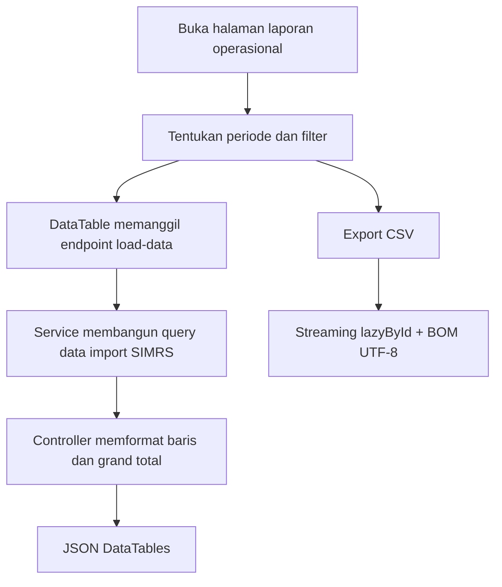
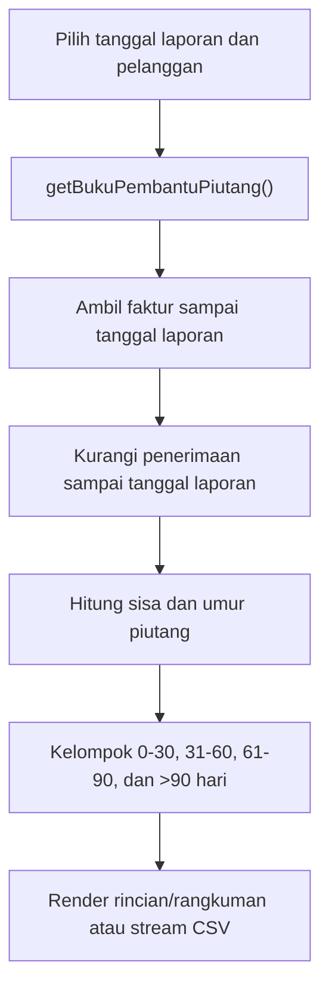
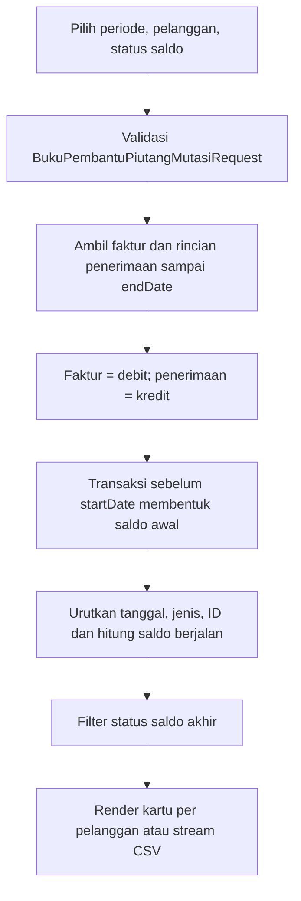

# Dokumentasi Modul Laporan — Pendapatan

## Ringkasan Modul

Modul **Laporan Pendapatan** menyediakan laporan read-only berikut:

1. **Kunjungan** — rekap billing pasien hasil import SIMRS,
2. **Penjualan Obat** — rekap penjualan obat hasil import SIMRS,
3. **Rincian Buku Pembantu Piutang** — posisi dan umur piutang per faktur,
4. **Rangkuman Buku Pembantu Piutang** — rekap umur piutang per pelanggan,
5. **Buku Pembantu Piutang (Mutasi)** — ledger penambahan dan penerimaan piutang per pelanggan.

Implementasi utama:

- `routes/web.php`
- `app/Http/Controllers/Laporan/LaporanPendapatanController.php`
- `app/Http/Requests/Laporan/BukuPembantuPiutangRequest.php`
- `app/Http/Requests/Laporan/BukuPembantuPiutangMutasiRequest.php`
- `app/Services/Laporan/LaporanPendapatanService.php`
- `app/Models/FakturPenjualan.php`, `app/Models/PenerimaanPenjualan.php`,
  `app/Models/PenerimaanPenjualanRinci.php`, dan model import pendapatan SIMRS

## Entry Point / API

Semua endpoint memakai izin `laporan.pendapatan,view`.

| Method | Path | Route Name | Controller Method | Izin |
| --- | --- | --- | --- | --- |
| `GET` | `/laporan/pendapatan` | `laporan.pendapatan.index` | `index()` | view |
| `GET` | `/laporan/pendapatan/kunjungan` | `laporan.pendapatan.kunjungan` | `kunjungan()` | view |
| `GET` | `/laporan/pendapatan/kunjungan/load-data` | `laporan.pendapatan.kunjungan.load-data` | `loadKunjungan()` | view |
| `GET` | `/laporan/pendapatan/kunjungan/export-csv` | `laporan.pendapatan.kunjungan.export-csv` | `exportKunjunganCsv()` | view |
| `GET` | `/laporan/pendapatan/penjualan-obat` | `laporan.pendapatan.penjualan-obat` | `penjualanObat()` | view |
| `GET` | `/laporan/pendapatan/penjualan-obat/load-data` | `laporan.pendapatan.penjualan-obat.load-data` | `loadPenjualanObat()` | view |
| `GET` | `/laporan/pendapatan/penjualan-obat/export-csv` | `laporan.pendapatan.penjualan-obat.export-csv` | `exportPenjualanObatCsv()` | view |
| `GET` | `/laporan/pendapatan/buku-pembantu-piutang` | `laporan.pendapatan.buku-pembantu-piutang` | `bukuPembantuPiutang()` | view |
| `GET` | `/laporan/pendapatan/buku-pembantu-piutang/search-pelanggan` | `laporan.pendapatan.buku-pembantu-piutang.search-pelanggan` | `searchBukuPembantuPiutangPelanggan()` | view |
| `GET` | `/laporan/pendapatan/buku-pembantu-piutang/search-coa` | `laporan.pendapatan.buku-pembantu-piutang.search-coa` | `searchBukuPembantuPiutangCoa()` | view |
| `GET` | `/laporan/pendapatan/buku-pembantu-piutang/export-csv` | `laporan.pendapatan.buku-pembantu-piutang.export-csv` | `exportBukuPembantuPiutangCsv()` | view |
| `GET` | `/laporan/pendapatan/rangkuman-buku-pembantu-piutang` | `laporan.pendapatan.rangkuman-buku-pembantu-piutang` | `rangkumanBukuPembantuPiutang()` | view |
| `GET` | `/laporan/pendapatan/rangkuman-buku-pembantu-piutang/export-csv` | `laporan.pendapatan.rangkuman-buku-pembantu-piutang.export-csv` | `exportRangkumanBukuPembantuPiutangCsv()` | view |
| `GET` | `/laporan/pendapatan/buku-pembantu-piutang-mutasi` | `laporan.pendapatan.buku-pembantu-piutang-mutasi` | `bukuPembantuPiutangMutasi()` | view |
| `GET` | `/laporan/pendapatan/buku-pembantu-piutang-mutasi/export-csv` | `laporan.pendapatan.buku-pembantu-piutang-mutasi.export-csv` | `exportBukuPembantuPiutangMutasiCsv()` | view |

## Validasi Request

### Laporan operasional

- `startDate` dan `endDate` memakai format `Y-m-d`; ekspor mewajibkan keduanya dan `endDate`
  tidak boleh lebih kecil dari `startDate`.
- Kunjungan dapat difilter dengan teks `poli` dan `penjamin`.

### Buku pembantu posisi/umur piutang

`BukuPembantuPiutangRequest` menerima:

- `reportDate`: opsional, format `Y-m-d`, default hari ini,
- `pelangganIds`: array opsional,
- `pelangganIds.*`: ID unik yang harus tersedia pada tabel `pelanggan`.

### Buku pembantu piutang mutasi

`BukuPembantuPiutangMutasiRequest` menerima:

- `startDate`: opsional pada halaman dan wajib saat ekspor, format `Y-m-d`,
- `endDate`: opsional pada halaman dan wajib saat ekspor, format `Y-m-d`, serta
  `after_or_equal:startDate`,
- `pelangganIds`: array minimal satu pelanggan; wajib saat ekspor,
- `pelangganIds.*`: ID integer unik yang tersedia pada tabel `pelanggan`,
- `statusSaldo`: salah satu `semua`, `masih-piutang`, atau `lunas`.

Halaman mutasi memakai default awal bulan sampai hari ini. Laporan belum dihitung sebelum pengguna
memilih minimal satu pelanggan.

## Alur 1: Laporan Kunjungan dan Penjualan Obat

### Algoritma

1. `getQueryKunjungan()` memfilter `SimrsImportPendapatan` berdasarkan periode, poli, dan penjamin.
2. `getQueryPenjualanObat()` memfilter `SimrsImportPendapatanJualObat` berdasarkan periode.
3. DataTable menerapkan pencarian server-side, format angka/tanggal, dan menghitung grand total.
4. Ekspor diproses bertahap dengan `lazyById(1000)` agar penggunaan memori stabil.

## Alur 2: Posisi dan Umur Piutang

### Algoritma

1. Faktur setelah `reportDate` diabaikan.
2. Nilai penerimaan langsung dihitung dari `sudah_terbayar` dikurangi seluruh rincian penerimaan agar
   tidak dihitung ganda; rincian penerimaan setelah tanggal laporan tidak mengurangi saldo historis.
3. Faktur bersaldo nol tidak ditampilkan.
4. Umur piutang dihitung dari tanggal faktur dan dimasukkan ke bucket umur.
5. Rincian dikelompokkan per pelanggan; rangkuman memakai subtotal yang sama dengan laporan rincian.
6. Kolom Keterangan pada rincian dan CSV berasal dari `faktur_penjualan.keterangan`; nilai kosong
   ditampilkan sebagai `-` pada halaman dan tetap kosong pada CSV.

## Alur 3: Buku Pembantu Piutang Mutasi

### Algoritma

1. Service hanya memproses pelanggan yang dipilih dan mengambil transaksi sampai `endDate`.
2. Faktur menambah piutang pada debit. Penerimaan teralokasi mengurangi piutang pada kredit.
3. Selisih positif antara `sudah_terbayar` dan total rincian dicatat sekali sebagai
   **Penerimaan langsung** pada tanggal faktur.
4. Akun transaksi berasal dari akun piutang faktur atau penerimaan; nilai kosong ditampilkan sebagai
   `Tanpa akun piutang`.
5. Saldo awal adalah total `debit - kredit` sebelum `startDate`. Saldo berjalan memakai rumus
   `saldo sebelumnya + debit - kredit`.
6. Filter `masih-piutang` menerima saldo akhir positif; `lunas` memakai toleransi absolut `< 0,005`.
7. Tampilan menyediakan pencarian transaksi di browser dan tautan ke detail faktur/cetak penerimaan.
8. CSV memakai BOM UTF-8 dan nama `buku-pembantu-piutang-mutasi-YYYYMMDD-YYYYMMDD.csv`.

## Fungsi yang Dipanggil

- `LaporanPendapatanController::index()/kunjungan()/penjualanObat()` beserta endpoint DataTable dan CSV
- `LaporanPendapatanController::bukuPembantuPiutang()/rangkumanBukuPembantuPiutang()` beserta pencarian dan CSV
- `LaporanPendapatanController::bukuPembantuPiutangMutasi()/exportBukuPembantuPiutangMutasiCsv()`
- `LaporanPendapatanService::getBukuPembantuPiutang()/getRangkumanBukuPembantuPiutang()`
- `LaporanPendapatanService::getBukuPembantuPiutangMutasi()/streamBukuPembantuPiutangMutasiCsv()`
- `FakturPenjualan::penerimaanPenjualanRincis()/akunPiutang()`
- `PenerimaanPenjualanRinci::penerimaanPenjualan()/fakturPenjualan()`

## Catatan Penting Bisnis

- Seluruh laporan bersifat read-only dan tidak mengubah faktur, penerimaan, atau buku besar.
- Laporan operasional bersumber dari hasil import SIMRS, sedangkan laporan buku pembantu bersumber
  dari `faktur_penjualan` dan alokasi `penerimaan_penjualan_rinci`.
- Nilai `sudah_terbayar` tidak langsung dijumlahkan seluruhnya karena bagian yang memiliki rincian
  penerimaan akan dihitung dari transaksi rincian sesuai tanggalnya.
- Saldo piutang normal bernilai positif; saldo negatif ditampilkan sebagai saldo kredit pelanggan.
- Lihat [Pendapatan — Invoice](pendapatan-invoice.md),
  [Pendapatan — Penerimaan](pendapatan-penerimaan.md), dan
  [Konvensi Buku Besar & COA](fondasi/konvensi-bukubesar-coa.md).
