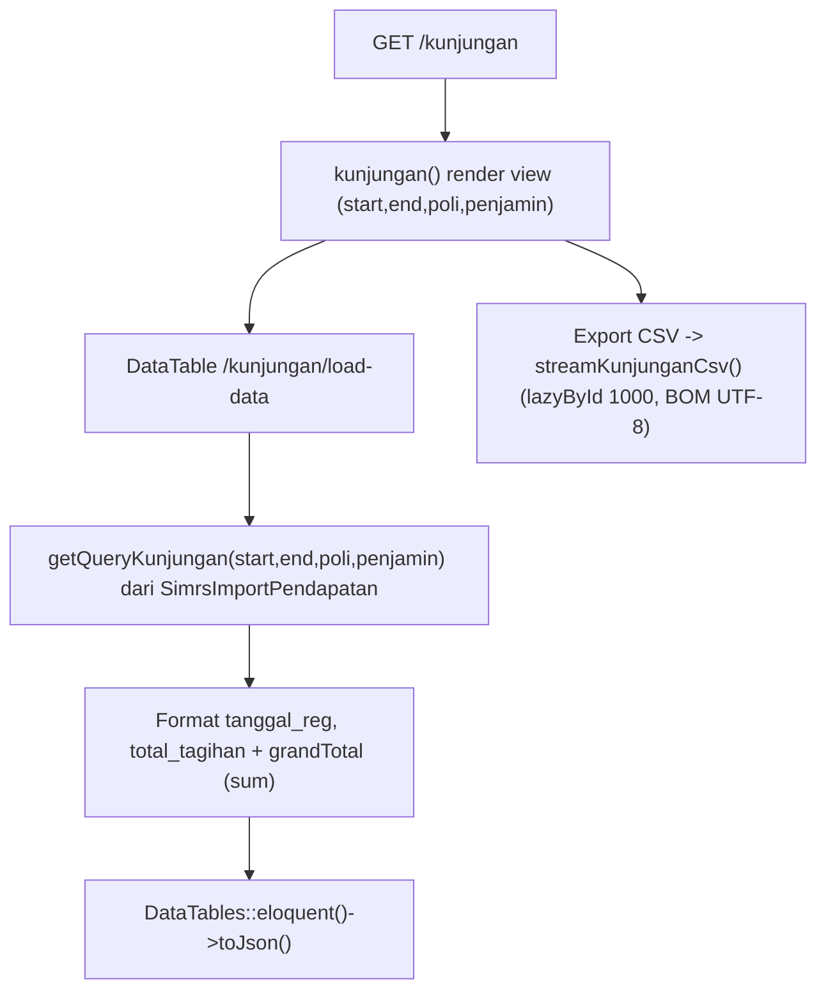
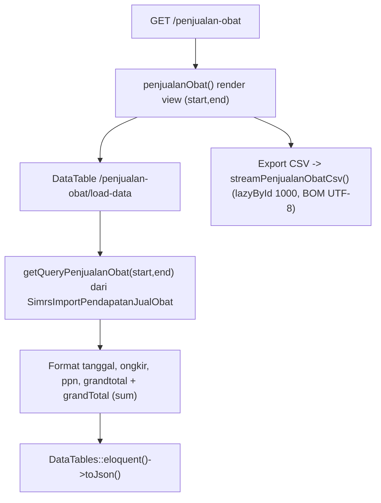

# Dokumentasi Modul Laporan — Pendapatan

## Ringkasan Modul

Modul **Laporan Pendapatan** menyajikan laporan operasional pendapatan (read-only, hanya `view`):

1. **Kunjungan** — rekap kunjungan/billing pasien hasil import (dengan filter poli & penjamin),
2. **Penjualan Obat** — rekap transaksi penjualan obat hasil import.

Keduanya mendukung tampilan DataTables (server-side) dan ekspor CSV streaming.

Implementasi utama:

- `routes/web.php`
- `app/Http/Controllers/Laporan/LaporanPendapatanController.php`
- `app/Services/Laporan/LaporanPendapatanService.php`
- `app/Models/SimrsImportPendapatan.php`, `app/Models/SimrsImportPendapatanJualObat.php`

## Entry Point / API

Semua endpoint memakai izin `laporan.pendapatan,view`.

| Method | Path | Route Name | Controller Method |
| --- | --- | --- | --- |
| `GET` | `/laporan/pendapatan` | `laporan.pendapatan.index` | `index()` |
| `GET` | `/laporan/pendapatan/kunjungan` | `laporan.pendapatan.kunjungan` | `kunjungan()` |
| `GET` | `/laporan/pendapatan/kunjungan/load-data` | `laporan.pendapatan.kunjungan.load-data` | `loadKunjungan()` |
| `GET` | `/laporan/pendapatan/kunjungan/export-csv` | `laporan.pendapatan.kunjungan.export-csv` | `exportKunjunganCsv()` |
| `GET` | `/laporan/pendapatan/penjualan-obat` | `laporan.pendapatan.penjualan-obat` | `penjualanObat()` |
| `GET` | `/laporan/pendapatan/penjualan-obat/load-data` | `laporan.pendapatan.penjualan-obat.load-data` | `loadPenjualanObat()` |
| `GET` | `/laporan/pendapatan/penjualan-obat/export-csv` | `laporan.pendapatan.penjualan-obat.export-csv` | `exportPenjualanObatCsv()` |

## Parameter

- `resolveDateRange()` menentukan `startDate`/`endDate` (default awal bulan s.d. hari ini).
- Laporan Kunjungan menerima filter `poli` dan `penjamin` (pencarian `like`).

## Alur 1: Laporan Kunjungan

### Algoritma

1. `getQueryKunjungan()` mengambil `SimrsImportPendapatan` per periode, difilter `poli`/`penjamin`
   bila diisi, urut `tanggal_reg`/`id` desc.
2. DataTable memformat `tanggal_reg` dan `total_tagihan`, serta menghitung `grandTotal`.
3. Ekspor CSV di-stream dengan `lazyById(1000)` dan BOM UTF-8; kolom: No. Billing, Tanggal Registrasi,
   Pasien, Status Layanan, Dokter, Poli, Penjamin, Nominal.

## Alur 2: Laporan Penjualan Obat

### Algoritma

1. `getQueryPenjualanObat()` mengambil `SimrsImportPendapatanJualObat` per periode, urut `tanggal`/`id` desc.
2. DataTable memformat `tanggal`, `ongkir`, `ppn`, `grandtotal`, dan menghitung `grandTotal`.
3. Ekspor CSV di-stream; kolom: No. Transaksi, Tanggal, Pelanggan, Jenis, Gudang, Rekening,
   Keterangan, Ongkir, PPN, Nominal.

## Fungsi yang Dipanggil

- `LaporanPendapatanController::index()/kunjungan()/loadKunjungan()/exportKunjunganCsv()`
- `LaporanPendapatanController::penjualanObat()/loadPenjualanObat()/exportPenjualanObatCsv()`
- `LaporanPendapatanController::resolveDateRange()` + helper pencarian DataTable (private)
- `LaporanPendapatanService::getQueryKunjungan()/getQueryPenjualanObat()`
- `LaporanPendapatanService::streamKunjunganCsv()/streamPenjualanObatCsv()` (+ helper export privat)
- `SimrsImportPendapatan::scopeBetweenDates()`, `SimrsImportPendapatanJualObat::scopeBetweenDates()`

## Catatan Penting Bisnis

- Modul ini **read-only**; sumber data adalah hasil import bridging (`SimrsImportPendapatan`,
  `SimrsImportPendapatanJualObat`).
- Ekspor CSV memakai streaming `lazyById` untuk efisiensi memori pada data besar, dengan BOM UTF-8
  agar terbaca benar di Excel.
- Lihat [Bridging Pendapatan](bridging-pendapatan.md) dan [Bridging Pendapatan Obat](bridging-pendapatan-obat.md)
  untuk asal data.
