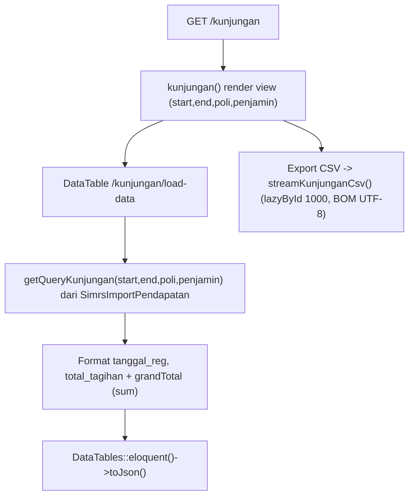
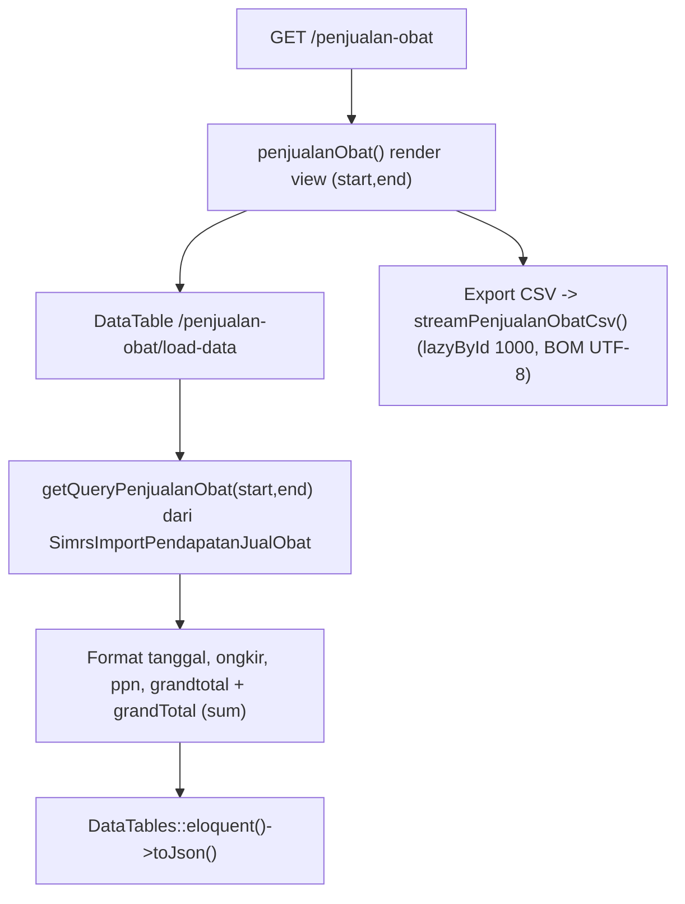
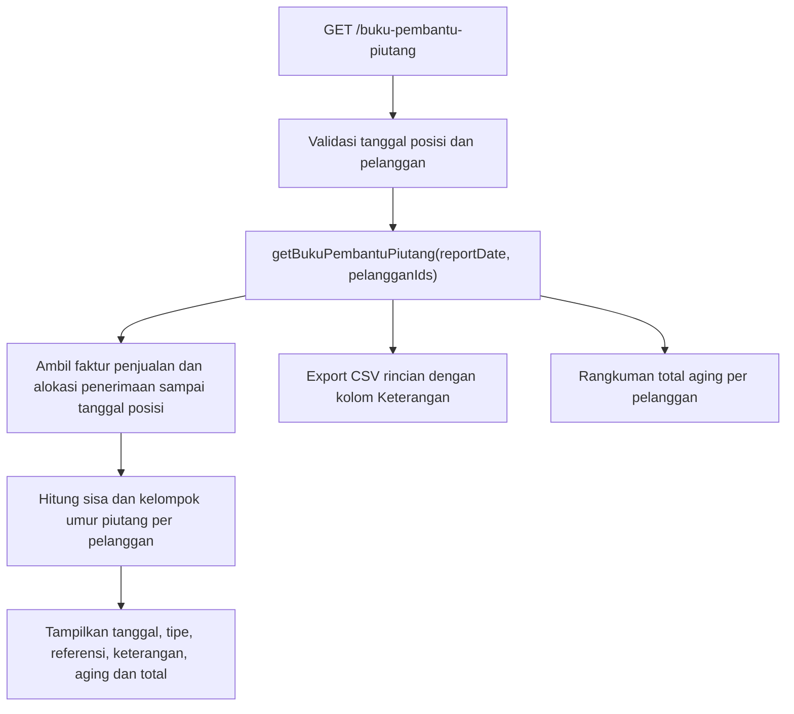

# Dokumentasi Modul Laporan — Pendapatan

## Ringkasan Modul

Modul **Laporan Pendapatan** menyajikan laporan operasional pendapatan (read-only, hanya `view`):

1. **Kunjungan** — rekap kunjungan/billing pasien hasil import (dengan filter poli & penjamin),
2. **Penjualan Obat** — rekap transaksi penjualan obat hasil import,
3. **Rincian Buku Pembantu Piutang** — posisi invoice penjualan yang masih memiliki saldo menurut umur piutang,
4. **Rangkuman Buku Pembantu Piutang** — total umur piutang per pelanggan.

Laporan kunjungan dan penjualan obat memakai DataTables server-side. Laporan buku pembantu piutang
disusun per tanggal posisi dan seluruh laporan mendukung ekspor CSV.

Implementasi utama:

- `routes/web.php`
- `app/Http/Controllers/Laporan/LaporanPendapatanController.php`
- `app/Services/Laporan/LaporanPendapatanService.php`
- `app/Models/SimrsImportPendapatan.php`, `app/Models/SimrsImportPendapatanJualObat.php`

## Entry Point / API

Semua endpoint memakai izin `laporan.pendapatan,view`.

| Method | Path | Route Name | Controller Method | Izin |
| --- | --- | --- | --- | --- |
| `GET` | `/laporan/pendapatan` | `laporan.pendapatan.index` | `index()` | `laporan.pendapatan,view` |
| `GET` | `/laporan/pendapatan/kunjungan` | `laporan.pendapatan.kunjungan` | `kunjungan()` | `laporan.pendapatan,view` |
| `GET` | `/laporan/pendapatan/kunjungan/load-data` | `laporan.pendapatan.kunjungan.load-data` | `loadKunjungan()` | `laporan.pendapatan,view` |
| `GET` | `/laporan/pendapatan/kunjungan/export-csv` | `laporan.pendapatan.kunjungan.export-csv` | `exportKunjunganCsv()` | `laporan.pendapatan,view` |
| `GET` | `/laporan/pendapatan/penjualan-obat` | `laporan.pendapatan.penjualan-obat` | `penjualanObat()` | `laporan.pendapatan,view` |
| `GET` | `/laporan/pendapatan/penjualan-obat/load-data` | `laporan.pendapatan.penjualan-obat.load-data` | `loadPenjualanObat()` | `laporan.pendapatan,view` |
| `GET` | `/laporan/pendapatan/penjualan-obat/export-csv` | `laporan.pendapatan.penjualan-obat.export-csv` | `exportPenjualanObatCsv()` | `laporan.pendapatan,view` |
| `GET` | `/laporan/pendapatan/buku-pembantu-piutang` | `laporan.pendapatan.buku-pembantu-piutang` | `bukuPembantuPiutang()` | `laporan.pendapatan,view` |
| `GET` | `/laporan/pendapatan/buku-pembantu-piutang/search-pelanggan` | `laporan.pendapatan.buku-pembantu-piutang.search-pelanggan` | `searchBukuPembantuPiutangPelanggan()` | `laporan.pendapatan,view` |
| `GET` | `/laporan/pendapatan/buku-pembantu-piutang/search-coa` | `laporan.pendapatan.buku-pembantu-piutang.search-coa` | `searchBukuPembantuPiutangCoa()` | `laporan.pendapatan,view` |
| `GET` | `/laporan/pendapatan/buku-pembantu-piutang/export-csv` | `laporan.pendapatan.buku-pembantu-piutang.export-csv` | `exportBukuPembantuPiutangCsv()` | `laporan.pendapatan,view` |
| `GET` | `/laporan/pendapatan/rangkuman-buku-pembantu-piutang` | `laporan.pendapatan.rangkuman-buku-pembantu-piutang` | `rangkumanBukuPembantuPiutang()` | `laporan.pendapatan,view` |
| `GET` | `/laporan/pendapatan/rangkuman-buku-pembantu-piutang/export-csv` | `laporan.pendapatan.rangkuman-buku-pembantu-piutang.export-csv` | `exportRangkumanBukuPembantuPiutangCsv()` | `laporan.pendapatan,view` |

## Parameter

- `resolveDateRange()` menentukan `startDate`/`endDate` (default awal bulan s.d. hari ini).
- Laporan Kunjungan menerima filter `poli` dan `penjamin` (pencarian `like`).
- Buku Pembantu Piutang menerima `reportDate` (default hari ini) dan `pelangganIds[]` opsional.

## Alur 1: Laporan Kunjungan

### Algoritma

1. `getQueryKunjungan()` mengambil `SimrsImportPendapatan` per periode, difilter `poli`/`penjamin`
   bila diisi, urut `tanggal_reg`/`id` desc.
2. DataTable memformat `tanggal_reg` dan `total_tagihan`, serta menghitung `grandTotal`.
3. Ekspor CSV di-stream dengan `lazyById(1000)` dan BOM UTF-8; kolom: No. Billing, Tanggal Registrasi,
   Pasien, Status Layanan, Dokter, Poli, Penjamin, Nominal.

## Alur 2: Laporan Penjualan Obat

### Algoritma

1. `getQueryPenjualanObat()` mengambil `SimrsImportPendapatanJualObat` per periode, urut `tanggal`/`id` desc.
2. DataTable memformat `tanggal`, `ongkir`, `ppn`, `grandtotal`, dan menghitung `grandTotal`.
3. Ekspor CSV di-stream; kolom: No. Transaksi, Tanggal, Pelanggan, Jenis, Gudang, Rekening,
   Keterangan, Ongkir, PPN, Nominal.

## Alur 3: Buku Pembantu Piutang

### Algoritma

1. `getBukuPembantuPiutang()` memilih faktur penjualan sampai `reportDate`, menerapkan filter pelanggan,
   lalu menghitung saldo berdasarkan pembayaran langsung dan alokasi penerimaan sampai tanggal posisi.
2. Faktur bersaldo dikelompokkan per pelanggan dan dimasukkan ke bucket umur 0–30, 31–60, 61–90,
   atau lebih dari 90 hari berdasarkan `tanggal_faktur`.
3. Rincian menampilkan `faktur_penjualan.keterangan` setelah No. Referensi; nilai kosong ditampilkan
   sebagai `-`. CSV menyimpan nilai kosong sebagai kolom kosong.
4. CSV rincian berisi Kode Pelanggan, Nama Pelanggan, Tanggal, Tipe, No. Referensi, Keterangan,
   empat bucket aging, subtotal pelanggan, dan grand total. Rangkuman tidak memuat keterangan invoice.

## Fungsi yang Dipanggil

- `LaporanPendapatanController::index()/kunjungan()/loadKunjungan()/exportKunjunganCsv()`
- `LaporanPendapatanController::penjualanObat()/loadPenjualanObat()/exportPenjualanObatCsv()`
- `LaporanPendapatanController::bukuPembantuPiutang()/rangkumanBukuPembantuPiutang()`
- `LaporanPendapatanController::exportBukuPembantuPiutangCsv()/exportRangkumanBukuPembantuPiutangCsv()`
- `LaporanPendapatanController::resolveDateRange()` + helper pencarian DataTable (private)
- `LaporanPendapatanService::getQueryKunjungan()/getQueryPenjualanObat()/getBukuPembantuPiutang()`
- `LaporanPendapatanService::streamKunjunganCsv()/streamPenjualanObatCsv()` (+ helper export privat)
- `LaporanPendapatanService::streamBukuPembantuPiutangCsv()/streamRangkumanBukuPembantuPiutangCsv()`
- `SimrsImportPendapatan::scopeBetweenDates()`, `SimrsImportPendapatanJualObat::scopeBetweenDates()`

## Catatan Penting Bisnis

- Modul ini **read-only**; sumber data adalah hasil import bridging (`SimrsImportPendapatan`,
  `SimrsImportPendapatanJualObat`) serta transaksi `FakturPenjualan` dan `PenerimaanPenjualan`.
- Laporan piutang historis hanya memperhitungkan penerimaan sampai tanggal posisi; penerimaan setelah
  tanggal tersebut tidak mengurangi saldo laporan.
- Ekspor CSV memakai streaming `lazyById` untuk efisiensi memori pada data besar, dengan BOM UTF-8
  agar terbaca benar di Excel.
- Lihat [Bridging Pendapatan](bridging-pendapatan.md) dan [Bridging Pendapatan Obat](bridging-pendapatan-obat.md)
  untuk asal data.
