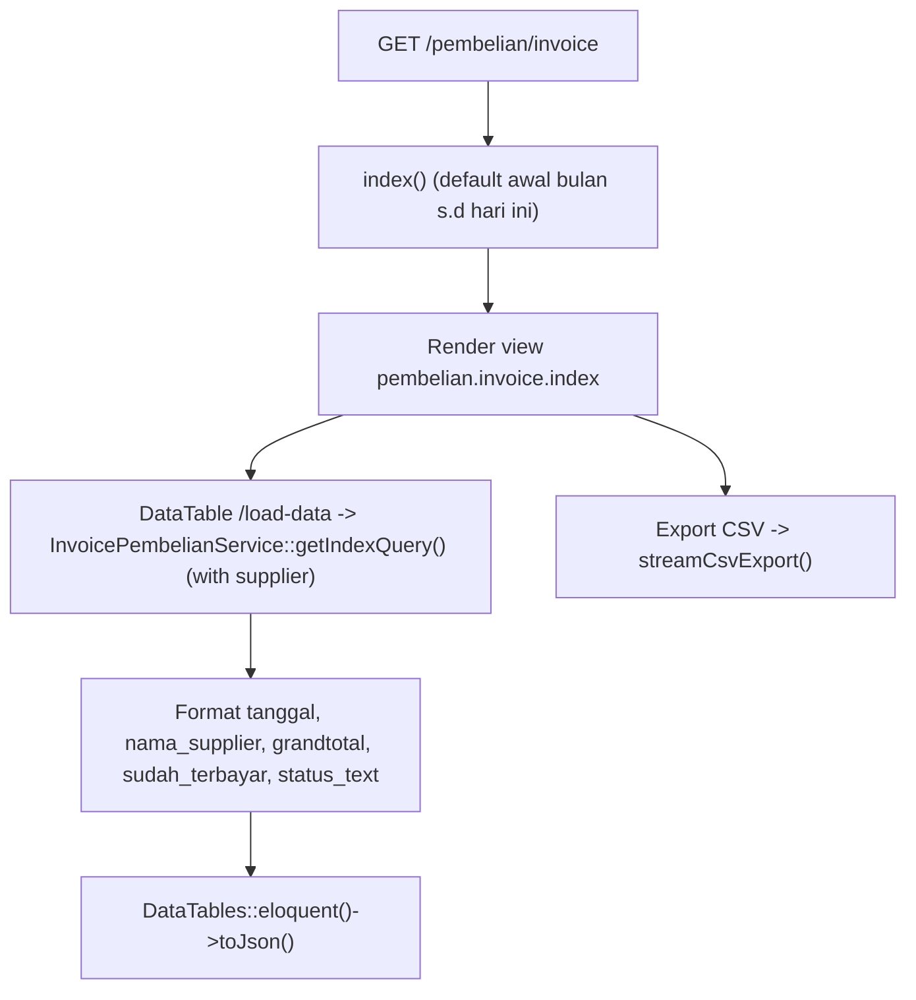
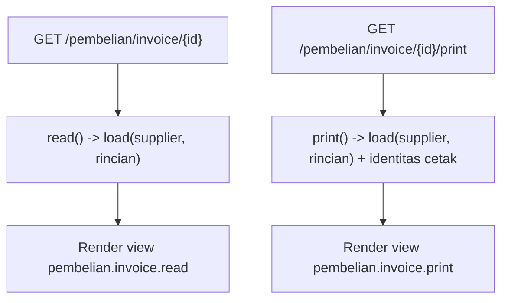

# Dokumentasi Modul Pembelian — Invoice

## Ringkasan Modul

Modul **Invoice Pembelian** (faktur pembelian) digunakan untuk:

1. menampilkan daftar invoice pembelian per periode (DataTables) dengan status lunas/belum lunas,
2. mengekspor daftar ke CSV,
3. melihat detail satu invoice (read-only),
4. mencetak invoice.

Invoice pembelian **dibuat oleh proses Bridging Pembelian**, bukan diinput manual di modul ini
(modul ini bersifat baca-saja: hanya `view`).

Implementasi utama:

- `routes/web.php`
- `app/Http/Controllers/Pembelian/InvoicePembelianController.php`
- `app/Services/Pembelian/InvoicePembelianService.php`
- `app/Models/FakturPembelian.php`, `app/Models/FakturPembelianRinci.php`, `app/Models/Supplier.php`

## Entry Point / API

| Method | Path | Route Name | Controller Method | Izin |
| --- | --- | --- | --- | --- |
| `GET` | `/pembelian/invoice` | `pembelian.invoice.index` | `index()` | view |
| `GET` | `/pembelian/invoice/load-data` | `pembelian.invoice.load-data` | `loadData()` | view |
| `GET` | `/pembelian/invoice/export-csv` | `pembelian.invoice.export-csv` | `exportCsv()` | view |
| `GET` | `/pembelian/invoice/{fakturPembelian}/print` | `pembelian.invoice.print` | `print()` | view |
| `GET` | `/pembelian/invoice/{fakturPembelian}` | `pembelian.invoice.read` | `read()` | view |

## Alur 1: Daftar & Ekspor

### Algoritma

1. `getIndexQuery()` mengambil `FakturPembelian` per periode (urut `tanggal_faktur`/`id` desc, eager `supplier`).
2. DataTable menambahkan kolom turunan: `nama_supplier`, `grandtotal_display`, `sudah_terbayar_display`,
   `status_text` (`Sudah Lunas` bila `sudah_terbayar >= grandtotal`), `nomer_link` (ke read).
3. Ekspor CSV memuat kolom Nomor faktur, Tanggal faktur, Tgl jatuh tempo, Supplier, Kode bangsal,
   Kategori faktur, Grandtotal, Sudah terbayar, Status.

## Alur 2: Lihat Detail & Cetak

## Fungsi yang Dipanggil

- `InvoicePembelianController::index()/loadData()/exportCsv()/read()/print()`
- `InvoicePembelianService::getIndexQuery()/findById()/increaseSudahTerbayar()/decreaseSudahTerbayar()`
- `FakturPembelian::scopeBetweenDates()`, `FakturPembelian::rincian()`, `FakturPembelian::supplier()`
- `PreferensiPerusahaanService::getPrintIdentity()`
- Trait `StreamsCsvExport::streamCsvExport()/csvNumber()`

> Catatan: `increaseSudahTerbayar()`/`decreaseSudahTerbayar()` dipakai oleh modul
> [Pembelian — Pembayaran](pembelian-pembayaran.md) untuk memperbarui `sudah_terbayar` faktur.

## Catatan Penting Bisnis

- Modul ini **read-only** (hanya `view`); tidak ada create/update/delete langsung.
- Sumber data invoice berasal dari [Bridging Pembelian](bridging-pembelian.md).
- Status lunas dihitung dari perbandingan `sudah_terbayar` dan `grandtotal`.
- Kolom `sudah_terbayar` diubah oleh modul Pembayaran Pembelian saat pembayaran dicatat/dihapus.
