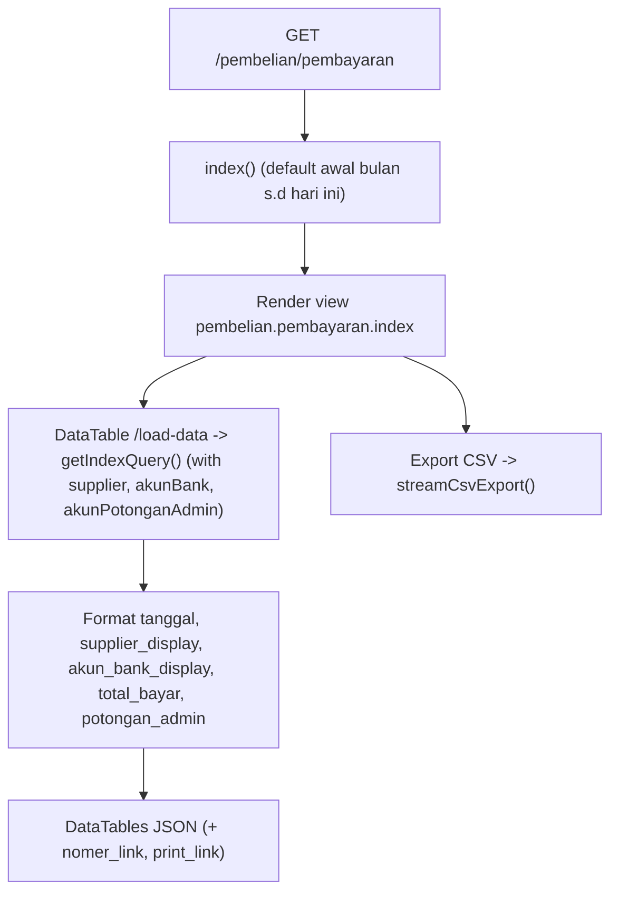
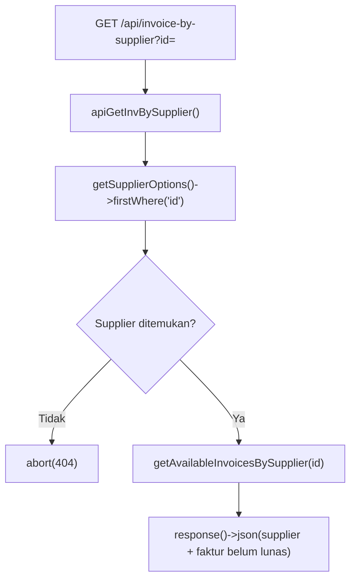
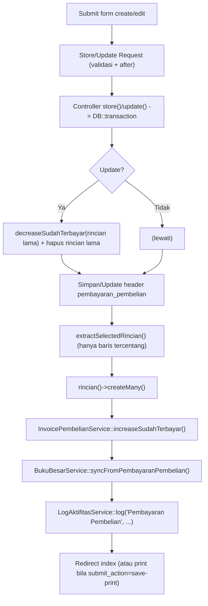
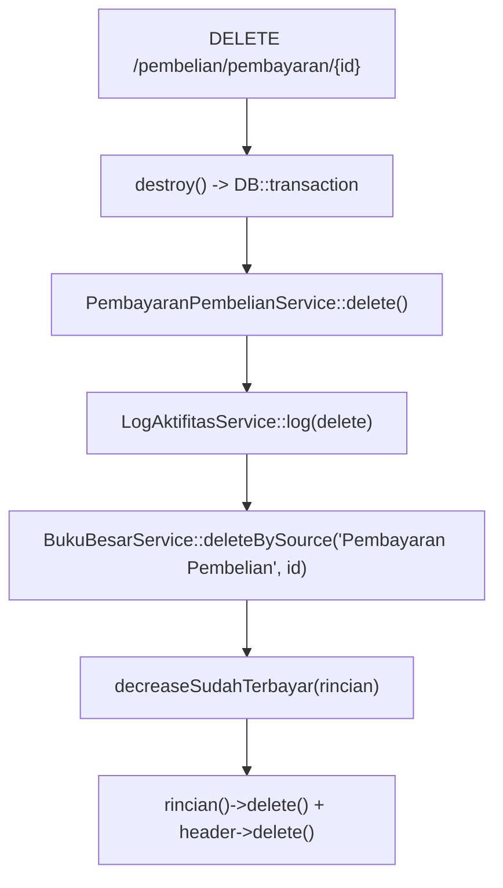

# Dokumentasi Modul Pembelian — Pembayaran

## Ringkasan Modul

Modul **Pembayaran Pembelian** digunakan untuk:

1. mencatat pembayaran atas satu atau lebih invoice pembelian (faktur pembelian),
2. menampilkan daftar pembayaran per periode (DataTables) dan mengekspornya ke CSV,
3. mengubah dan menghapus pembayaran,
4. mencetak bukti pembayaran,
5. menyediakan API daftar invoice pembelian yang belum lunas per supplier,
6. menyinkronkan setiap perubahan ke **Buku Besar** dan memperbarui `sudah_terbayar` faktur.

Implementasi utama:

- `routes/web.php`
- `app/Http/Controllers/Pembelian/PembayaranPembelianController.php`
- `app/Http/Requests/Pembelian/StorePembayaranPembelianRequest.php`
- `app/Http/Requests/Pembelian/UpdatePembayaranPembelianRequest.php`
- `app/Services/Pembelian/PembayaranPembelianService.php`
- `app/Services/Pembelian/InvoicePembelianService.php`
- `app/Services/Bukubesar/BukuBesarService.php`
- `app/Models/PembayaranPembelian.php`, `app/Models/PembayaranPembelianRinci.php`,
  `app/Models/FakturPembelian.php`, `app/Models/Supplier.php`, `app/Models/Coa.php`

## Entry Point / API

| Method | Path | Route Name | Controller Method | Izin |
| --- | --- | --- | --- | --- |
| `GET` | `/pembelian/pembayaran` | `pembelian.pembayaran.index` | `index()` | view |
| `GET` | `/pembelian/pembayaran/load-data` | `pembelian.pembayaran.load-data` | `loadData()` | view |
| `GET` | `/pembelian/pembayaran/export-csv` | `pembelian.pembayaran.export-csv` | `exportCsv()` | view |
| `GET` | `/pembelian/pembayaran/{pembayaranPembelian}/print` | `pembelian.pembayaran.print` | `print()` | view |
| `GET` | `/pembelian/pembayaran/api/invoice-by-supplier` | `pembelian.pembayaran.api.invoice-by-supplier` | `apiGetInvBySupplier()` | view |
| `GET` | `/pembelian/pembayaran/create` | `pembelian.pembayaran.create` | `create()` | create |
| `POST` | `/pembelian/pembayaran` | `pembelian.pembayaran.store` | `store()` | create |
| `GET` | `/pembelian/pembayaran/{pembayaranPembelian}/edit` | `pembelian.pembayaran.edit` | `edit()` | update |
| `PUT` | `/pembelian/pembayaran/{pembayaranPembelian}` | `pembelian.pembayaran.update` | `update()` | update |
| `DELETE` | `/pembelian/pembayaran/{pembayaranPembelian}` | `pembelian.pembayaran.destroy` | `destroy()` | delete |

## Validasi Request

`StorePembayaranPembelianRequest` / `UpdatePembayaranPembelianRequest`:

- `supplier_id` wajib, ada di `supplier`,
- `akun_bank_id`, `akun_hutang_id` wajib, ada di `coa`,
- `akun_potongan_admin_id` opsional, ada di `coa`,
- `nomer_pembayaran` wajib, maks 50, unik pada `pembayaran_pembelian` (ignore diri sendiri saat update),
- `tanggal` wajib,
- `total_bayar` wajib numerik `>= 0`,
- `potongan_admin` opsional numerik `>= 0`,
- `keterangan` opsional maks 255,
- `rincian` wajib array minimal 1; tiap baris `faktur_pembelian_id` (ada di `faktur_pembelian`),
  `nominal_bayar` numerik `>= 0`, dan `check` opsional.

Validasi tambahan (`after`):

- minimal satu faktur dicentang (`check`),
- `total_bayar` harus sama dengan total nominal rincian tercentang,
- bila `potongan_admin > 0`, `akun_potongan_admin_id` wajib,
- `potongan_admin` tidak boleh lebih besar dari `total_bayar`.

## Alur 1: Daftar & Ekspor

## Alur 2: API Invoice per Supplier

`getAvailableInvoicesBySupplier()` mengambil faktur supplier yang masih outstanding
(`FLOOR(grandtotal) > FLOOR(sudah_terbayar)`; pada SQLite pakai CAST INTEGER) dan `status_proses`
bukan `'1'` (atau null).

## Alur 3: Buat / Ubah + Sinkronisasi

### Algoritma

1. Controller membungkus operasi dalam `DB::transaction` dan meneruskan `actor`.
2. Pada update: `decreaseSudahTerbayar()` rincian lama lalu hapus rincian lama.
3. Service menyimpan/memperbarui header, lalu menyimpan hanya rincian **tercentang**.
4. `increaseSudahTerbayar()` menaikkan `sudah_terbayar` pada faktur terkait.
5. `syncFromPembayaranPembelian()` menulis buku besar: Hutang `D = total_bayar`,
   Bank `K = total_bayar − potongan_admin`, dan akun potongan admin `K` bila ada.
6. Aktivitas dicatat via `LogAktifitasService::log()`.
7. `submit_action = save-print` mengarahkan ke halaman cetak.

## Alur 4: Hapus

## Alur 5: Cetak

- `print()` memuat relasi (`supplier`, `akunBank`, `akunHutang`, `akunPotonganAdmin`,
  `rincian.fakturPembelian`) dan identitas cetak, lalu merender `pembelian.pembayaran.print`.

## Fungsi yang Dipanggil

- `PembayaranPembelianController::index()/loadData()/exportCsv()/create()/store()/edit()/update()/destroy()/print()/apiGetInvBySupplier()`
- `PembayaranPembelianService::getIndexQuery()/getCoaOptions()/getSupplierOptions()/getAvailableInvoicesBySupplier()`
- `PembayaranPembelianService::create()/update()/delete()/extractSelectedRincian()/outstandingInvoiceCondition()`
- `InvoicePembelianService::increaseSudahTerbayar()/decreaseSudahTerbayar()`
- `BukuBesarService::syncFromPembayaranPembelian()/deleteBySource()`
- `LogAktifitasService::log()`, `PreferensiPerusahaanService::getPrintIdentity()`
- `Coa::scopeSelectableTransaction()`, `PembayaranPembelian::scopeBetweenDates()`
- Trait `StreamsCsvExport::streamCsvExport()/csvNumber()`

## Catatan Penting Bisnis

- Hanya baris faktur yang **dicentang** yang diproses menjadi rincian pembayaran.
- `total_bayar` = total rincian terpilih (divalidasi).
- `potongan_admin > 0` mewajibkan `akun_potongan_admin_id`, dan tidak boleh melebihi `total_bayar`.
- Pembayaran memperbarui `sudah_terbayar` faktur; update/hapus mengembalikan nilai lama dulu (decrease).
- Buku besar disinkronkan idempoten (`deleteBySource` di dalam `syncFrom*`).
- Opsi supplier hanya yang punya faktur belum lunas dan belum berstatus proses `'1'`.
- Lihat [Pembelian — Invoice](pembelian-invoice.md) dan [Konvensi Buku Besar & COA](fondasi/konvensi-bukubesar-coa.md).
