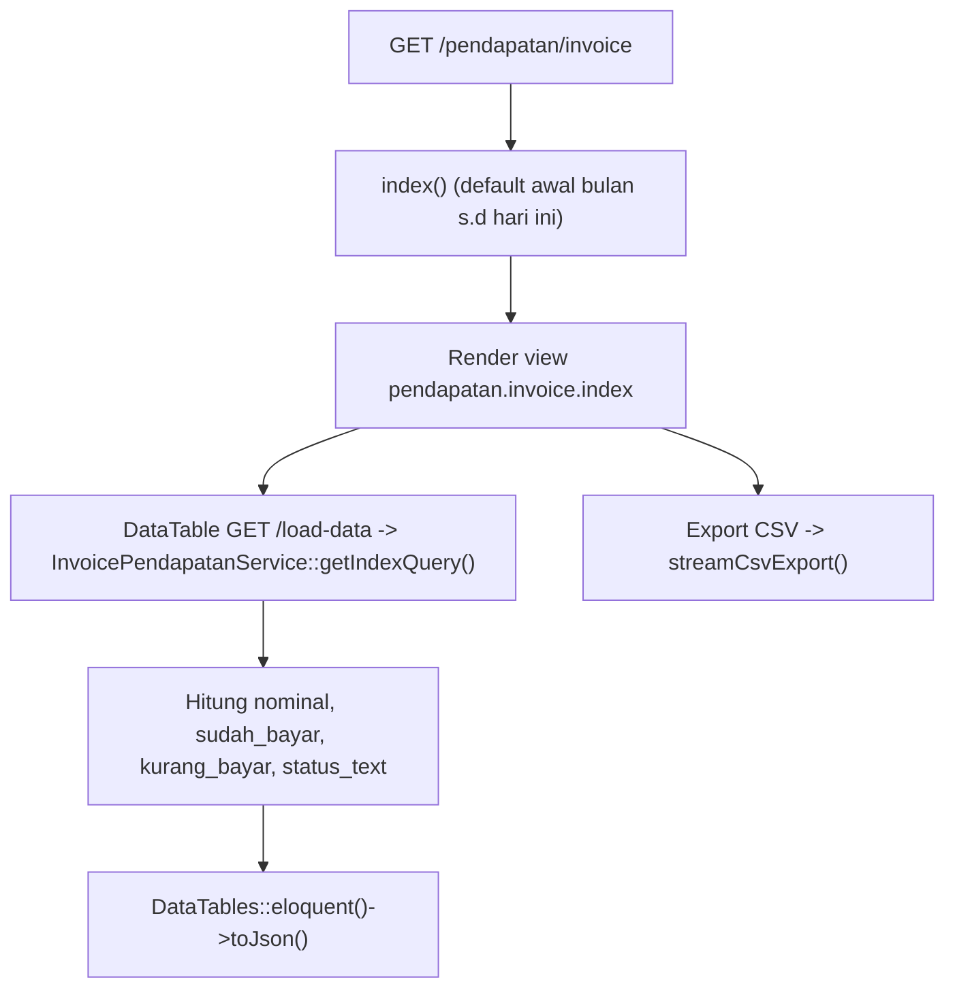
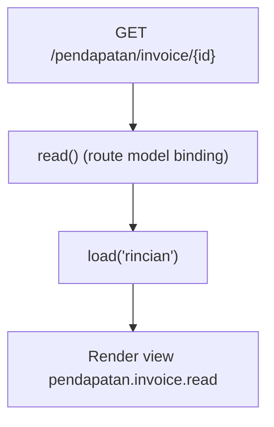

# Dokumentasi Modul Pendapatan — Invoice

## Ringkasan Modul

Modul **Invoice Pendapatan** (faktur penjualan) digunakan untuk:

1. menampilkan daftar invoice pendapatan per periode (DataTables) dengan status lunas/belum lunas,
2. mengekspor daftar invoice ke CSV,
3. melihat detail satu invoice (read-only).

Invoice pendapatan **dibuat oleh proses Bridging Pendapatan**, bukan diinput manual di modul ini
(modul ini bersifat baca-saja: hanya `view`).

Implementasi utama:

- `routes/web.php`
- `app/Http/Controllers/Pendapatan/InvoicePendapatanController.php`
- `app/Services/Pendapatan/InvoicePendapatanService.php`
- `app/Models/FakturPenjualan.php`, `app/Models/FakturPenjualanRinci.php`

## Entry Point / API

| Method | Path | Route Name | Controller Method | Izin |
| --- | --- | --- | --- | --- |
| `GET` | `/pendapatan/invoice` | `pendapatan.invoice.index` | `index()` | view |
| `GET` | `/pendapatan/invoice/load-data` | `pendapatan.invoice.load-data` | `loadData()` | view |
| `GET` | `/pendapatan/invoice/export-csv` | `pendapatan.invoice.export-csv` | `exportCsv()` | view |
| `GET` | `/pendapatan/invoice/{fakturPenjualan}` | `pendapatan.invoice.read` | `read()` | view |

## Alur 1: Daftar & Ekspor

### Algoritma

1. `getIndexQuery()` mengambil `FakturPenjualan` per periode (urut `tanggal_faktur`/`id` desc).
2. DataTable menambahkan kolom turunan: `nominal` (grandtotal), `sudah_bayar`, `kurang_bayar`
   (`grandtotal - sudah_terbayar`), dan `status_text` (`Sudah Lunas` bila `sudah_terbayar >= grandtotal`,
   selain itu `Belum Lunas`), serta `nomer_link` menuju halaman read.
3. Ekspor CSV memuat kolom Nomor, Tanggal, Dokter, No. RM, Pasien, Poli, Penjamin, Nominal,
   Sudah bayar, Kurang bayar, Status.

## Alur 2: Lihat Detail Invoice

## Fungsi yang Dipanggil

- `InvoicePendapatanController::index()/loadData()/exportCsv()/read()`
- `InvoicePendapatanService::getIndexQuery()/findById()/increaseSudahTerbayar()/decreaseSudahTerbayar()`
- `FakturPenjualan::scopeBetweenDates()`, `FakturPenjualan::rincian()`
- Trait `StreamsCsvExport::streamCsvExport()/csvNumber()`

> Catatan: `increaseSudahTerbayar()` dan `decreaseSudahTerbayar()` pada service ini dipakai oleh
> modul [Penerimaan Pendapatan](pendapatan-penerimaan.md) untuk memperbarui `sudah_terbayar` invoice.

## Catatan Penting Bisnis

- Modul ini **read-only** (hanya `view`); tidak ada create/update/delete langsung.
- Sumber data invoice berasal dari [Bridging Pendapatan](bridging-pendapatan.md).
- Status lunas dihitung dari perbandingan `sudah_terbayar` dan `grandtotal`.
- Kolom `sudah_terbayar` diubah oleh modul Penerimaan Pendapatan saat pembayaran dicatat/dihapus.
