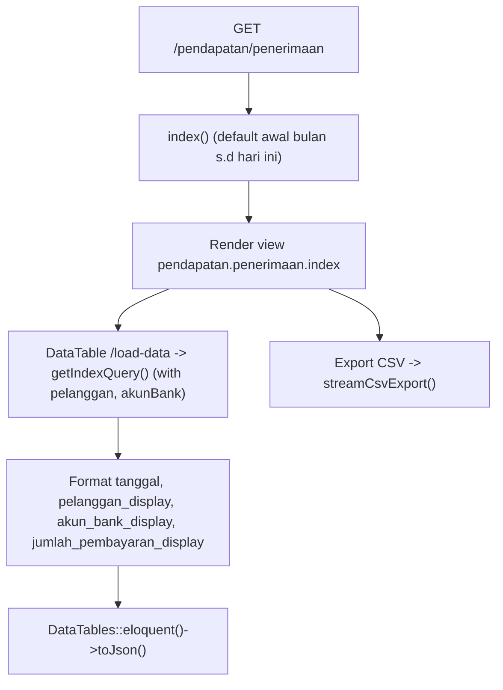
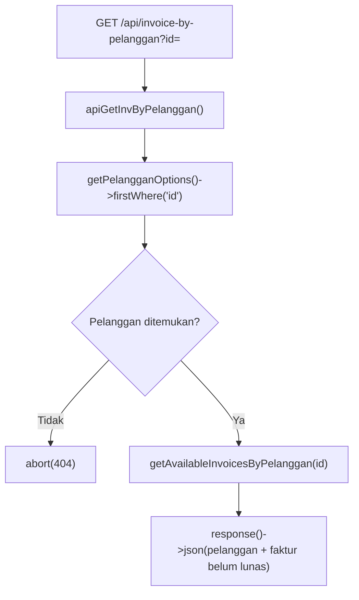
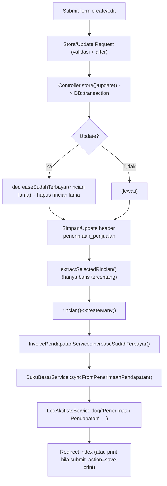
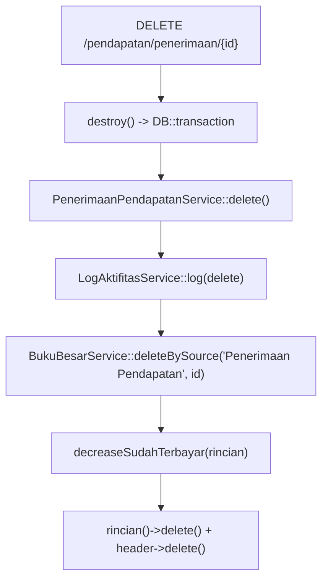

# Dokumentasi Modul Pendapatan — Penerimaan

## Ringkasan Modul

Modul **Penerimaan Pendapatan** digunakan untuk:

1. mencatat penerimaan pembayaran atas satu atau lebih invoice pendapatan (faktur penjualan),
2. menampilkan daftar penerimaan per periode (DataTables) dan mengekspornya ke CSV,
3. mengubah dan menghapus penerimaan,
4. mencetak bukti penerimaan,
5. menyediakan API daftar invoice yang belum lunas per pelanggan,
6. menyinkronkan setiap perubahan ke **Buku Besar** dan memperbarui `sudah_terbayar` invoice.

Implementasi utama:

- `routes/web.php`
- `app/Http/Controllers/Pendapatan/PenerimaanPendapatanController.php`
- `app/Http/Requests/Pendapatan/StorePenerimaanPendapatanRequest.php`
- `app/Http/Requests/Pendapatan/UpdatePenerimaanPendapatanRequest.php`
- `app/Services/Pendapatan/PenerimaanPendapatanService.php`
- `app/Services/Pendapatan/InvoicePendapatanService.php`
- `app/Services/Bukubesar/BukuBesarService.php`
- `app/Models/PenerimaanPenjualan.php`, `app/Models/PenerimaanPenjualanRinci.php`,
  `app/Models/FakturPenjualan.php`, `app/Models/Pelanggan.php`, `app/Models/Coa.php`

## Entry Point / API

| Method | Path | Route Name | Controller Method | Izin |
| --- | --- | --- | --- | --- |
| `GET` | `/pendapatan/penerimaan` | `pendapatan.penerimaan.index` | `index()` | view |
| `GET` | `/pendapatan/penerimaan/load-data` | `pendapatan.penerimaan.load-data` | `loadData()` | view |
| `GET` | `/pendapatan/penerimaan/export-csv` | `pendapatan.penerimaan.export-csv` | `exportCsv()` | view |
| `GET` | `/pendapatan/penerimaan/{penerimaanPenjualan}/print` | `pendapatan.penerimaan.print` | `print()` | view |
| `GET` | `/pendapatan/penerimaan/api/invoice-by-pelanggan` | `pendapatan.penerimaan.api.invoice-by-pelanggan` | `apiGetInvByPelanggan()` | view |
| `GET` | `/pendapatan/penerimaan/create` | `pendapatan.penerimaan.create` | `create()` | create |
| `POST` | `/pendapatan/penerimaan` | `pendapatan.penerimaan.store` | `store()` | create |
| `GET` | `/pendapatan/penerimaan/{penerimaanPenjualan}/edit` | `pendapatan.penerimaan.edit` | `edit()` | update |
| `PUT` | `/pendapatan/penerimaan/{penerimaanPenjualan}` | `pendapatan.penerimaan.update` | `update()` | update |
| `DELETE` | `/pendapatan/penerimaan/{penerimaanPenjualan}` | `pendapatan.penerimaan.destroy` | `destroy()` | delete |

## Validasi Request

`StorePenerimaanPendapatanRequest` / `UpdatePenerimaanPendapatanRequest`:

- `pelanggan_id` wajib, ada di `pelanggan`,
- `akun_bank_id`, `akun_piutang_id` wajib, ada di `coa`,
- `akun_selisih_tarif_id` opsional, ada di `coa`,
- `nomer` wajib, maks 50, unik pada `penerimaan_penjualan` (ignore diri sendiri saat update),
- `tanggal` wajib,
- `jumlah_pembayaran` wajib numerik `>= 0`,
- `selisih_tarif` opsional numerik,
- `keterangan` opsional maks 255,
- `rincian` wajib array minimal 1; tiap baris `faktur_penjualan_id` (ada di `faktur_penjualan`),
  `nominal_bayar` numerik `>= 0`, dan `check` opsional.

Validasi tambahan (`after`):

- minimal satu faktur harus dicentang (`check`),
- `jumlah_pembayaran` harus sama dengan (total nominal rincian tercentang + `selisih_tarif`),
- bila `selisih_tarif` ≠ 0, `akun_selisih_tarif_id` wajib diisi.

## Alur 1: Daftar & Ekspor

## Alur 2: API Invoice per Pelanggan

`getAvailableInvoicesByPelanggan()` mengambil faktur pelanggan yang `grandtotal <> sudah_terbayar`
dan `status_proses` bukan `3` (atau null).

## Alur 3: Buat / Ubah + Sinkronisasi

### Algoritma

1. Controller membungkus operasi dalam `DB::transaction` dan meneruskan `actor` (nama/email user).
2. Pada update: `decreaseSudahTerbayar()` untuk rincian lama lalu hapus rincian lama sebelum menulis baru.
3. Service menyimpan/memperbarui header, lalu menyimpan hanya rincian yang **tercentang**
   (`extractSelectedRincian`).
4. `increaseSudahTerbayar()` menaikkan `sudah_terbayar` pada faktur terkait.
5. `syncFromPenerimaanPendapatan()` menulis buku besar: Bank `D = jumlah_pembayaran`,
   Piutang `K = jumlah_pembayaran − selisih_tarif`, dan akun selisih tarif `K/D` bila ada.
6. Aktivitas dicatat via `LogAktifitasService::log()`.
7. `submit_action = save-print` mengarahkan ke halaman cetak.

## Alur 4: Hapus

## Alur 5: Cetak

- `print()` memuat relasi (`pelanggan`, `akunBank`, `akunPiutang`, `akunSelisihTarif`,
  `rincian.fakturPenjualan`) dan identitas cetak, lalu merender `pendapatan.penerimaan.print`.

## Fungsi yang Dipanggil

- `PenerimaanPendapatanController::index()/loadData()/exportCsv()/create()/store()/edit()/update()/destroy()/print()/apiGetInvByPelanggan()`
- `PenerimaanPendapatanService::getIndexQuery()/getCoaOptions()/getPelangganOptions()/getAvailableInvoicesByPelanggan()`
- `PenerimaanPendapatanService::create()/update()/delete()/findById()/extractSelectedRincian()`
- `InvoicePendapatanService::increaseSudahTerbayar()/decreaseSudahTerbayar()`
- `BukuBesarService::syncFromPenerimaanPendapatan()/deleteBySource()`
- `LogAktifitasService::log()`, `PreferensiPerusahaanService::getPrintIdentity()`
- `Coa::scopeSelectableTransaction()`, `Pelanggan::scopeActive()`
- Trait `StreamsCsvExport::streamCsvExport()/csvNumber()`

## Catatan Penting Bisnis

- Hanya baris faktur yang **dicentang** yang diproses menjadi rincian pembayaran.
- `jumlah_pembayaran` = total rincian terpilih + `selisih_tarif` (divalidasi).
- `selisih_tarif` ≠ 0 mewajibkan `akun_selisih_tarif_id`.
- Pembayaran memperbarui `sudah_terbayar` pada invoice; update/hapus mengembalikan nilai lama dulu
  (decrease) agar konsisten.
- Buku besar disinkronkan idempoten (`deleteBySource` di dalam `syncFrom*`).
- Opsi pelanggan hanya yang punya faktur belum lunas dan belum berstatus proses `3`.
- Lihat [Pendapatan — Invoice](pendapatan-invoice.md) dan [Konvensi Buku Besar & COA](fondasi/konvensi-bukubesar-coa.md).
