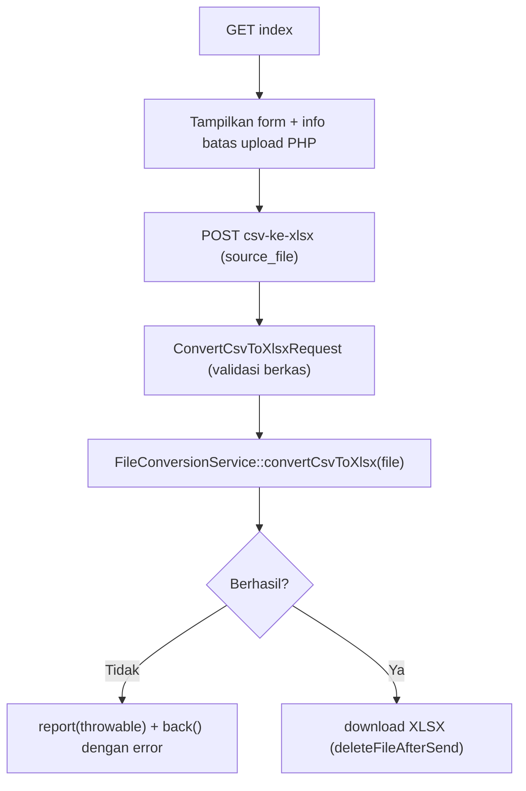

# Dokumentasi Modul Pengaturan — Konversi File

## Ringkasan Modul

Modul **Konversi File** menyediakan utilitas mengonversi berkas **CSV → XLSX**. Berguna untuk
menyiapkan berkas yang akan dipakai pada proses lain (mis. impor spreadsheet).

Implementasi utama:

- `routes/web.php`
- `app/Http/Controllers/Pengaturan/KonversiFileController.php`
- `app/Http/Requests/Pengaturan/ConvertCsvToXlsxRequest.php`
- `app/Services/Pengaturan/FileConversionService.php`
- Library `phpoffice/phpspreadsheet`.

## Entry Point / API

| Method | Path | Route Name | Controller Method | Izin |
| --- | --- | --- | --- | --- |
| `GET` | `/pengaturan/konversi-file` | `pengaturan.konversi-file.index` | `index()` | view |
| `POST` | `/pengaturan/konversi-file/csv-ke-xlsx` | `pengaturan.konversi-file.csv-ke-xlsx` | `convertCsvToXlsx()` | create |

## Alur

### Algoritma

1. `index()` menampilkan form dan info batas ukuran unggah PHP (`upload_max_filesize`, `post_max_size`).
2. `convertCsvToXlsx()` memvalidasi berkas melalui `ConvertCsvToXlsxRequest`, lalu memanggil
   `FileConversionService::convertCsvToXlsx()`.
3. Bila konversi gagal (exception), error dilaporkan (`report`) dan user dikembalikan dengan pesan
   berkas tidak valid.
4. Bila berhasil, berkas XLSX diunduh dan berkas sementara dihapus setelah dikirim
   (`deleteFileAfterSend(true)`).

## Fungsi yang Dipanggil

- `KonversiFileController::index()/convertCsvToXlsx()`
- `FileConversionService::convertCsvToXlsx()`

## Catatan Penting Bisnis

- Konversi bergantung pada batas unggah PHP; berkas melebihi `upload_max_filesize`/`post_max_size`
  akan ditolak sebelum diproses.
- Berkas hasil konversi bersifat sementara dan dihapus otomatis setelah diunduh.
- Kegagalan pemrosesan menampilkan pesan agar user memeriksa delimiter dan isi CSV.
