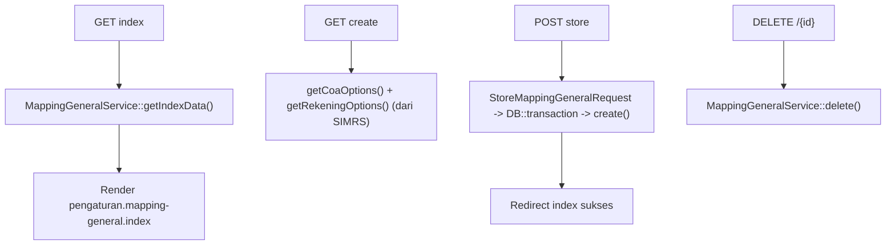

# Dokumentasi Modul Pengaturan — Mapping General

## Ringkasan Modul

Modul **Mapping General** mengelola pemetaan **kode rekening SIMRS → COA lokal** (`mapping_coa_simrs`).
Pemetaan ini dipakai oleh proses bridging (Pendapatan Obat dan Pembelian) saat menyalin jurnal SIMRS
ke buku besar lokal.

Implementasi utama:

- `routes/web.php`
- `app/Http/Controllers/Pengaturan/MappingGeneralController.php`
- `app/Http/Requests/Pengaturan/StoreMappingGeneralRequest.php`
- `app/Services/Pengaturan/MappingGeneralService.php`
- `app/Models/MappingCoaSimrs.php`, `app/Models/Coa.php`

## Entry Point / API

| Method | Path | Route Name | Controller Method | Izin |
| --- | --- | --- | --- | --- |
| `GET` | `/pengaturan/mapping-general` | `pengaturan.mapping-general.index` | `index()` | view |
| `GET` | `/pengaturan/mapping-general/create` | `pengaturan.mapping-general.create` | `create()` | create |
| `POST` | `/pengaturan/mapping-general` | `pengaturan.mapping-general.store` | `store()` | create |
| `DELETE` | `/pengaturan/mapping-general/{mappingCoaSimrs}` | `pengaturan.mapping-general.destroy` | `destroy()` | delete |

## Alur

### Algoritma

1. `index()` menampilkan daftar mapping via `getIndexData()`.
2. `create()` menyediakan opsi COA (`getCoaOptions`) dan daftar rekening SIMRS (`getRekeningOptions`).
3. `store()` menyimpan mapping dalam transaksi.
4. `destroy()` menghapus mapping.

## Fungsi yang Dipanggil

- `MappingGeneralController::index()/create()/store()/destroy()`
- `MappingGeneralService::getIndexData()/getCoaOptions()/getRekeningOptions()/create()/delete()`

## Catatan Penting Bisnis

- Mapping ini wajib ada untuk setiap `kd_rek` yang muncul di jurnal SIMRS yang diimpor; jika belum
  dipetakan, proses bridging (Pendapatan Obat & Pembelian) akan gagal dengan pesan mapping tidak ditemukan.
- Lihat [Bridging Pendapatan Obat](bridging-pendapatan-obat.md), [Bridging Pembelian](bridging-pembelian.md),
  dan [Integrasi SIMRS](fondasi/integrasi-simrs.md).
