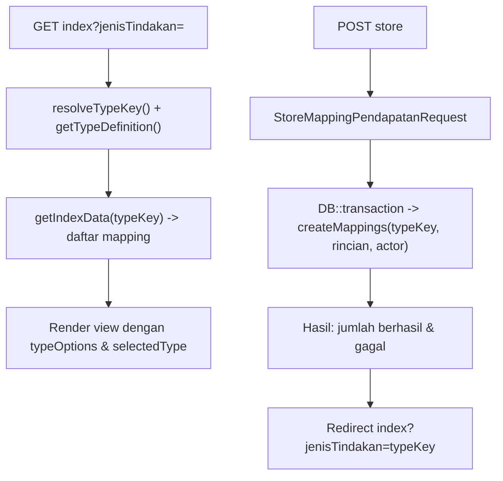
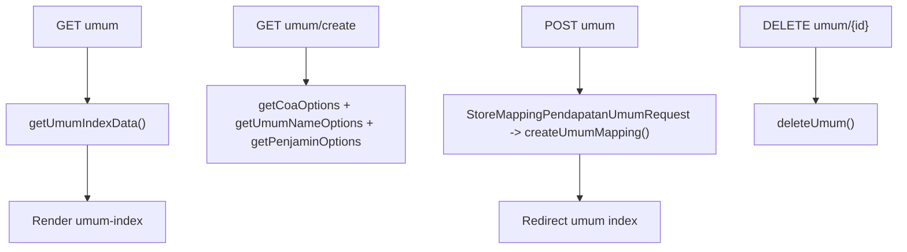
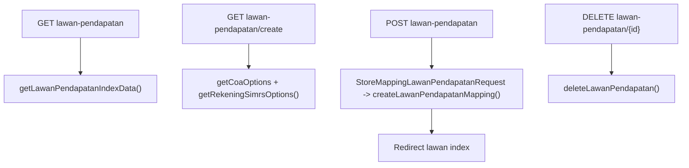

# Dokumentasi Modul Pengaturan — Mapping Pendapatan

## Ringkasan Modul

Modul **Mapping Pendapatan** mengelola pemetaan komponen billing SIMRS ke COA pendapatan yang
dipakai oleh proses [Bridging Pendapatan](bridging-pendapatan.md). Terdapat empat sub-daftar mapping:

1. **Mapping Tindakan** — per jenis tindakan (ralan, ranap, laborat, radiologi, kamar) + akun kamar,
2. **Mapping Umum** — pemetaan berdasarkan status + penjamin,
3. **Mapping Lawan Pendapatan** — pemetaan kode rekening SIMRS ke COA akun lawan.

Implementasi utama:

- `routes/web.php`
- `app/Http/Controllers/Pengaturan/MappingPendapatanController.php`
- `app/Http/Requests/Pengaturan/StoreMappingPendapatanRequest.php`
- `app/Http/Requests/Pengaturan/StoreMappingPendapatanUmumRequest.php`
- `app/Http/Requests/Pengaturan/StoreMappingLawanPendapatanRequest.php`
- `app/Services/Pengaturan/MappingPendapatanTindakanService.php`
- `app/Models/MappingPendapatan.php`, `MappingPendapatanKamar.php`, `MappingPendapatanUmum.php`,
  `MappingLawanPendapatanSimrs.php`, `Coa.php`

## Entry Point / API

| Method | Path | Route Name | Controller Method | Izin |
| --- | --- | --- | --- | --- |
| `GET` | `/pengaturan/mapping-pendapatan` | `pengaturan.mapping-pendapatan.index` | `index()` | view |
| `GET` | `/pengaturan/mapping-pendapatan/umum` | `pengaturan.mapping-pendapatan.umum.index` | `indexUmum()` | view |
| `GET` | `/pengaturan/mapping-pendapatan/lawan-pendapatan` | `pengaturan.mapping-pendapatan.lawan.index` | `indexLawanPendapatan()` | view |
| `GET` | `/pengaturan/mapping-pendapatan/create` | `pengaturan.mapping-pendapatan.create` | `create()` | create |
| `POST` | `/pengaturan/mapping-pendapatan` | `pengaturan.mapping-pendapatan.store` | `store()` | create |
| `GET` | `/pengaturan/mapping-pendapatan/umum/create` | `pengaturan.mapping-pendapatan.umum.create` | `createUmum()` | create |
| `POST` | `/pengaturan/mapping-pendapatan/umum` | `pengaturan.mapping-pendapatan.umum.store` | `storeUmum()` | create |
| `GET` | `/pengaturan/mapping-pendapatan/lawan-pendapatan/create` | `pengaturan.mapping-pendapatan.lawan.create` | `createLawanPendapatan()` | create |
| `POST` | `/pengaturan/mapping-pendapatan/lawan-pendapatan` | `pengaturan.mapping-pendapatan.lawan.store` | `storeLawanPendapatan()` | create |
| `DELETE` | `/pengaturan/mapping-pendapatan/{mappingPendapatan}` | `pengaturan.mapping-pendapatan.destroy` | `destroy()` | delete |
| `DELETE` | `/pengaturan/mapping-pendapatan/kamar/{mappingPendapatanKamar}` | `pengaturan.mapping-pendapatan.kamar.destroy` | `destroyKamar()` | delete |
| `DELETE` | `/pengaturan/mapping-pendapatan/umum/{mappingPendapatanUmum}` | `pengaturan.mapping-pendapatan.umum.destroy` | `destroyUmum()` | delete |
| `DELETE` | `/pengaturan/mapping-pendapatan/lawan-pendapatan/{mappingLawanPendapatanSimrs}` | `pengaturan.mapping-pendapatan.lawan.destroy` | `destroyLawanPendapatan()` | delete |

## Alur 1: Mapping Tindakan (index/create/store/destroy)

### Algoritma

1. `index()` menentukan `jenisTindakan` aktif via `resolveTypeKey()` dan mengambil daftar mapping
   melalui `getIndexData()`.
2. `create()` menyediakan opsi COA (`getCoaOptions`) dan daftar tindakan yang tersedia
   (`getAvailableTindakan`) sesuai jenis.
3. `store()` menyimpan banyak mapping sekaligus (`createMappings`) dalam transaksi, lalu melaporkan
   jumlah `success`/`failed`.
4. `destroy()` menentukan `typeKey` dari `sumber_tindakan` mapping, lalu menghapus.
5. Jenis `kamar` punya penghapusan terpisah `destroyKamar()` (model `MappingPendapatanKamar`).

## Alur 2: Mapping Umum

## Alur 3: Mapping Lawan Pendapatan

## Fungsi yang Dipanggil

- Controller: `index()/create()/store()/destroy()/destroyKamar()`,
  `indexUmum()/createUmum()/storeUmum()/destroyUmum()`,
  `indexLawanPendapatan()/createLawanPendapatan()/storeLawanPendapatan()/destroyLawanPendapatan()`.
- Service `MappingPendapatanTindakanService`: `resolveTypeKey()`, `getTypeDefinition()`, `getTypeOptions()`,
  `getIndexData()`, `getCoaOptions()`, `getAvailableTindakan()`, `createMappings()`, `delete()`, `deleteKamar()`,
  `getTypeKeyFromSource()`, `getUmumIndexData()`, `getUmumNameOptions()`, `getPenjaminOptions()`,
  `createUmumMapping()`, `deleteUmum()`, `getLawanPendapatanIndexData()`, `getRekeningSimrsOptions()`,
  `createLawanPendapatanMapping()`, `deleteLawanPendapatan()`.

## Catatan Penting Bisnis

- Mapping ini menjadi prasyarat proses Bridging Pendapatan; jika mapping tidak lengkap, import
  jurnal/invoice dapat gagal.
- Rincian tindakan diambil dari SIMRS (`getAvailableTindakan`, `getRekeningSimrsOptions`).
- Penyimpanan mapping tindakan bersifat batch dan melaporkan jumlah berhasil/gagal.
- Lihat [Bridging Pendapatan](bridging-pendapatan.md) dan [Sistem Otorisasi](fondasi/sistem-otorisasi.md).
