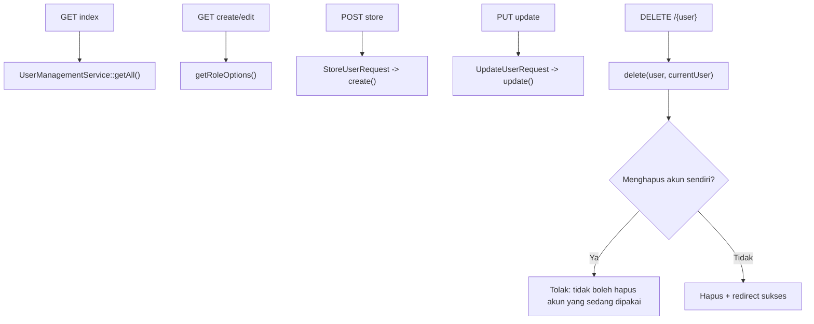

# Dokumentasi Modul Pengaturan — Pengguna

## Ringkasan Modul

Modul **Pengguna** mengelola akun pengguna (user) beserta role yang menentukan hak aksesnya.

Implementasi utama:

- `routes/web.php`
- `app/Http/Controllers/Pengaturan/PenggunaController.php`
- `app/Http/Requests/Pengaturan/StoreUserRequest.php`
- `app/Http/Requests/Pengaturan/UpdateUserRequest.php`
- `app/Services/Pengaturan/UserManagementService.php`
- `app/Models/User.php`, `app/Models/Role.php`

## Entry Point / API

| Method | Path | Route Name | Controller Method | Izin |
| --- | --- | --- | --- | --- |
| `GET` | `/pengaturan/pengguna` | `pengaturan.pengguna.index` | `index()` | view |
| `GET` | `/pengaturan/pengguna/create` | `pengaturan.pengguna.create` | `create()` | create |
| `POST` | `/pengaturan/pengguna` | `pengaturan.pengguna.store` | `store()` | create |
| `GET` | `/pengaturan/pengguna/{user}/edit` | `pengaturan.pengguna.edit` | `edit()` | update |
| `PUT` | `/pengaturan/pengguna/{user}` | `pengaturan.pengguna.update` | `update()` | update |
| `DELETE` | `/pengaturan/pengguna/{user}` | `pengaturan.pengguna.destroy` | `destroy()` | delete |

## Alur

### Algoritma

1. `index()` menampilkan seluruh user via `getAll()`.
2. `create()`/`edit()` menyediakan opsi role via `getRoleOptions()`.
3. `store()`/`update()` menyimpan user (password di-hash sesuai cast model `User`).
4. `destroy()` menolak penghapusan bila user yang dihapus adalah akun yang sedang login
   (`delete()` mengembalikan `false`).

## Fungsi yang Dipanggil

- `PenggunaController::index()/create()/store()/edit()/update()/destroy()`
- `UserManagementService::getAll()/getRoleOptions()/create()/update()/delete()`

## Catatan Penting Bisnis

- User tidak dapat menghapus akun yang sedang ia gunakan.
- `role_id` menentukan hak akses modul (lihat [Sistem Otorisasi](fondasi/sistem-otorisasi.md)).
- Password disimpan ter-hash (cast `hashed` pada model `User`).
