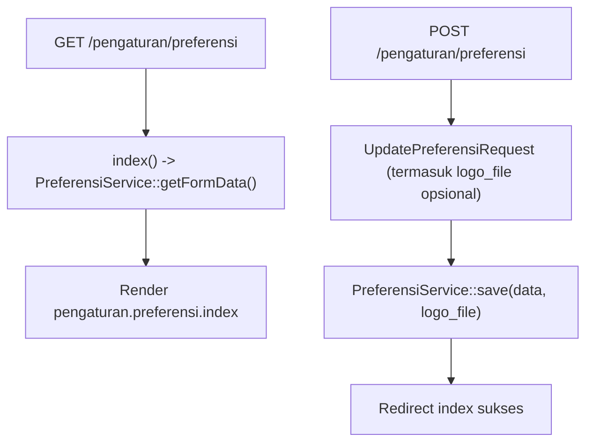

# Dokumentasi Modul Pengaturan — Preferensi

## Ringkasan Modul

Modul **Preferensi** mengelola preferensi perusahaan/rumah sakit (mis. nama perusahaan, logo,
identitas cetak). Nama perusahaan yang tersimpan dipakai untuk branding di seluruh view melalui
view composer global di `AppServiceProvider`.

Implementasi utama:

- `routes/web.php`
- `app/Http/Controllers/Pengaturan/PreferensiController.php`
- `app/Http/Requests/Pengaturan/UpdatePreferensiRequest.php`
- `app/Services/Pengaturan/PreferensiService.php`
- `app/Services/PreferensiPerusahaanService.php`
- `app/Models/PreferensiPerusahaan.php`

## Entry Point / API

| Method | Path | Route Name | Controller Method | Izin |
| --- | --- | --- | --- | --- |
| `GET` | `/pengaturan/preferensi` | `pengaturan.preferensi.index` | `index()` | view |
| `POST` | `/pengaturan/preferensi` | `pengaturan.preferensi.update` | `update()` | update |

## Alur

### Algoritma

1. `index()` mengambil data form via `getFormData()`.
2. `update()` menyimpan preferensi via `save()`, termasuk unggahan berkas logo (`logo_file`) bila ada.
3. Nama perusahaan yang tersimpan disuntikkan ke seluruh view sebagai `brandCompanyName`
   (lihat `AppServiceProvider::boot()`), dengan fallback ke `config('siakurat.rs_name')`.

## Fungsi yang Dipanggil

- `PreferensiController::index()/update()`
- `PreferensiService::getFormData()/save()`
- `PreferensiPerusahaanService::getPrintIdentity()` (dipakai modul lain untuk identitas cetak)

## Catatan Penting Bisnis

- Preferensi tidak punya create/delete; hanya satu record preferensi yang di-`update`.
- Identitas cetak (`getPrintIdentity()`) dipakai oleh modul-modul yang punya fitur cetak
  (Jurnal Umum, Kasbank, Penerimaan Pendapatan, Pembayaran Pembelian, Invoice Pembelian).
- Unggahan logo harus memenuhi validasi berkas pada `UpdatePreferensiRequest`.
- Lihat [Overview Arsitektur](fondasi/overview-arsitektur.md) untuk view composer branding.
