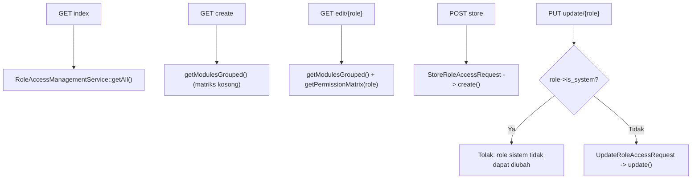

# Dokumentasi Modul Pengaturan — Role Akses

## Ringkasan Modul

Modul **Role Akses** mengelola peran (role) dan matriks izin per modul
(`can_view`/`can_create`/`can_update`/`can_delete`). Role menentukan hak akses user (lihat
[Sistem Otorisasi](fondasi/sistem-otorisasi.md)).

Implementasi utama:

- `routes/web.php`
- `app/Http/Controllers/Pengaturan/RoleAksesController.php`
- `app/Http/Requests/Pengaturan/StoreRoleAccessRequest.php`
- `app/Http/Requests/Pengaturan/UpdateRoleAccessRequest.php`
- `app/Services/Pengaturan/RoleAccessManagementService.php`
- `app/Models/Role.php`, `app/Models/RolePermission.php`, `app/Models/AccessModule.php`

## Entry Point / API

| Method | Path | Route Name | Controller Method | Izin |
| --- | --- | --- | --- | --- |
| `GET` | `/pengaturan/role-akses` | `pengaturan.role-akses.index` | `index()` | view |
| `GET` | `/pengaturan/role-akses/create` | `pengaturan.role-akses.create` | `create()` | create |
| `POST` | `/pengaturan/role-akses` | `pengaturan.role-akses.store` | `store()` | create |
| `GET` | `/pengaturan/role-akses/{role}/edit` | `pengaturan.role-akses.edit` | `edit()` | update |
| `PUT` | `/pengaturan/role-akses/{role}` | `pengaturan.role-akses.update` | `update()` | update |

> Modul ini tidak memiliki endpoint `delete`.

## Alur

### Algoritma

1. `index()` menampilkan seluruh role via `getAll()`.
2. `create()` menyediakan modul dikelompokkan (`getModulesGrouped()`) dengan matriks izin kosong.
3. `edit()` menyediakan modul + matriks izin role (`getPermissionMatrix()`).
4. `store()`/`update()` menyimpan role dan matriks izinnya.
5. `update()` **menolak** perubahan bila `role->is_system` bernilai `true`.

## Fungsi yang Dipanggil

- `RoleAksesController::index()/create()/store()/edit()/update()`
- `RoleAccessManagementService::getAll()/getModulesGrouped()/getPermissionMatrix()/create()/update()`

## Catatan Penting Bisnis

- Role bertanda `is_system` tidak dapat diubah.
- Daftar modul yang dapat diberi izin mengikuti `AccessModuleRegistry` (lihat
  [Sistem Otorisasi](fondasi/sistem-otorisasi.md)).
- Perubahan izin role langsung memengaruhi hak akses seluruh user pada role tersebut.
