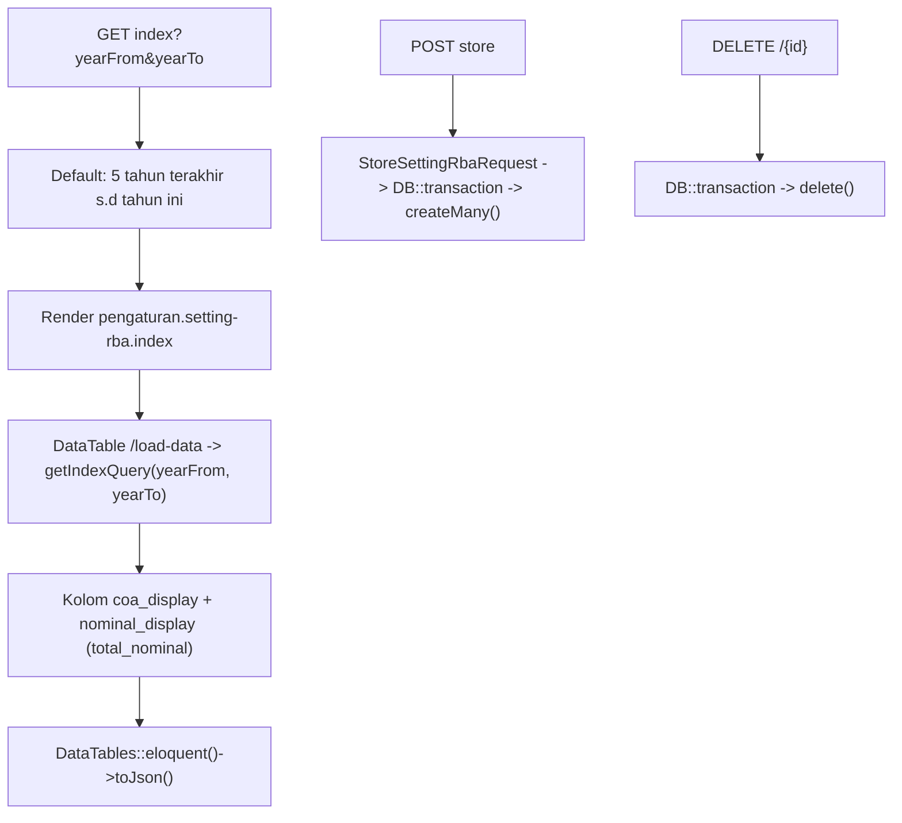

# Dokumentasi Modul Pengaturan — Setting RBA

## Ringkasan Modul

Modul **Setting RBA** (Rencana Bisnis Anggaran) mengelola nilai anggaran per COA per periode.
Data RBA dipakai sebagai pembanding pada laporan laba rugi (lihat [Laporan Keuangan](laporan-keuangan.md)).

Implementasi utama:

- `routes/web.php`
- `app/Http/Controllers/Pengaturan/SettingRbaController.php`
- `app/Http/Requests/Pengaturan/StoreSettingRbaRequest.php`
- `app/Services/Pengaturan/SettingRbaService.php`
- `app/Models/SettingRba.php`, `app/Models/SettingRbaRinci.php`, `app/Models/Coa.php`

## Entry Point / API

| Method | Path | Route Name | Controller Method | Izin |
| --- | --- | --- | --- | --- |
| `GET` | `/pengaturan/setting-rba` | `pengaturan.setting-rba.index` | `index()` | view |
| `GET` | `/pengaturan/setting-rba/load-data` | `pengaturan.setting-rba.load-data` | `loadData()` | view |
| `GET` | `/pengaturan/setting-rba/create` | `pengaturan.setting-rba.create` | `create()` | create |
| `POST` | `/pengaturan/setting-rba` | `pengaturan.setting-rba.store` | `store()` | create |
| `DELETE` | `/pengaturan/setting-rba/{settingRba}` | `pengaturan.setting-rba.destroy` | `destroy()` | delete |

## Alur

### Algoritma

1. `index()` menentukan rentang tahun (`yearFrom`/`yearTo`, default tahun ini − 5 s.d. tahun ini).
2. `loadData()` memakai `getIndexQuery()` dan menampilkan `coa_display` (kode - nama) serta
   `nominal_display` dari `total_nominal`.
3. `create()` menyediakan opsi COA (`getCoaOptions`).
4. `store()` menyimpan banyak baris RBA (`createMany`) dalam transaksi.
5. `destroy()` menghapus satu setting RBA dalam transaksi.

## Fungsi yang Dipanggil

- `SettingRbaController::index()/loadData()/create()/store()/destroy()`
- `SettingRbaService::getIndexQuery()/getCoaOptions()/createMany()/delete()`

## Catatan Penting Bisnis

- RBA menjadi angka pembanding anggaran pada laporan laba rugi; perubahan RBA memengaruhi kolom
  pembanding di laporan tersebut.
- Rentang tahun default adalah 6 tahun (tahun ini dan 5 tahun sebelumnya).
- Lihat [Laporan Keuangan](laporan-keuangan.md) dan [Konvensi Buku Besar & COA](fondasi/konvensi-bukubesar-coa.md).
